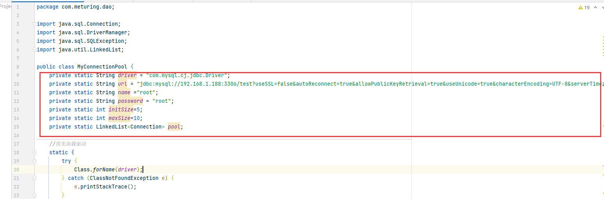

## 为什么要使用连接池

### 建立数据库连接的两种方式

#### 传统连接方式

首先调用Class.forName()方法加载数据库驱动，然后调用DriverManager.getConnection()方法建立连接.

>**存在的问题** : Connection对象在每次执行DML和DQL的过程中都要创建一次,DML和DQL执行完毕后,connection对象都会被销毁. connection对象是可以反复使用的,没有必要每次都创建新的.该对象的创建和销毁都是比较消耗系统资源的,如何实现connection对象的反复使用呢?使用连接池技术实现.

#### 连接池连接方式

连接池解决方案是在应用程序启动时就预先建立多个数据库连接对象,然后将连接对象保存到连接池中。当客户请求到来时,从池中取出一个连接对象为客户服务。当请求完成时,客户程序调用close()方法,将连接对象放回池中.对于多于连接池中连接数的请求，排队等待。应用程序还可根据连接池中连接的使用率，动态增加或减少池中的连接数。

> 优势 : 预先准备一些链接对象,放入连接池中,当多个线程并发执行时,可以避免短时间内一次性大量创建链接对象,减少计算机单位时间内的运算压力,提高程序的响应速度. 实现链接对象的反复使用,可以大大减少链接对象的创建次数,减少资源的消耗


## 具体实现


### 创建连接池文件

```java
package com.meturing.dao;

import java.sql.Connection;
import java.sql.DriverManager;
import java.sql.SQLException;
import java.util.LinkedList;

public class MyConnectionPool {
    private static String driver = "com.mysql.cj.jdbc.Driver";
    private static String url = "jdbc:mysql://192.168.1.188:3306/test?useSSL=false&autoReconnect=true&allowPublicKeyRetrieval=true&useUnicode=true&characterEncoding=UTF-8&serverTimezone=Asia/Shanghai";
    private static String name ="root";
    private static String password = "root";
    private static int initSize=5;
    private static int maxSize=10;
    private static LinkedList<Connection> pool;

    //优先加载驱动
    static {
        try {
            Class.forName(driver);
        } catch (ClassNotFoundException e) {
            e.printStackTrace();
        }
        //初始化Pool
        pool = new LinkedList<Connection>();
        // 初始化连接池
        for (int i = 0; i < initSize; i++) {
            Connection connection = initConnection();
            if (connection!=null){
                pool.add(connection);
                System.out.println("初始化连接"+connection.hashCode()+"放入连接池");
            }
        }
    }

    /**
     * 私有的初始化链接方法
     * @return
     */
    private static Connection initConnection(){
        try {
            return DriverManager.getConnection(url, name, password);
        } catch (SQLException e) {
            e.printStackTrace();
        }
        return null;
    }

    /**
     * 公共的获取链接方法
     * @return
     */
    public static Connection getConnection(){
        Connection connection =null;
        if (pool.size()>0){
            connection = pool.removeFirst();//从池中拿出第一个
            System.out.println("取出连接:"+connection.hashCode());
        }else {
            connection = initConnection();
            System.out.println("创建连接:"+connection.hashCode());
        }
        return connection;
    }

    /**
     * 公共的向连接池中归还链接
     * @param connection
     */
    public static void returnConnection(Connection connection){
        if (connection!=null){
            try {
                if (!connection.isClosed()) {//判断链接是否关闭
                    if (pool.size()<maxSize) {//判断Pool的大小是否超过上限
                        connection.setAutoCommit(true);//调整链接为自动提交
                        System.out.println("设置连接:"+connection.hashCode()+"自动提交为true");
                        pool.addLast(connection);
                        System.out.println("连接池未满,归还连接:"+connection.hashCode());
                    }else {
                        //当前连接池超过设定最大上限,直接关闭链接 无需归还
                        try {
                            connection.close();
                            System.out.println("连接池满了,关闭连接:"+connection.hashCode());
                        } catch (SQLException e) {
                            e.printStackTrace();
                        }
                    }
                }else {
                    System.out.println("链接已经关闭,无需归还!");
                }
            } catch (SQLException e) {
                e.printStackTrace();
            }
        }else {
            System.out.println("传入的连接为null,不可归还");
        }
    }
}

```

### 修改BaseDAO

```java
package dao;  
  
import utils.ConnectionPool;  
  
import java.lang.reflect.Field;  
import java.lang.reflect.ParameterizedType;  
import java.lang.reflect.Type;  
import java.sql.*;  
import java.util.ArrayList;  
import java.util.List;  
  
/**  
 * BaseDao工具类  
 *  
 * @author FrostyLunar  
 * @date 2023/08/13  
 */public abstract class BaseDao<T> {  
    private PreparedStatement psmt = null;  
    private ResultSet rs = null;  
    /**  
     * entity类  
     */  
    private Class entityClass;  
  
    public BaseDao() {  
        // 根据继承关系获取泛型类类型  
        Type genericSuperclass = getClass().getGenericSuperclass();  
        // 获取泛型类  
        if (genericSuperclass instanceof ParameterizedType) {  
            // 泛型参数的实际类型信息  
            Type[] actualTypeArguments = ((ParameterizedType) genericSuperclass).getActualTypeArguments();  
            // T的真实的类型  
            Type actualTypeArgument = actualTypeArguments[0];  
            try {  
                entityClass = Class.forName(actualTypeArgument.getTypeName());  
            } catch (ClassNotFoundException e) {  
                throw new RuntimeException(e);  
            }  
        }  
    }  
  
    /**  
     * 关闭资源  
     *  
     * @param rs   ResultSet  
     * @param psmt PreparedStatement  
     * @param conn Connection  
     */    private void close(ResultSet rs, PreparedStatement psmt, Connection conn) {  
        if (rs != null) {  
            try {  
                rs.close();  
            } catch (SQLException e) {  
                throw new RuntimeException(e);  
            }  
        }  
        if (psmt != null) {  
            try {  
                psmt.close();  
            } catch (SQLException e) {  
                throw new RuntimeException(e);  
            }  
        }  
        ConnectionPool.returnConnection(conn);  
    }  
  
    /**  
     * 设置参数  
     *  
     * @param preparedStatement PreparedStatement对象  
     * @param params            参数列表  
     * @throws SQLException sqlexception异常  
     */  
    private void setParams(PreparedStatement preparedStatement, Object... params) throws SQLException {  
        if (params != null && params.length > 0) {  
            for (int i = 0; i < params.length; i++) {  
                preparedStatement.setObject(i + 1, params[i]);  
            }  
        }  
    }  
  
    /**  
     * 执行更新  
     *  
     * @param sql    sql  
     * @param params 参数列表  
     * @return int 如果为插入，则返回下个生成的key，否则返回受影响的行数。  
     */  
    protected int executeUpdate(String sql, Object... params) {  
        Connection connection = null;  
        boolean insertFlag = false;  
        int count = 0;  
        insertFlag = sql.trim().toUpperCase().startsWith("INSERT");  
        try {  
            //创建连接  
            connection = ConnectionPool.getConnection();  
            if (connection != null) {  
                if (insertFlag) {  
                    psmt = connection.prepareStatement(sql, Statement.RETURN_GENERATED_KEYS);  
                } else {  
                    psmt = connection.prepareStatement(sql);  
                }  
                setParams(psmt, params);  
                count = psmt.executeUpdate();  
                // 返回生成的key  
                if (insertFlag) {  
                    rs = psmt.getGeneratedKeys();  
                    if (rs.next()) {  
                        return ((Long) rs.getLong(1)).intValue();  
                    }  
                }  
            } else {  
                System.out.println("获取数据库连接失败！");  
            }  
        } catch (SQLException e) {  
            e.printStackTrace();  
        } finally {  
            close(rs, psmt, connection);  
        }  
        return count;  
    }  
  
    /**  
     * 通过反射技术给obj对象的property属性赋propertyValue值  
     *  
     * @param obj           obj  
     * @param property      财产  
     * @param propertyValue 属性值  
     */  
    private void setValue(Object obj, String property, Object propertyValue) {  
        Class clazz = obj.getClass();  
        try {  
            Field field = clazz.getDeclaredField(property);  
            if (field != null) {  
                field.setAccessible(true);  
                field.set(obj, propertyValue);  
            }  
        } catch (NoSuchFieldException | IllegalAccessException e) {  
            throw new RuntimeException(e);  
        }  
    }  
  
    /**  
     * 执行复杂查询，返回统计结果  
     *  
     * @param sql    sql  
     * @param params 参数个数  
     * @return {@link Object[]}  
     */  
    protected Object[] executeComplexQuery(String sql, Object... params) {  
        Connection connection = null;  
        try {  
            connection = ConnectionPool.getConnection();  
            psmt = connection.prepareStatement(sql);  
            setParams(psmt, params);  
            rs = psmt.executeQuery();  
            //通过rs可以获取结果集的元数据  
            //元数据：描述结果集数据的数据 , 简单讲，就是这个结果集有哪些列，什么类型等等  
            ResultSetMetaData rsmd = rs.getMetaData();  
            //获取结果集的列数  
            int columnCount = rsmd.getColumnCount();  
            Object[] columnValueArr = new Object[columnCount];  
            //6.解析rs  
            if (rs.next()) {  
                for (int i = 0; i < columnCount; i++) {  
                    Object columnValue = rs.getObject(i + 1);  
                    columnValueArr[i] = columnValue;  
                }  
                return columnValueArr;  
            }  
        } catch (SQLException e) {  
            e.printStackTrace();  
        } finally {  
            close(rs, psmt, connection);  
        }  
        return null;  
    }  
  
    /**  
     * 执行查询，返回单个实体对象  
     *  
     * @param sql    sql  
     * @param params 参数个数  
     * @return {@link T}  
     */  
    protected T selectOne(String sql, Object... params) {  
        Connection connection = null;  
        try {  
            connection = ConnectionPool.getConnection();  
            psmt = connection.prepareStatement(sql);  
            setParams(psmt, params);  
            rs = psmt.executeQuery();  
            //通过rs可以获取结果集的元数据  
            //元数据：描述结果集数据的数据 , 简单讲，就是这个结果集有哪些列，什么类型等等  
            ResultSetMetaData rsmd = rs.getMetaData();  
            //获取结果集的列数  
            int columnCount = rsmd.getColumnCount();  
            //6.解析rs  
            if (rs.next()) {  
                T entity = (T) entityClass.newInstance();  
                for (int i = 0; i < columnCount; i++) {  
                    String columnName = rsmd.getColumnName(i + 1);  
                    Object columnValue = rs.getObject(i + 1);  
                    setValue(entity, columnName, columnValue);  
                }  
                return entity;  
            }  
        } catch (SQLException | IllegalAccessException | InstantiationException e) {  
            e.printStackTrace();  
        } finally {  
            close(rs, psmt, connection);  
        }  
        return null;  
    }  
  
  
    /**  
     * 执行查询，返回List  
     *     * @param sql    sql  
     * @param params 参数个数  
     * @return {@link List}<{@link T}>  
     */    protected List<T> executeQuery(String sql, Object... params) {  
        Connection connection = null;  
        List<T> list = new ArrayList<>();  
        try {  
            connection = ConnectionPool.getConnection();  
            psmt = connection.prepareStatement(sql);  
            setParams(psmt, params);  
            rs = psmt.executeQuery();  
            //通过rs可以获取结果集的元数据  
            //元数据：描述结果集数据的数据 , 简单讲，就是这个结果集有哪些列，什么类型等等  
            ResultSetMetaData rsmd = rs.getMetaData();  
            //获取结果集的列数  
            int columnCount = rsmd.getColumnCount();  
            //6.解析rs  
            while (rs.next()) {  
                T entity = (T) entityClass.newInstance();  
                for (int i = 0; i < columnCount; i++) {  
                    String columnName = rsmd.getColumnName(i + 1);  
                    Object columnValue = rs.getObject(i + 1);  
                    setValue(entity, columnName, columnValue);  
                }  
                list.add(entity);  
            }  
        } catch (SQLException | IllegalAccessException | InstantiationException e) {  
            e.printStackTrace();  
        } finally {  
            close(rs, psmt, connection);  
        }  
        return list;  
    }  
}
```

### 效果


## 继续优化



我们发现仍有大量的配置化的参数在我们的逻辑代码中,这样是不友好的.不方便我们对于项目的管理与维护

我们尝试使用配置文件来管理参数

### 创建配置文件


```properties
driver=com.mysql.cj.jdbc.Driver
url=jdbc:mysql://192.168.1.188:3306/test?useSSL=false&autoReconnect=true&allowPublicKeyRetrieval=true&useUnicode=true&characterEncoding=UTF-8&serverTimezone=Asia/Shanghai
name=root
password=root
initSize=5
maxSize=10
```

### 创建PropertiesUtil

```java
public class PropertiesUtil {
    private Properties properties;
    //初始化
    public PropertiesUtil(String path){
        properties = new Properties();  
		ClassLoader classLoader = this.getClass().getClassLoader();  
		URL url = classLoader.getResource(path);  
	try {  
	    properties.load(url.openStream());  
	} catch (IOException e) {  
	    e.printStackTrace();  
	}
    
    //获取指定Key的值
    public String getProperties(String key){
        return properties.getProperty(key);
    }
}
```

### 修改连接池

```java
public class MyConnectionPool {
    private static String driver;
    private static String url;
    private static String name;
    private static String password;
    private static int initSize;
    private static int maxSize;
    private static LinkedList<Connection> pool;

    //优先加载驱动
    static {
        //初始化参数
        PropertiesUtil propertiesUtil=new PropertiesUtil("/jdbc.properties");
        driver=propertiesUtil.getProperties("driver");
        url=propertiesUtil.getProperties("url");
        name=propertiesUtil.getProperties("name");
        password=propertiesUtil.getProperties("password");
        initSize=Integer.parseInt(propertiesUtil.getProperties("initSize"));
        maxSize=Integer.parseInt(propertiesUtil.getProperties("maxSize"));
        try {
            Class.forName(driver);
        } catch (ClassNotFoundException e) {
            e.printStackTrace();
        }
        //初始化Pool
        pool = new LinkedList<Connection>();
        // 初始化连接池
        for (int i = 0; i < initSize; i++) {
            Connection connection = initConnection();
            if (connection!=null){
                pool.add(connection);
                System.out.println("初始化连接"+connection.hashCode()+"放入连接池");
            }
        }
    }

    /**
     * 私有的初始化链接方法
     * @return
     */
    private static Connection initConnection(){
        try {
            return DriverManager.getConnection(url, name, password);
        } catch (SQLException e) {
            e.printStackTrace();
        }
        return null;
    }

    /**
     * 公共的获取链接方法
     * @return
     */
    public static Connection getConnection(){
        Connection connection =null;
        if (pool.size()>0){
            connection = pool.removeFirst();//从池中拿出第一个
            System.out.println("取出连接:"+connection.hashCode());
        }else {
            connection = initConnection();
            System.out.println("创建连接:"+connection.hashCode());
        }
        return connection;
    }

    /**
     * 公共的向连接池中归还链接
     * @param connection
     */
    public static void returnConnection(Connection connection){
        if (connection!=null){
            try {
                if (!connection.isClosed()) {//判断链接是否关闭
                    if (pool.size()<maxSize) {//判断Pool的大小是否超过上限
                        connection.setAutoCommit(true);//调整链接为自动提交
                        System.out.println("设置连接:"+connection.hashCode()+"自动提交为true");
                        pool.addLast(connection);
                        System.out.println("连接池未满,归还连接:"+connection.hashCode());
                    }else {
                        //当前连接池超过设定最大上限,直接关闭链接 无需归还
                        try {
                            connection.close();
                            System.out.println("连接池满了,关闭连接:"+connection.hashCode());
                        } catch (SQLException e) {
                            e.printStackTrace();
                        }
                    }
                }else {
                    System.out.println("链接已经关闭,无需归还!");
                }
            } catch (SQLException e) {
                e.printStackTrace();
            }
        }else {
            System.out.println("传入的连接为null,不可归还");
        }
    }
}
```
