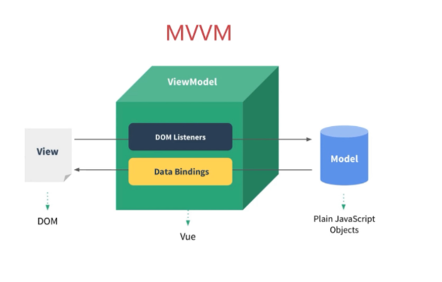

## 了解Vue

Vue (读音` /vjuː/`，类似于 view) **是一套用于构建用户界面的渐进式框架**。与其它大型框架不同的是，Vue 被设计为可以自底向上逐层应用。**Vue 的核心库只关注视图层**，不仅易于上手，还便于与第三方库或既有项目整合。另一方面，当与现代化的工具链以及各种支持类库结合使用时，**Vue 也完全能够为复杂的单页应用提供驱动**

相关网站
[https://cn.vuejs.org/](https://cn.vuejs.org/ "https://cn.vuejs.org/") 官方网站
[https://github.com/vuejs](https://github.com/vuejs "https://github.com/vuejs")  Github网站

## Vue的好处

实际上vue框架就是一个MVVM框架，它是渐进式框架，它是初创公司的首选框架，它是轻量级的，有很多根据Vue拓展的独立的功能或库



通过下面的例子我们来了解Vue的好处

### 传统方式操作元素

```html
<!DOCTYPE html>
<html lang="en">
<head>
	<meta charset="UTF-8">
	<title>Title</title>
</head>
<body>
<div>
	<h1>0</h1>
	<button>点我+1</button>
	<button>点我-1</button>
	<script>
        let count = 0;
        const btn01 = document.getElementsByTagName('button')[0];
        const elh1 = document.getElementsByTagName('h1')[0];
        btn01.onclick = function () {
            count++;
            elh1.innerHTML = count;
        }
        const btn02 = document.getElementsByTagName('button')[1];
        btn02.onclick = function () {
            count--;
            elh1.innerHTML = count;
        }
	</script>
</div>
</body>
```

在传统方式操作数据中，我们每次改变数据的值，都需要重新绘制视图。

### 使用Vue操作元素

```html
<!DOCTYPE html>
<html lang="en">
<head>
	<meta charset="UTF-8">
	<title>Title</title>
</head>
<body>
<div id="app">
	<h1>{{a}}</h1>
	<button @click="add">点我+1</button>
	<button @click="minus">点我-1</button>
</div>
<script src="../resource/vue.js"></script>
<script>
    new Vue({
        el: '#app',
        data: {a: 0},
        methods: {
            add() {
                this.a++;
            }, minus() {
                this.a--;
            }
        }
    })
</script>
</body>
</html>
```

使用Vue操作时，我们无需关注视图模型，仅仅需要修改数据，视图的渲染都交给Vue来执行。

## Vue的使用

### 引入Vue

1.  Vue2文件
在Vue的起步中，区分开发环境和生产环境，两者的不同，开发环境可以清晰的看清源码，生产环境就是将源码进行压缩，占比大小更小，我们学习过程中使用生产环境
+ 开发环境版本，包含了有帮助的命令行警告
+ 生产环境版本，优化了尺寸和速度

2.  简单的语法格式
    ```html
    <body>
        <div id="app">
            {{a}}
        </div>
        <script src="js/vue.js"></script>
        <script>
            var vue = new Vue({
                // 挂载点，所有的Vue的方法和属性都必须在对应的挂载根标签内部使用
                el: '#app',
                // 数据管理中心，所有的Vue的数据都在data对象中
                data:{
                    a: 100
                },
                // 方法，对应的Vue事件方法清单
                methods:{
                }
            })
        </script>
    </body>
    ```

### 插值语法

插值语法是通过一对`{{}}`进行书写，内部是对data数据管理中心的属性进行渲染，也可以是表达式moustache（胡子）是双大括号学名，也叫（胡子语法）

内部也可以存放表达式: `{{a >= 100 ? 20 : 10}}`  ,  注意，**表达式支持简单，比如简单判断**，**比如三元表达式**，**不可以使用if等等复杂判断** `{{if(a>200){a=100}else{a=300}}}`

我们需要注意的是，所有的对象中的清单内容，都是Vue规定，内置的，不可以自由发挥

```html
<body>
    <div id="app">
        {{b}}
    </div>
    <script src="js/vue.js"></script>
    <script>
        var vue = new Vue({
            // 挂载点，所有的Vue的方法和属性都必须在对应的挂载根标签内部使用
            el: '#app',
            // 数据管理中心，所有的Vue的数据都在data对象中
            data:{
                a: 100
            },
            // 方法，对应的Vue事件方法清单
            methods:{

            },
            content:{
                b: 200
            }
        })
    </script>
</body>
```

上面代码中content对象是我们自己随意创建的，所以是不支持在Vue中使用的
