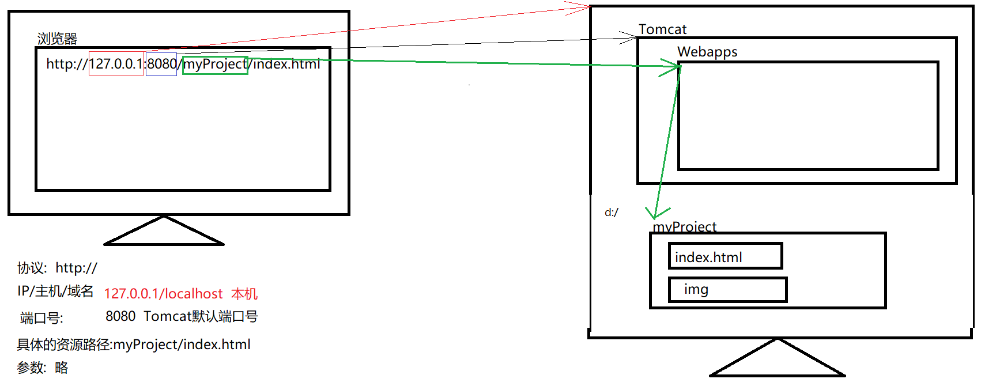

## 方式一 : 在webapps目录中

1. 在Tomcat的webapps中创建一个我们自己的项目目录
	
2.  在自己的myProject中放入一下静态资源
    

3.  启动Tomcat,访问对应的资源
   

运行原理


## 方式二 : 在其他目录中

在localhost中添加配置文件

建议配置文件名和项目名相同
```xml
<Context path="/MyProject" docBase="D:/MyProject"/>
```

`path`为项目访问路径，`docBase`为项目实际所在路径，当我们在浏览器发起请求时，Tomcat会将请求转发到实际项目所在地。 


运行原理


