## 了解HTTP协议

### 什么是HTTP协议

**HTTP协议是Hyper Text Transfer Protocol（超文本传输协议）的缩写, HTTP是万维网（WWW:World Wide Web）的数据通信的基础。

HTTP是**一个简单的请求 → 响应协议**，它通常运行在TCP之上。它指定了客户端可能发送给服务器什么样的消息以及得到什么样的响应。


HTTP是一个基于TCP/IP通信协议来传递数据（HTML 文件, 图片文件, 查询结果等）。

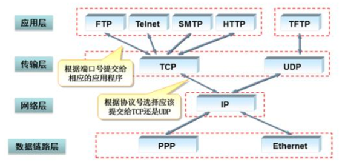

### HTTP协议特点

#### 支持客户/服务器模式

HTTP协议支持客户端服务端模式，需要使用浏览器作为客户端来访问服务端

#### 简单快速

客户向服务器请求服务时，只需传送请求方法和路径。请求方法常用的有GET、POST等。每种方法规定了客户与服务器联系的类型不同。由于HTTP协议简单，使得HTTP服务器的程序规模小，因而通信速度很快

#### 灵活

HTTP允许传输任意类型的数据对象。正在传输的类型由Content-Type（Content-Type是HTTP包中用来表示内容类型的标识）加以标记。

#### 无连接

每次请求一次，释放一次连接。所以无连接表示每次连接只能处理一个请求。优点就是节省传输时间，实现简单。我们有时称这种无连接为短连接。对应的就有了长链接，长连接专门解决效率问题。当建立好了一个连接之后，可以多次请求。但是缺点就是容易造成占用资源不释放的问题。当HTTP协议头部中字段Connection：keep-alive表示支持长链接。

#### 单向性

服务端永远是被动的等待客户端的请求。

#### 无状态

HTTP协议是无状态协议。无状态是指协议对于事务处理没有记忆能力。缺少状态意味着如果后续处理需要前面的信息，则它必须重传，这样可能导致每次连接传送的数据量增大。另一方面，在服务器不需要先前信息时它的应答就较快。为了解决HTTP协议无状态，于是，两种用于保持HTTP连接状态的技术就应运而生了，一个是Cookie，而另一个则是Session

### HTTP协议发展和版本

http协议在1991年发布第一个版本版本号为0.9。随后WWW联盟（WWW Consortium-W3C）于1994年成立，http协议被纳入到W3C组织中进行维护和管理。

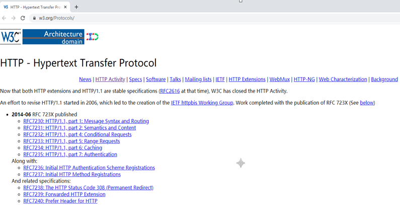


#### http1.0

最早在1996年在网页中使用，内容简单，所以浏览器的每次请求都需要与服务器建立一个TCP连接，服务器处理完成后立即断开TCP连接（无连接），服务器不跟踪每个客户端也不记录过去的请求（无状态）,请求只能由客户端发起（单向性）

#### http1.1

到1999年广泛在各大浏览器网络请求中使用，HTTP/1.0中默认使用Connection: close。在HTTP/1.1中已经默认使用Connection: keep-alive（长连接），避免了连接建立和释放的开销，但服务器必须按照客户端请求的先后顺序依次回送相应的结果，以保证客户端能够区分出每次请求的响应内容。通过Content-Length字段来判断当前请求的数据是否已经全部接收。不允许同时存在两个并行的响应。

1.1中最重要的一个特点是支持“长连接”，即“一次连接可以多次请求”。

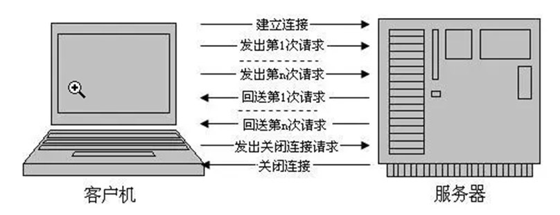

HTTP 1.1支持持久连接（HTTP/1.1的默认模式使用带流水线的持久连接），在一个TCP连接上可以传送多个HTTP请求和响应，减少了建立和关闭连接的消耗和延迟。一个包含有许多图像的网页文件的多个请求和应答可以在一个连接中传输，但每个单独的网页文件的请求和应答仍然需要使用各自的连接。HTTP 1.1还允许客户端不用等待上一次请求结果返回，就可以发出下一次请求，但服务器端必须按照接收到客户端请求的先后顺序依次回送响应结果，以保证客户端能够区分出每次请求的响应内容，这样也显著地减少了整个下载过程所需要的时间。

#### http2.0

##### 长连接

在HTTP/2中，客户端向某个域名的服务器请求页面的过程中，只会创建一条TCP连接，即使这页面可能包含上百个资源。  单一的连接应该是HTTP2的主要优势，单一的连接能减少TCP握手带来的时延。HTTP2中用一条单一的长连接，避免了创建多个TCP连接带来的网络开销，提高了吞吐量

##### 多路复用 (Multiplexing)
 
HTTP2.0中所有加强性能的核心是二进制传输，在HTTP1.x中，我们是通过文本的方式传输数据。在HTTP2.0中引入了新的编码机制，所有传输的数据都会被分割，并采用二进制格式编码。
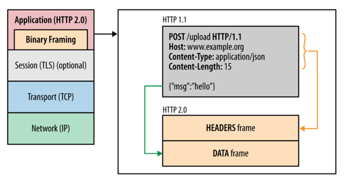

多路复用，连接共享。不同的request可以使用同一个连接传输（最后根据每个request上的id号组合成正常的请求）
HTTP2.0中，有两个概念非常重要：帧（frame）和流（stream）。
帧是最小的数据单位，每个帧会标识出该帧属于哪个流，流是多个帧组成的数据流。
所谓多路复用，即在一个TCP连接中存在多个流，即可以同时发送多个请求，对端可以通过帧中的标识知道该帧属于哪个请求。在客户端，这些帧乱序发送，到对端后再根据每个帧首部的流标识符重新组装。通过该技术，可以避免HTTP旧版本的队头阻塞问题，极大提高传输性能。


##### 首部压缩（Header Compression） 

由于1.1中header带有大量的信息，并且得重复传输，2.0使用encoder来减少需要传输的hearder大小。

##### 服务端推送（Server Push） 

在HTTP2.0中，服务端可以在客户端某个请求后，主动推送其他资源。
可以想象一下，某些资源客户端是一定会请求的，这时就可以采取服务端push的技术，提前给客户端推送必要的资源，就可以相对减少一点延迟时间。在浏览器兼容的情况下也可以使用prefetch。

##### 更安全 

HTTP2.0使用了tls的拓展ALPN作为协议升级，除此之外，HTTP2.0对tls的安全性做了近一步加强，通过黑名单机制禁用了几百种不再安全的加密算法。


## HTTP请求

### 了解HTTP请求

#### 打开网页的基本流程

1.  当你在浏览器输入URL的时候，浏览器发送一个Request去获取html.  服务器把Response发送回给浏览器。
2.  浏览器分析Response中的 HTML，发现其中引用了很多其他文件，比如图片，CSS文件，JS文件。
3.  浏览器会自动再次发送Request去获取图片，CSS文件，或者JS文件。
4.  等所有的文件都下载成功后。 网页就被显示出来了。

#### Request 消息结构

第一部分叫Request line
第二部分叫Request header
第三部分是Request body

Request header和Request body之间有个空行。

### 请求的主要组成部分

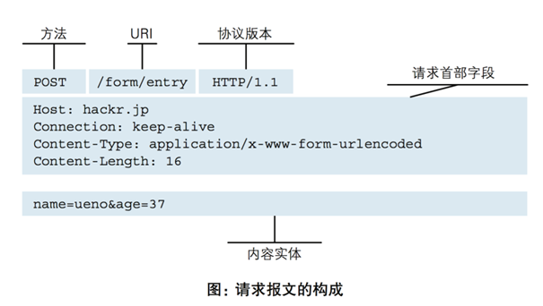

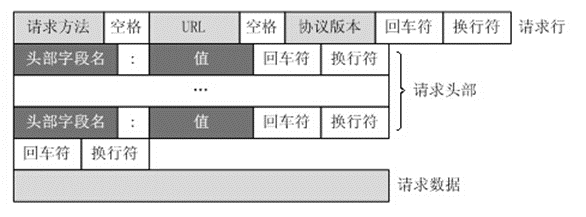

#### 请求行 request Line

```txt
GET /course/id/18.html?a=3&b=4 HTTP/1.1
POST /login HTTP/1.1
```

1.  请求方式  默认 GET
2.  资源路径
3.  请求使用的协议

#### 请求头 request headers

请求头用于说明是谁或什么在发送请求、请求源于何处，或者客户端的喜好及能力。服务器可以根据请求头部给出的客户端信息，试着为客户端提供更好的响应。请求头中信息的格式为key：value。

| 参数                    | 说明                                                                                                                                             |
| ------------------------- | -------------------------------------------------------------------------------------------------------------------------------------------------- |
| Host                      | 客户端指定自己想访问的WEB服务器的域名/IP 地址和端口号                                                                                                                     |
| Connection                | 连接方式。如果值是close则表示基于短连接方式，如果该值是keep-alive，网络连接就是持久的，在一定时间范围内是不会关闭，使得对同一个服务器的请求可以继续在该连接上完成                                                           |
| Upgrade-Insecure-Requests | 服务端是否支持https加密协议                                                                                                                                   |
| Cache-Control             | 指定请求和响应遵循的缓存机制                                                                                                                                     |
| User-Agent                | 浏览器表明自己的身份（是哪种浏览器）。例如Chrome浏览器：Mozilla/5.0 (Windows NT 10.0; Win64; x64) AppleWebKit/537.36 (KHTML, like Gecko) Chrome/81.0.4044.129 Safari/537.36 |
| Accept                    | 告诉WEB服务器自己接受什么介质类型，表示任何类型，type/ 表示该类型下的所有子类型                                                                                                 |
| Accept-Encoding           | 浏览器申明自己接收的编码方法，通常指定压缩方法，是否支持压缩，支持什么压缩方法（gzip，deflate）                                                                                              |
| Accept-Language           | 浏览器申明自己接收的语言。语言跟字符集的区别：中文是语言，中文有多种字符集，比如big5，gb2312，gbk等                                                                                           |
| Accept-Charset            | 浏览器告诉服务器自己能接收的字符集                                                                                                                                  |
| Referer                   | 浏览器向WEB 服务器表明自己是从哪个网页URL获得点击当前请求中的网址/URL                                                                                                           |
| Refresh                   | 表示浏览器应该在多少时间之后刷新文档，以秒计时                                                                                                                            |
| Cookie                    | 可向服务端传递数据一种模型                                                                                                                                      |

#### 请求体 request body

客户端传递给服务器的数据。比如：表单使用post方式提交的数据、上传的文件数据等。

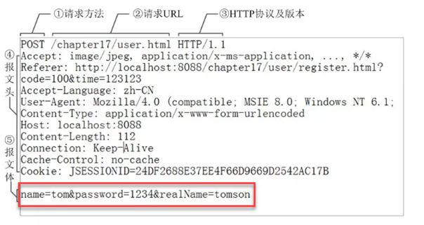

### HTTP请求方式

#### GET

向指定的资源发出“显示”请求。GET请求中会将请求中传递的数据包含在URL中并在浏览器的地址栏中显示。GET请求传递数据时要求数据必须是ASCII字符。GET请求可以被浏览器缓存

#### POST

向指定资源提交数据，请求服务器进行处理（例如提交表单或者上传文件）。数据被包含在请求体中。POST请求传递数据时，数据可以试试ASCII字符也可以是字节型数据，默认为字符型。POST请求默认情况下不会被浏览器所缓存

#### HEAD

向服务器索要与GET请求相一致的响应，只不过响应体将不会被返回。这一方法可以在不必传输整个响应内容的情况下，就可以获取包含在响应消息头度中的元信息

#### PUT

向指定资源位置上传其最新内容

#### DELETE

请求服务器删除Request-URI所标识的资源

#### TRACE

回显服务器收到的请求，主要用于测试或诊断

#### OPTIONS

这个方法可使服务器传回该资源所支持的所有HTTP请求方法。用' \*'来代替资源名称，向Web服务器发送OPTIONS请求，可以测试服务器功能是否正常运作

#### CONNECT

HTTP/1.1协议中预留给能够将连接改为管道方式的代理服务器。通常用于SSL加密服务器的链接（经由非加密的HTTP代理服务器）

### GET和POST的区别-面试常问

1.  GET在浏览器回退时是无害的，而POST会再次提交请求
2.  GET产生的URL地址可以被Bookmark，而POST不可以
3.  GET请求会被浏览器主动cache，而POST不会，除非手动设置
4.  GET请求只能进行url编码，而POST支持多种编码方式
5.  GET请求参数会被完整保留在浏览器历史记录里，而POST中的参数不会被保留
6.  GET请求在URL中传送的参数是有长度限制的，而POST则没有。对参数的数据类型GET只接受ASCII字符，而POST即可是字符也可是字节
7.  GET比POST更不安全，因为参数直接暴露在URL上，所以不能用来传递敏感信息
8.  GET参数通过URL传递，POST放在Request body中

## HTTP响应

### 响应行

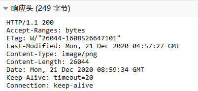

响应行：HTTP/1.1 200

和请求消息相比，响应消息多了一个“响应状态码”，它以“清晰明确”的语言告诉客户端本次请求的处理结果。

#### HTTP状态码分类


#### 常见状态码及含义

| 状态码 | 含义                        |
| --- | ------------------------- |
| 200 | 请求成功，已经正常处理完毕             |
| 301 | 请求永久重定向，转移到其它URL          |
| 302 | 请求临时重定向                   |
| 304 | 请求被重定向到客户端本地缓存            |
| 400 | 客户端请求存在语法错误               |
| 401 | 客户端请求没有经过授权               |
| 403 | 客户端的请求被服务器拒绝，一般为客户端没有访问权限 |
| 404 | 资源未找到，客户端请求的URL在服务端不存在    |
| 500 | 服务端出现异常                   |

#### 状态码明细

##### 1xx


#####  2xx

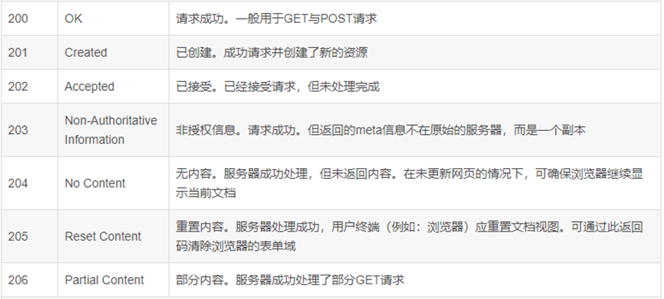

##### 3xx

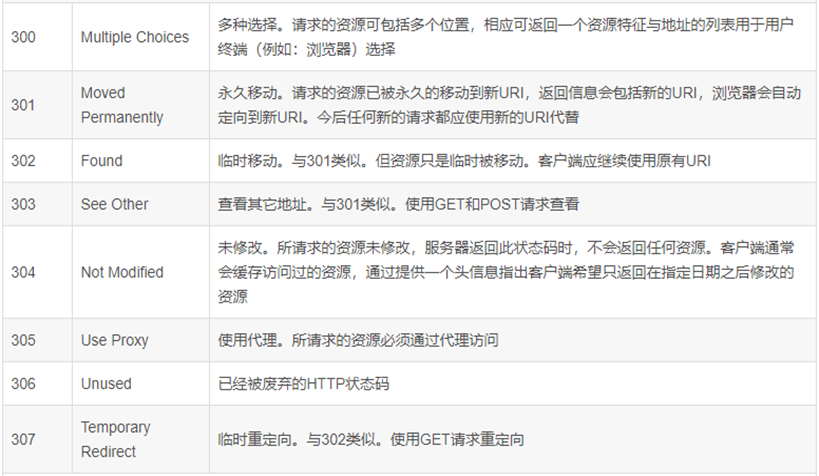

##### 4xx

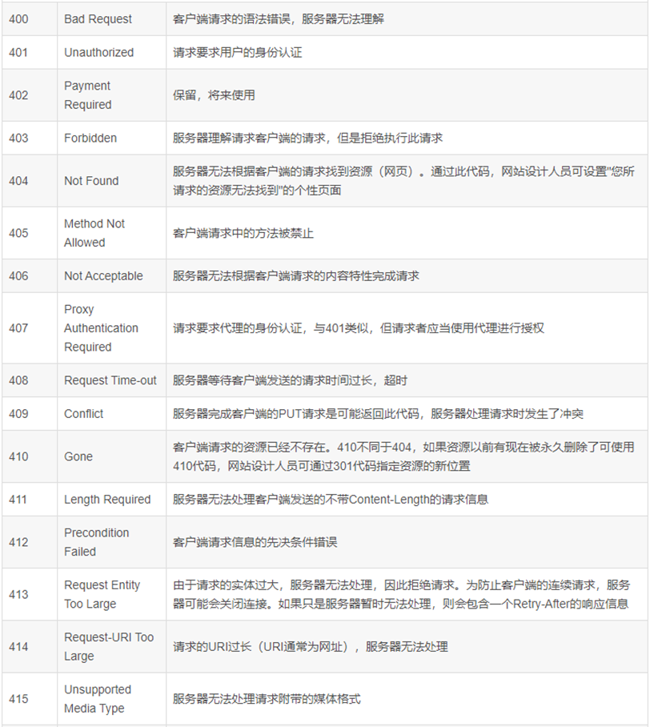


#####  5xx

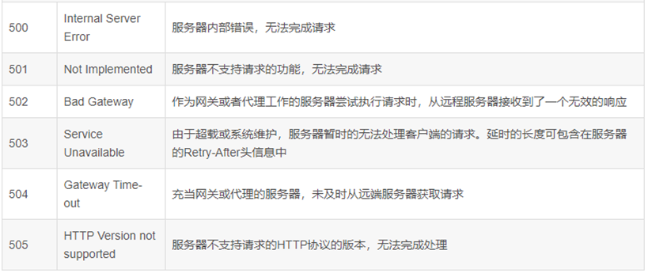

### 响应头

响应头用于告知浏览器当前响应中的详细信息，浏览器通过获取响应头中的信息可以知道应该如何处理响应结果。响应头中信息的格式为`key：value`

#### Date

响应的Date使用的是GMT时间格式，表示响应消息送达时间

#### Server

服务器通过这个Server告诉浏览器服务器的类型

#### Vary

客户端缓存机制或者是缓存服务器在做缓存操作的时候，会使用到Vary头，会读取响应头中的Vary的内容，进行一些缓存的判断

#### Content-Encoding

文档的编码(Encode)方式。用gzip压缩文档能够显著地减少HTML文档的响应时间

#### Content-Length

表示内容长度。只有当浏览器使用持久HTTP连接时才需要这个数据

#### Content-Type

表示响应的文档属于什么MIME类型

#####  什么是MIME?

MIME(Multipurpose Internet Mail Extensions)多用途互联网邮件扩展类型。是设定某种扩展名的文件用一种应用程序来打开的方式类型，当该扩展名文件被访问的时候，浏览器会自动使用指定应用程序来打开。多用于指定一些客户端自定义的文件名，以及一些媒体文件打开方式。

##### MIME作用

HTTP协议所产生的响应中正文部分可以是任意格式的数据，那么如何保证接收方能看得懂发送方发送的正文数据呢？HTTP协议采用MIME协议来规范正文的数据格式。

#####  MIME类型

| Type                                 | Meaning                        |
| ------------------------------------ | ------------------------------ |
| application/postscript               | PostScript file                |
| application/vnd.lotus-notes          | Lotus Notes file               |
| application/vnd.ms-excel             | Excel spreadsheet              |
| application/vnd.ms-powerpoint        | PowerPoint presentation        |
| application/x-gzip                   | Gzip archive                   |
| application/x-java-archive           | JAR file                       |
| application/x-java-serialized-object | Serialized Java object         |
| application/x-java-vm                | Java bytecode (class)file      |
| application/zip                      | Zip archive                    |
| audio/basic                          | Sound file in au or snd format |
| audio/midi                           | MIDI sound file                |
| audio/x-aiff                         | AIFF sound file                |
| audio/x-wav                          | Microsoft Windows sound file   |
| image/gif                            | GIF image                      |
| image/jpeg                           | JPEG image                     |
| image/png                            | PNG image                      |
| image/tiff                           | TIFF image                     |
| image/x-xbitmap                      | X Windows bitmap image         |
| text/css                             | HTML cascading style sheet     |
| text/html                            | HTML document                  |
| text/plain                           | Plain text                     |
| text/xml                             | XML                            |
| video/mpeg                           | MPEG video clip                |
| video/quicktime                      | QuickTime video clip           |
| application/msword                   | Microsoft Word document        |
| application/octet-stream             | Unrecognized or binary data    |
| application/pdf                      | Acrobat (.pdf) file            |

### 响应体

响应体就是响应的消息体，如果是纯数据就是返回纯数据，如果请求的是HTML页面，那么返回的就是HTML代码，如果是JS就是JS代码，如此之类。
