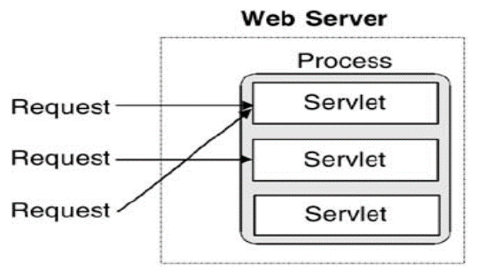
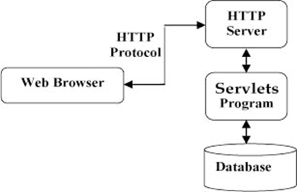
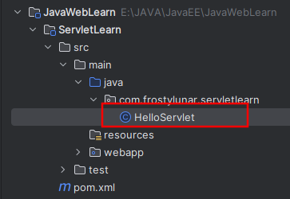
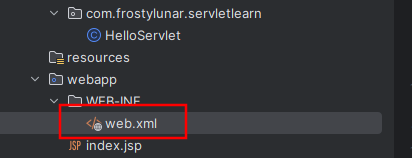
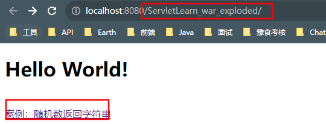
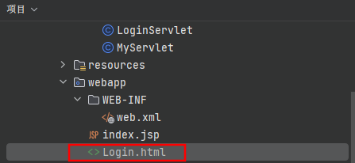
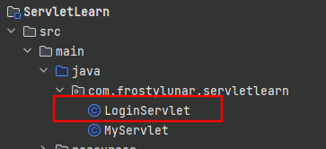
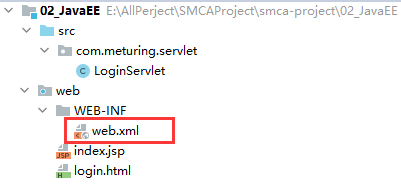

## Servlet简介

Servlet是Server Applet的简称，称为服务端小程序，是JavaEE平台下的技术标准，基于Java语言编写的服务端程序，Web容器或应用服务器实现了Servlet标准所以Servlet需运行在Web容器或应用服务器中，Servlet主要功能在于能在服务器中执行并生成数据。

### Servlet技术特点

Servlet使用单进程多线程方式运行



### Servlet在应用程序中的位置



### 静态资源和动态资源区分

-   静态资源
    每次访问都不需要运算，直接就可以返回的资源,，如HTML  CSS  JS  多媒体文件等等，每次访问获得的资源都是一样的。
-   动态资源
    每次访问都需要运算代码生成的资源，如Servlet JSP，每次访问获得的结果可能都是不一样的。

### Servlet在程序中地位

Servlet是可以接受Http请求并作出响应的一种技术，是JAVA语言编写的一种动态资源。

Servlet是前后端衔接的一种技术，不是所有的JAVA类都可以接收请求和作出相应，Servlet可以在MVC模式中，Servlet作为Controller层(控制层)主要技术，用于和浏览器完成数据交互，控制交互逻辑。

## 快速开发

案例：在后台随机生成一个整数, 当浏览器请求一个Servlet时, 如果生成的是奇数，返回"happy new year", 如果生成的是偶数,返回"happy birthday"。

### 开发步骤

#### 继承HttpServlet 类，重写service方法



```java
/**  
 * hello servlet * * @author FrostyLunar  
 * @date 2023/08/19  
 */@Slf4j  
public class HelloServlet extends HttpServlet {  
    @Override  
    public void service(HttpServletRequest req, HttpServletResponse resp) {  
        log.info("成功请求到HelloServlet!");  
    }  
}
```

#### 编写功能性代码

```java
/**  
 * 自定义Servlet  
 * * @author FrostyLunar  
 * @date 2023/08/19  
 */
 public class MyServlet extends HttpServlet {  
    @Override  
    public void service(HttpServletRequest req, HttpServletResponse resp) {  
        Random random = new Random();  
        //动态生成数据  
        int randomNum = random.nextInt();  
        try {  
            PrintWriter writer = resp.getWriter();  
            writer.write(randomNum%2==0?"Happy birthday!":"Happy new year!");  
        } catch (IOException e) {  
            e.printStackTrace();  
        }  
    }  
}
```

#### 在web.xml中配置Servlet的映射路径



```xml
<?xml version="1.0" encoding="UTF-8"?>  
<web-app xmlns="http://xmlns.jcp.org/xml/ns/javaee"  
         xmlns:xsi="http://www.w3.org/2001/XMLSchema-instance"  
         xsi:schemaLocation="http://xmlns.jcp.org/xml/ns/javaee http://xmlns.jcp.org/xml/ns/javaee/web-app_4_0.xsd"  
         version="4.0">  
    <servlet>  
        <servlet-name>MyServlet</servlet-name>  
        <servlet-class>com.frostylunar.servletlearn.MyServlet</servlet-class>  
    </servlet>  
    <servlet-mapping>  
        <servlet-name>MyServlet</servlet-name>  
        <url-pattern>/myServlet.do</url-pattern>  
    </servlet-mapping>  
</web-app>
```

#### 测试截图

启动项目，进入首页。当我们点击超链接，发起请求，进入`MyServlet`处理流程。

发起`myServlet.do`请求，根据`web.xml`配置的ServletName找到全限定类名，进入此Servlet中执行案例方法：随机生成整数，如果生成的是奇数，返回"happy new year", 如果生成的是偶数,返回"happy birthday"。


## 一个简单的登录Demo

准备一个登录页,可以输入用户名和密码, 输入完毕后向后台Servlet提交用户名和密码.，Servlet接收到用户名和密码之后，校验是否正确，如果正确响应Success，失败响应Fail。

### 创建登录页面



```html
<!DOCTYPE html>  
<html lang="en">  
<head>  
    <meta charset="UTF-8">  
    <title>登录页面</title>  
</head>  
<body>  
<div>  
    <form method="get" action="loginServlet.do">  
        <table style="margin: 0 auto">  
            <tr>  
                <td>用户名：</td>  
                <td><input type="text" name="username" id="username"></td>  
            </tr>  
            <tr>                <td>密码：</td>  
                <td><input type="password" name="password" id="password"></td>  
            </tr>  
            <tr align="center">  
                <td colspan="2"><input type="submit" value="登录"></td>  
            </tr>  
        </table>  
    </form>  
</div>  
</body>  
</html>
```

### 创建Servlet



```java
/**  
 * 登录servlet  
 * * @author FrostyLunar  
 * @date 2023/08/19  
 */
 public class LoginServlet extends HttpServlet {  
    @Override  
    public void service(HttpServletRequest req, HttpServletResponse resp) {  
        String username = req.getParameter("username");  
        String password = req.getParameter("password");  
        PrintWriter writer = null;  
        try {  
            writer = resp.getWriter();  
        } catch (IOException e) {  
            throw new RuntimeException(e);  
        }  
        //动态生成数据  
        if (Objects.isNull(username) || Objects.isNull(password)) {  
            writer.write("<h1 style='color:red'>The user name or password cannot be empty!</h1>");  
        } else if ("admin".equals(username) && "123456".equals(password)) {  
            writer.write("<h1 style='color:green'>Login successful!</h1>");  
        } else {  
            writer.write("<h1 style='color:red'>The username or password is incorrect!</h1>");  
        }  
    }  
}
```

### 配置web.xml



```xml
<?xml version="1.0" encoding="UTF-8"?>  
<web-app xmlns="http://xmlns.jcp.org/xml/ns/javaee"  
         xmlns:xsi="http://www.w3.org/2001/XMLSchema-instance"  
         xsi:schemaLocation="http://xmlns.jcp.org/xml/ns/javaee http://xmlns.jcp.org/xml/ns/javaee/web-app_4_0.xsd"  
         version="4.0">  
    <servlet>  
        <servlet-name>MyServlet</servlet-name>  
        <servlet-class>com.frostylunar.servletlearn.MyServlet</servlet-class>  
    </servlet>  
    <servlet-mapping>  
        <servlet-name>MyServlet</servlet-name>  
        <url-pattern>/myServlet.do</url-pattern>  
    </servlet-mapping>  
    <!--声明一个Servlet-->  
    <servlet>  
        <servlet-name>LoginServlet</servlet-name>  
        <servlet-class>com.frostylunar.servletlearn.LoginServlet</servlet-class>  
    </servlet>  
    <!--给Servlet配置映射路径-->  
    <servlet-mapping>  
        <servlet-name>LoginServlet</servlet-name>  
        <url-pattern>/loginServlet.do</url-pattern>  
    </servlet-mapping>  
    <!--配置首页-->  
    <welcome-file-list>  
        <welcome-file>Login.html</welcome-file>  
    </welcome-file-list>  
</web-app>
```
