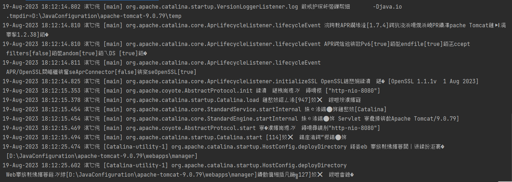
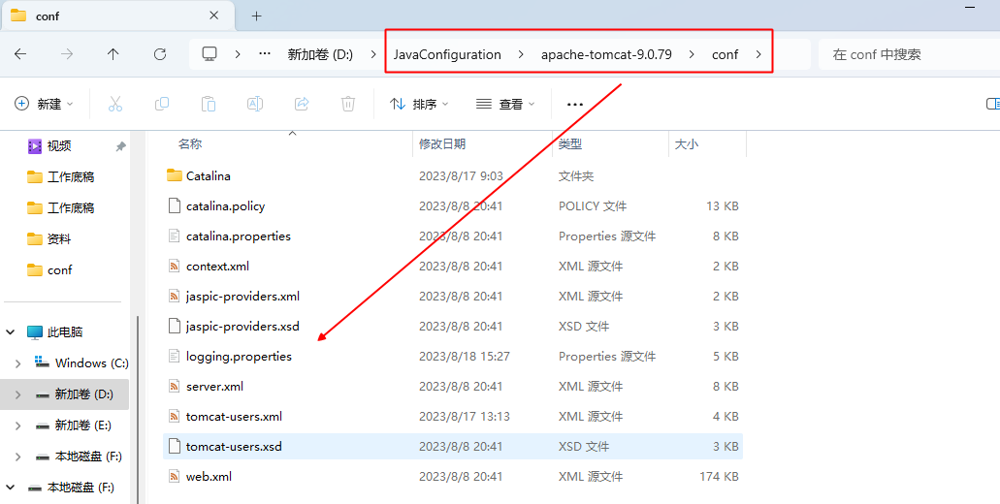
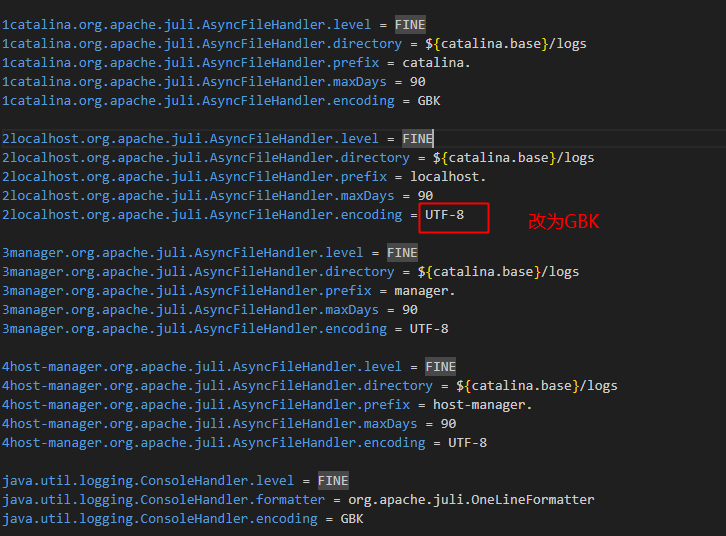
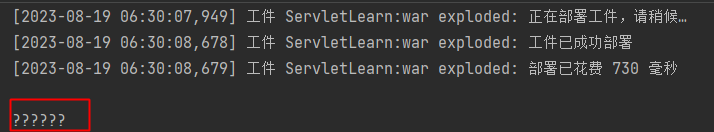
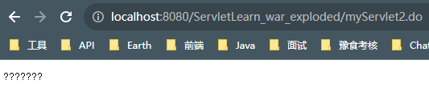
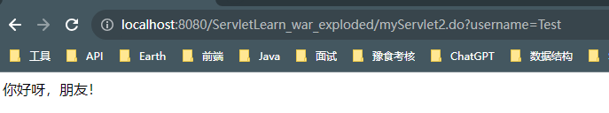

# 关于乱码问题

## 控制台乱码问题

Tomcat启动的过程中，控制台乱码；


解决方式：Tomcat的配置文件`logging.properties`中的所有UTF-8字符替换为GBK。




## POST请求方式

当我们form表单的请求方式为`POST`请求时，提交中文数据到后台Servlet接收，如果不经处理，则接收到的数据为乱码。如下图所示，前端所传数据为`中文`两个字。


乱码原因：Tomcat默认的编码形式为`ISO-8859-1`，浏览器发起请求传递的编码形式为UTF-8，因此后端解析请求体参数时需要设置编码为UTF-8。

```java
req.setCharacterEncoding("UTF-8");
```

在通过HttpServletRequest获取参数前设置请求编码为UTF-8，即可解决中文乱码问题。

## GET请求乱码

当form表单使用get方式发起请求时，如果存在中文则会出现乱码现象。此时有两种解决方案：

+ 解决方案一：
```java
    byte[] bytes = username.getBytes("iso-8859-1");
    String usernameb = new String(bytes,"UTF-8");
    //使用上述方案虽然可以解决问题，但是比较繁琐，每当多一个参数重新设置一遍，推荐使用第二种方式解决
```
+ 解决方案二：

  + 设置Tomcat的配置文件`server.xml`中的URI编码：
 ```xml
      <Connector port="8080" protocol="HTTP/1.1"
                 connectionTimeout="20000"
                 redirectPort="8443" URIEncoding="utf-8"/>
```

> 注意：在Tomcat 9.0版本中，Get方式请求不存在中文乱码问题；

## 响应乱码

我们使用响应`HttpServletResponse`将数据显示到浏览器窗口中时，如果包含中文，则会显示乱码。



此时可以通过设置响应流的编码以及设置浏览器应该以哪种编码解析的方式解决。

```java
//设置响应流编码为UTF-8
resp.setCharacterEncoding("UTF-8");
//告诉浏览器以UTF-8编码解析
resp.setContentType("text/html;charset=UTF-8");
```

> 注意：设置响应流编码应该在获取打印流之前设置，否则不生效。


## 下载文件名乱码

```java
resp.addHeader("Content-Disposition","attachment;filename="+new String (file.getName().getBytes("gbk"),"iso-8859-1"));
```
