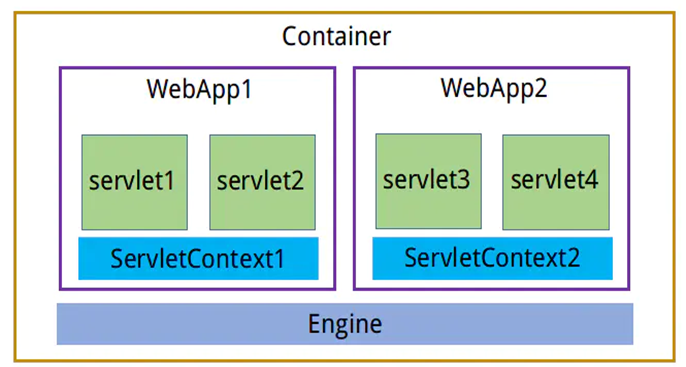
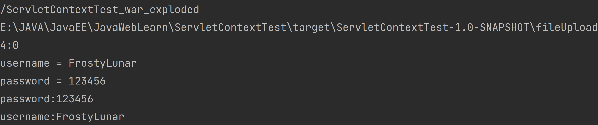
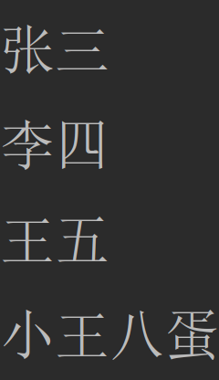

## ServletContext对象

ServletContext官方叫**Servlet上下文**。服务器会为**每一个Web应用创建一个ServletContext对象**。这个对象**全局唯一**，而且Web应用中的所有Servlet**都共享这个对象**。所以叫全局应用程序共享对象



### 作用与API

-   **相对路径转绝对路径**
-   **获取容器的附加信息**
-   **读取配置信息**
-   **全局容器**

| **API**                         | **说明**                                                                 |
| ------------------------------- | ---------------------------------------------------------------------- |
| getContextPath()                | 获取项目的部署名                                                               |
| getRealPath("path")             | 相对路径转绝对路径(文件上传下载时需要注意)&#xA;该方法可以将一个相对路径转换为绝对路径，在文件上传与下载时需要用到该方法做路径的转换。 |
| getServerInfo()                 | 获取容器的附加信息&#xA;返回Servlet容器的名称和版本号                                       |
| getMajorVersion()               | 返回Servlet容器的名称和版本号                                                     |
| getMinorVersion()               | 返回Servlet容器所支持Servlet的主版本号                                             |
| getInitParameter("key")         | 该方法可以读取web.xml文件中\<context-param>标签中的配置信息                              |
| getInitParameterNames()         | 该方法可以读取web.xml文件中所有param-name标签中的值                                     |
| setAttribute("key",ObjectValue) | 向全局容器中存放数据                                                             |
| getAttribute("key")             | 从全局容器中获取数据                                                             |
| removeAttribute("key")          | 根据key删除全局容器中的value                                                     |

### 生命周期

当容器启动时会创建ServletContext对象并一直缓存该对象,直到容器关闭后该对象生命周期结束。
ServletContext对象的生命周期非常长，所以在使用全局容器时不建议存放业务数据。

### 使用案例

案例一

```xml
<!--设置全局初始信息-->  
<context-param>  
    <param-name>username</param-name>  
    <param-value>FrostyLunar</param-value>  
</context-param>  
<context-param>  
    <param-name>password</param-name>  
    <param-value>123456</param-value>  
</context-param>
```

```java
package com.frostylunar.servletcontexttest;  
  
import javax.servlet.ServletContext;  
import javax.servlet.ServletRequest;  
import javax.servlet.ServletResponse;  
import javax.servlet.http.HttpServlet;  
import java.util.Enumeration;  
  
public class Servlet1 extends HttpServlet {  
    @Override  
    public void service(ServletRequest req, ServletResponse res) {  
        //获取Servlet对象的方式  
        //通过req对象  
        ServletContext servletContext1 = req.getServletContext();  
        //通过继承的方法  
        ServletContext servletContext2 = this.getServletContext();  
        //判断两种方式获得的ServletContext对象是否为同一个对象  
        System.out.println(servletContext1 == servletContext2); //true  
        //获取项目部署名  
        String contextPath = servletContext1.getContextPath();  
        System.out.println(contextPath); // /ServletContextTest_war_exploded  
        //获取文件真实路径  
        String fileUpload = servletContext1.getRealPath("fileUpload");  
        System.out.println(fileUpload);// E:\JAVA\JavaEE\JavaWebLearn\ServletContextTest\target\ServletContextTest-1.0-SNAPSHOT\fileUpload  
        //返回此Servlet容器支持的Servlet API的主要版本  
        int majorVersion = servletContext1.getMajorVersion();  
        //返回此Servlet容器支持的Servlet API的次要版本  
        int minorVersion = servletContext1.getMinorVersion();  
        System.out.println(majorVersion + ":" + minorVersion); //4:0  
        //获取web.xml中的全局初始信息，根据key获取value  
        String username = servletContext1.getInitParameter("username");  
        System.out.println("username = " + username);// username = FrostyLunar  
        String password = servletContext1.getInitParameter("password");  
        System.out.println("password = " + password);// password = 123456  
        //获取web.xml中的全局初始信息，获取全部键值对，返回值为枚举类型  
        Enumeration<String> initParameterNames = servletContext1.getInitParameterNames();  
        while (initParameterNames.hasMoreElements()) {  
            String key = initParameterNames.nextElement();  
            String value = servletContext1.getInitParameter(key);  
            System.out.println(key + ":" + value);  
        }  
    }  
}
```


案例二

```java
public class Servlet1 extends HttpServlet {  
    @Override  
    public void service(ServletRequest req, ServletResponse res) {  
        ServletContext servletContext = req.getServletContext();
        servletContext.setAttribute("list", Arrays.asList("张三", "李四", "王五"));  
        servletContext.setAttribute("name", "小王八蛋");  
    }  
}
```

```java
public class Servlet2 extends HttpServlet {  
    @Override  
    public void service(ServletRequest req, ServletResponse res) throws ServletException, IOException {  
        ServletContext servletContext = req.getServletContext();  
        List list = (List) servletContext.getAttribute("list");  
        list.forEach(System.out::println);  
        String name = (String) servletContext.getAttribute("name");  
        System.out.println(name);  
    }  
}
```



## ServletConfig对象

ServletConfig对象对应web.xml文件中的\<servlet>节点。当Tomcat初始化一个Servlet时，会将该Servlet的配置信息，封装到一个ServletConfig对象中。

### 作用与API

我们可以通过该对象读取\<servlet>节点中的配置信息

| API                     | 说明                                                   |
| ----------------------- | ---------------------------------------------------- |
| getInitParameter("key") | 该方法可以读取web.xml文件中\<servlet>标签中\<init-param>标签中的配置信息  |
| getInitParameterNames() | 该方法可以读取web.xml文件中当前\<servlet>标签中所有\<init-param>标签中的值 |

### 使用案例

案例一

```java
public class Servlet3 extends HttpServlet {
    @Override
    protected void service(HttpServletRequest req, HttpServletResponse resp) throws ServletException, IOException {
        ServletConfig servletConfig = this.getServletConfig();
        System.out.println(servletConfig.getInitParameter("brand"));
        System.out.println(servletConfig.getInitParameter("screen"));
    }
}
```

案例二

```java
public class Servlet4 extends HttpServlet {
    @Override
    protected void service(HttpServletRequest req, HttpServletResponse resp) throws ServletException, IOException {
        ServletConfig servletConfig = this.getServletConfig();
        System.out.println(servletConfig.getInitParameter("pinpai"));
        System.out.println(servletConfig.getInitParameter("pingmu"));
    }
}

```

XML

```xml
<?xml version="1.0" encoding="UTF-8"?>
<web-app xmlns="http://xmlns.jcp.org/xml/ns/javaee"
         xmlns:xsi="http://www.w3.org/2001/XMLSchema-instance"
         xsi:schemaLocation="http://xmlns.jcp.org/xml/ns/javaee http://xmlns.jcp.org/xml/ns/javaee/web-app_4_0.xsd"
         version="4.0">
     <servlet>
        <servlet-name>servlet1</servlet-name>
        <servlet-class>com.meturing.testServlet.Servlet1</servlet-class>
    </servlet>
    <servlet>
        <servlet-name>servlet2</servlet-name>
        <servlet-class>com.meturing.testServlet.Servlet2</servlet-class>
    </servlet>
   <servlet-mapping>
        <servlet-name>servlet1</servlet-name>
        <url-pattern>/servlet1.do</url-pattern>
    </servlet-mapping>
    <servlet-mapping>
        <servlet-name>servlet2</servlet-name>
        <url-pattern>/servlet2.do</url-pattern>
    </servlet-mapping>
    
    <servlet>
        <servlet-name>servlet3</servlet-name>
        <servlet-class>com.meturing.testServlet.Servlet3</servlet-class>
        <init-param>
            <param-name>brand</param-name>
            <param-value>ASUS</param-value>
        </init-param>
        <init-param>
            <param-name>screen</param-name>
            <param-value>三星</param-value>
        </init-param>
    </servlet>
    <servlet>
        <servlet-name>servlet4</servlet-name>
        <servlet-class>com.meturing.testServlet.Servlet4</servlet-class>
        <init-param>
            <param-name>pinpai</param-name>
            <param-value>联想</param-value>
        </init-param>
        <init-param>
            <param-name>pingmu</param-name>
            <param-value>京东方</param-value>
        </init-param>
    </servlet>
</web-app>
```
