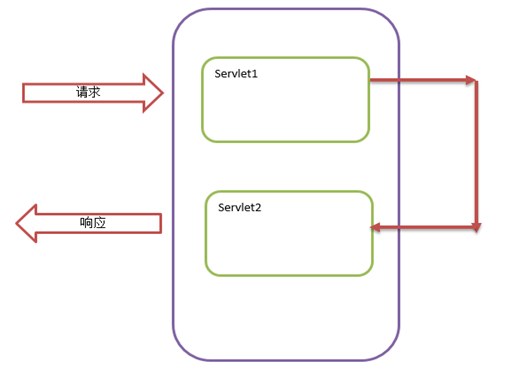
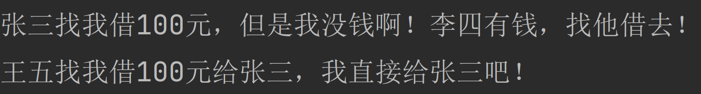
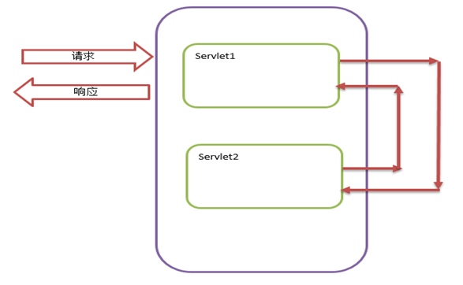
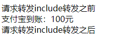
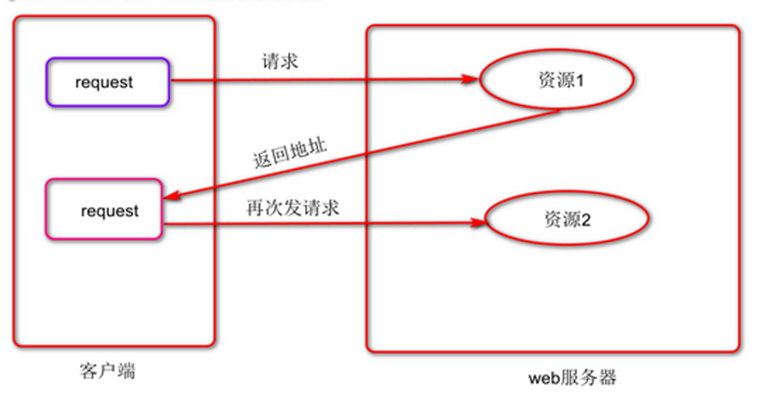
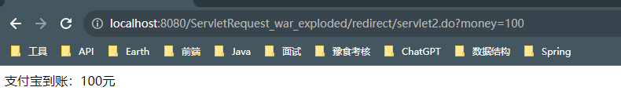
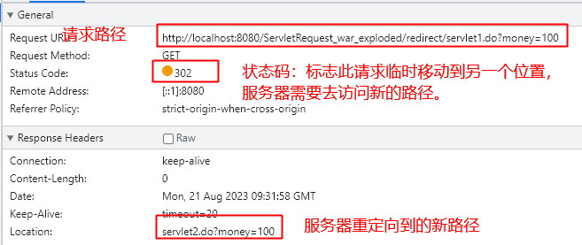

## 请求转发

### forword转发

#### 处理流程

1.  清空Response存放响应正文数据的缓冲区
2.  如果目标资源为Servlet或JSP，就调用它们的service()方法，把该方法产生的响应结果发送到客户端; 如果目标资源文件系统中的静态HTML文档，就读取文档中的数据把它发送到客户端。



#### 处理特点

1.  由于forword()方法先清空用于存放响应正文的缓冲区，因此源Servlet生成的响应结果不会被发送到客户端，只有目标资源生成的响应结果才会被发送到客户端
2.  如果源Servlet在进行请求转发之前，已经提交了响应（flushBuffer(),close()方法），那么forward()方法抛出IllegalStateException。为了避免该异常，不应该在源Servlet中提交响应结果。

#### 测试代码

servlet1 请求转发至servlet2

servlet1
```java
@WebServlet(urlPatterns = "/servlet1.do")  
public class Servlet1 extends HttpServlet {  
    @Override  
    protected void service(HttpServletRequest req, HttpServletResponse resp) throws ServletException, IOException {  
        String money = req.getParameter("money");  
        System.out.println("张三找我借" + money + "元，但是我没钱啊！李四有钱，找他借去！");  
        //创建请求转发器  
        RequestDispatcher requestDispatcher = req.getRequestDispatcher("servlet2.do");  
        //请求转发器做出转发动作  
        requestDispatcher.forward(req, resp);  
    }  
}
```
在forward转发模式下，请求应该完全交给目标资源(servlet2.do)去处理，我们在源组件中，不要做出任何的响应处理。
在forward方法调用之后，也不要继续使用req和resp对象做出任何操作了。

servlet2

```java
@WebServlet(urlPatterns = "/servlet2.do")  
public class Servlet2 extends HttpServlet {  
    @Override  
    protected void service(HttpServletRequest req, HttpServletResponse resp) throws ServletException, IOException {  
        String money = req.getParameter("money");  
        System.out.println("王五找我借" + money + "元给张三，我直接给张三吧！");  
        //设置响应编码  
        resp.setCharacterEncoding("UTF-8");  
        resp.setContentType("text/html;charset=UTF-8");  
        resp.getWriter().write("支付宝到账：" + money + "元");  
    }  
}
```


### include转发

#### 处理流程

1.  如果目标资源为Servlet或JSP，就调用他们的相应的service()方法，把该方法产生的响应正文添加到源Servlet的响应结果中；如果目标组件为HTML文档，就直接把文档的内容添加到源Servlet的响应结果中
2.  返回到源Servlet的服务方法中，继续执行后续代码块



#### 处理特点

include与forward转发相比，包含有以下特点

1.  源Servlet与被包含的目标资源的输出数据都会被添加到响应结果中。
2.  在目标资源中对响应状态码或者响应头所做的修改都会被忽略。

#### 测试代码

servlet1 请求转发至servlet2

servlet1

```java
@WebServlet(urlPatterns = "/include/servlet1.do")  
public class Servlet1 extends HttpServlet {  
    @Override  
    protected void service(HttpServletRequest req, HttpServletResponse resp) throws ServletException, IOException {  
        String money = req.getParameter("money");  
        System.out.println("张三找我借" + money + "元，但是我没钱啊！李四有钱，找他借去！");  
        resp.setCharacterEncoding("UTF-8");  
        resp.setContentType("text/html;charset=UTF-8");  
        resp.getWriter().write("请求转发include转发之前<br/>");  
        RequestDispatcher requestDispatcher = req.getRequestDispatcher("servlet2.do");  
        requestDispatcher.include(req, resp);  
        resp.getWriter().write("请求转发include转发之后");  
    }
}
```

servlet2

```java
@WebServlet(urlPatterns = "/include/servlet2.do")  
public class Servlet2 extends HttpServlet {  
    @Override  
    protected void service(HttpServletRequest req, HttpServletResponse resp) throws IOException {  
        String money = req.getParameter("money");  
        System.out.println("王五找我借" + money + "元，我直接给王五吧！");  
        resp.getWriter().write("支付宝到账：" + money + "元<br/>");  
    }  
}

```


### 注意事项

1.  请求转发是一种服务器的行为，是对浏览器屏蔽。
2.  浏览器的地址栏不会发生变化。
3.  请求的参数是可以从源组件传递到目标组件的
4.  请求对象和响应对象没有重新创建，而是传递给了目标组件。
5.  请求转发可以帮助我们完成页面的跳转。
6.  请求转发可以转发至WEB-INF里。
7.  请求转发只能转发给当前项目的内部资源，不能转发至外部资源。
8.  常用forward

## 响应重定向

响应重定向是通过`HttpServletResponse对象.sendRedirect(“路径”)`的方式实现，是服务器通知浏览器，让浏览器去自主请求其他资源的一种方式。



### 处理流程

1.  用户在浏览器端输入特定URL，请求访问服务器端的某个Servlet
2.  服务器端的Servlet返回一个状态码为302的响应结果，该响应结果的含义为：让浏览器端再请求访问另一个Web资源，在响应结果中提供了另一个Web资源的URL. 另一个Web资源有可能在同一个Web服务器上，也有可能不再同一个Web服务器上
3.  当浏览器端接收到这种响应结果后，再立即自动请求访问另一个Web资源
4.  浏览器端接收到另一个Web资源的响应结果

### 测试代码

servlet1 请求转发至servlet2

```java
@WebServlet(urlPatterns = "/redirect/servlet1.do")  
public class Servlet1 extends HttpServlet {  
    @Override  
    protected void service(HttpServletRequest req, HttpServletResponse resp) throws ServletException, IOException {  
        String money = req.getParameter("money");  
        System.out.println("张三找我借" + money + "元，但是我没钱啊！我知道李四有钱，你找他借去！");  
        resp.sendRedirect("servlet2.do?money=" + money);  
    }  
}
```

```java
@WebServlet(urlPatterns = "/redirect/servlet2.do")  
public class Servlet2 extends HttpServlet {  
    @Override  
    protected void service(HttpServletRequest req, HttpServletResponse resp) throws IOException {  
        String money = req.getParameter("money");  
        System.out.println("张三找我借" + money + "元，我直接给张三吧！");  
        resp.setCharacterEncoding("UTF-8");  
        resp.setContentType("text/html;charset=UTF-8");  
        resp.getWriter().write("支付宝到账：" + money + "元<br/>");  
    }  
}
```



>注意：当我们使用重定向时，`resp.sendRedirect("servlet2.do?money=" + money);`此代码块替换路径为最后一个`/`后面的路径；
>例如：`resp.sendRedirect("redirect/servlet2.do?money=" + money);`重定向后的路径为：`redirect/redirect/servlet2.do?money=100`
### 注意事项

1.  重定向是服务器给浏览器重新指定请求方向 是一种浏览器行为 地址栏会发生变化
2.  重定向时,请求对象和响应对象都会再次产生,请求中的参数是不会携带
3.  重定向也可以帮助我们完成页面跳转
4.  **重定向不能帮助我们访问WEB-INF中的资源
5.  重定向可以定向到外部资源



