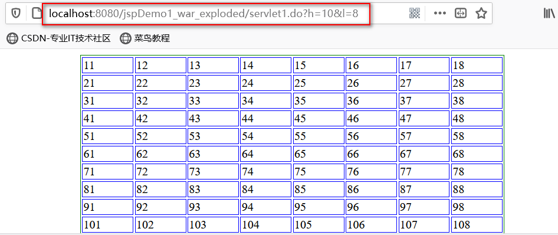
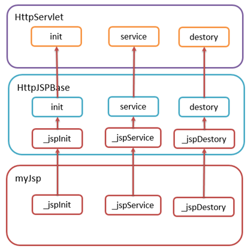
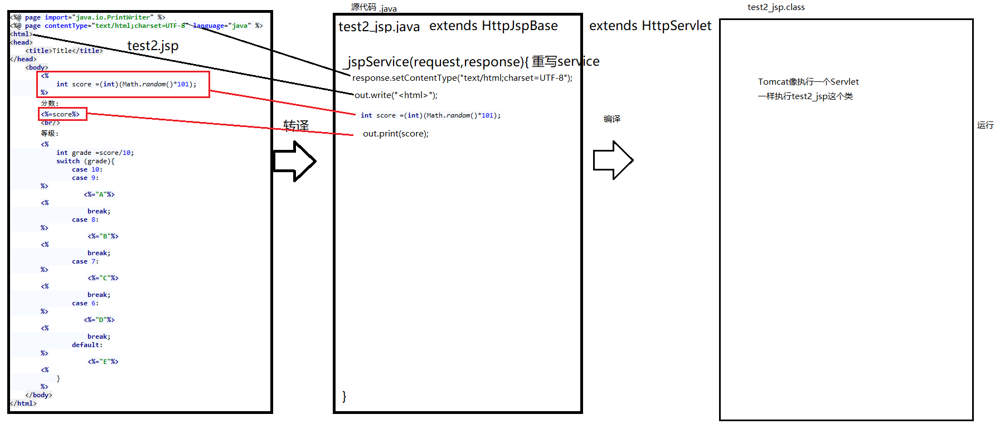
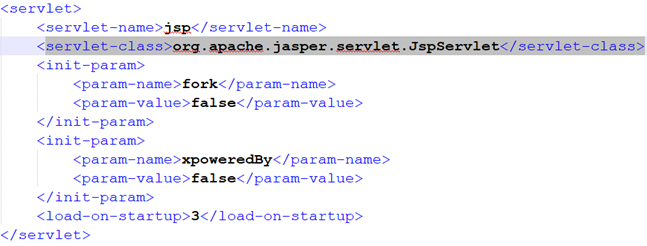

##  JSP 简介

JSP（全称**Java Server Pages**）是由Sun公司主导创建的一种动态网页技术标准。
JSP部署于网络服务器上，可以响应客户端发送的请求，并根据请求内容动态地生成HTML、XML或其他格式文档的WEB网页，然后返回给请求者。

简单来说: **JSP(JavaServer Pages)是一种动态页面技术，它的主要目的是将表示逻辑从Servlet中分离出来**
它实现了Html语法中可以嵌入java编码的扩展（以 <%, %>形式）。JSP与Servlet一样，是在服务器端执行的。通常返回给客户端的就是一个HTML文本，因此客户端只要有浏览器就能浏览。

Java Servlet是JSP的技术基础，而且大型的Web应用程序的开发需要Java Servlet和JSP配合才能完成。JSP具备了Java技术的简单易用，完全的面向对象，具有平台无关性且安全可靠。

例如: 使用Servlet向页面动态响应HTML页面资源

```java
@WebServlet("/servlet1.do")
public class Servlet1 extends HttpServlet {
    @Override
    protected void service(HttpServletRequest req, HttpServletResponse resp) throws ServletException, IOException {
        int h = Integer.parseInt(req.getParameter("h"));
        int l = Integer.parseInt(req.getParameter("l"));
        StringBuilder sbd=new StringBuilder();
        sbd.append("<html lang='en'><head><meta charset='UTF-8'><title>Title</title><style>");
        sbd.append("table{border: 1px solid green;width: 50%;margin: 0px auto;}");
        sbd.append("table td{border: 1px solid blue;}</style></head><body><table>");
        for (int i = 1; i <=h ; i++) {
            sbd.append("<tr>");
            for (int j = 1; j <=l ; j++) {
                sbd.append("<td>");
                sbd.append(String.valueOf(i));
                sbd.append(String.valueOf(j));
                sbd.append("</td>");
            }
            sbd.append("</tr>");
        }
        sbd.append("</table></body></html>");
        // 设置响应内容和编码
        resp.setContentType("text/html;charset=UTF-8");
        resp.setCharacterEncoding("UTF-8");
        // 响应内容给浏览器
        PrintWriter writer = resp.getWriter();
        writer.print(sbd.toString());
    }
}
```



总结:  Servlet作为动态资源，在JAVA代码中通过字符串形式响应数据，通过字符串拼接HTML文档特别繁琐，不利于后期的维护，容易出现问题，如果用于向浏览器响应页面资源操作非常繁琐，且非常不利于页面的更新和维护，所以Servlet不可以作为页面资源，一般专门用接收用户端数据，向用户端响应数据，控制前后端页面跳转，交互逻辑等。**在MVC模式下，作为控制层使用！**

## JSP动态显示Demo

Servlet同样也可以向浏览器动态响应HTML，但是需要大量的字符串拼接处理，在JAVA代码上大量拼接HTML字符串是非常繁琐耗时的一件事，它涉及到HTML本身的字符串处理，还涉及到css样式代码和文件，以及js脚本代码和文件，HTML中的各种外部引入路径等等，处理起来相当的麻烦。

直接在JSP中使用Java代码
```java
<%@ page import="java.io.PrintWriter" %>
<%--
  Created by IntelliJ IDEA.
  User: Mark70
  Date: 2021/1/11
  Time: 13:16
  To change this template use File | Settings | File Templates.
--%>
<%@ page contentType="text/html;charset=UTF-8" language="java" %>
<html>
<head>
    <title>Title</title>
    <style>
        table{border: 1px solid green;width: 50%;margin: 0px auto;}
        table td{border: 1px solid blue;}
    </style>
</head>
<body>
    <%
        int h = Integer.parseInt(request.getParameter("h"));
        int l = Integer.parseInt(request.getParameter("l"));
        StringBuilder sbd=new StringBuilder();
        sbd.append("<table>");
        for (int i = 1; i <=h ; i++) {
            sbd.append("<tr>");
            for (int j = 1; j <=l ; j++) {
                sbd.append("<td>");
                sbd.append(String.valueOf(i));
                sbd.append(String.valueOf(j));
                sbd.append("</td>");
            }
            sbd.append("</tr>");
        }
        sbd.append("</table>");
        out.print(sbd.toString());
    %>
</body>
</html>
```


## JSP运行原理

JSP看似是HTML代码，看似是页面，但是事实上是一种后台技术，当我们第一次发送请求一个JSP资源时，JSP加载引擎会帮助我们将一个.JSP文件转换成一个.java文件，相当于自动的给我们生成了一个Servlet并将页面上HTML代码编入到这个Servlet中，然后运行这个Servlet，将数据响应给浏览器。

**.JSP的本质其实就是一个Servlet**，.JSP中的HTML代码相当于是我们向浏览器响应的HTML内容的模板。

### JSP执行过程

JSP的执行过程大致可以分为两个时期：**转译时期**和**请求时期**

- **转译时期（Translation Time）**
JSP网页转译成Servlet，生成`.java`文件,然后进行编译生成`.class`字节码文件

- **请求时期（Request Time）**
运行`.class`字节码文件，处理请求。

### 具体过程

1. 客户端发出Request请求
2. JSP Container 将JSP转译成Servlet的源代码.java文件
3. 将产生的Servlet源代码经过编译后，生成字节码.class文件
4. 将.class字节码文件加载进入内存并执行，其实就是在运行一个Servlet
5. 通过Response对象将数据响应给浏览器

## 继承结构

JSP文件转换成JAVA代码之后，它默认`继承了HttpJSPBase`,**实现了JSPSourceDependent，和JSPSourceImports两个接口**

其中HttpJSPBase又继承了HttpServlet ，也就是说,JSP本质上就是一个Servlet

### HttpJSPBase

`HttpJSPBase`重写了`init`,`service`和`destory`方法，并且自定义了` _jspInit`,`_ jspService`,`_ jspDestory`. 然后在重写的`init`方法中调用了`_JSPInit`，在重写的`service`方法中调用了`_jspService`,在重写的`destory`方法中调用了`_jspDestory`.

那么我们`JSP`文件编译成JAVA代码后，继承`HttpJspBase`重写的方法是`_jspInit`,`_ jspService`,`_jspDestory`





通过查看代码我们发现，我们页面上所有HTML相关的代码全部被转化成了字符串，并在`_JSPService`方法中，通过输出流的形式响应给了浏览器,`<%%>`中的代码也在该方法中穿插执行.

当JSP网页在执行时，JSP Container 会做检查工作，**如果发现JSP网页有更新修改时，JSP Container 才会再次编译JSP成 Servlet;** 如果JSP没有更新时，就直接执行前面所产生的Servlet。 也就是说,当我们在JSP上修改了代码时，**不需要频繁的更新和重启项目,直接访问就可以完成更新**

## JSP加载引擎

查看tomcat web.xml 我们发现,这里默认配置了一个JSP的加载引擎 — `JSPServlet`



JSP加载引擎的匹配路径规则如下


通过上述代码查看我们发现, 请求JSP是都会被JSP加载引擎所匹配,

### 作用

- 转译JSP页面
	将JSP页面翻译成一个Servlet，这个Servlet是一个java文件，同时也是一个完整的java程序
- 编译JSP对应java文件
	JSP引擎调用java编译器对这个Servlet进行编译，得到可执行文件class
- 请求处理阶段
	JSP引擎调用java虚拟机来解释执行class文件，生成向客户端发送的应答，然后发送给客户端

## JSP的性能问题

有人都会认为JSP的执行性能会和Servlet相差很多，其实执行**性能上的差别只在第一次的执行**。因为JSP在执行第一次后，会被编译成Servlet的类文件，即.class，当再重复调用执行时，就直接执行第一次所产生的Servlet,而不再重新把JSP编译成Servelt。除了第一次的编译会花较久的时间之外，之后JSP和同等功能的Servlet的执行速度就几乎相同了。

JSP慢的原因不仅仅是第一次请求需要进行转译和编译,而是因为JSP作为一种动态资源,本质上就是Servlet,它是需要运行代码才会生成资源,和HTML本身资源已经存在,直接返回,着本质上的差异,另外,**JSP转译之后,内部通过大量IO流形式发送页面内容**,IO流本身是一种重量级操作,是比较消耗资源的