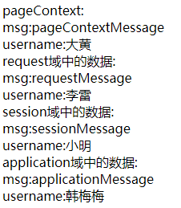
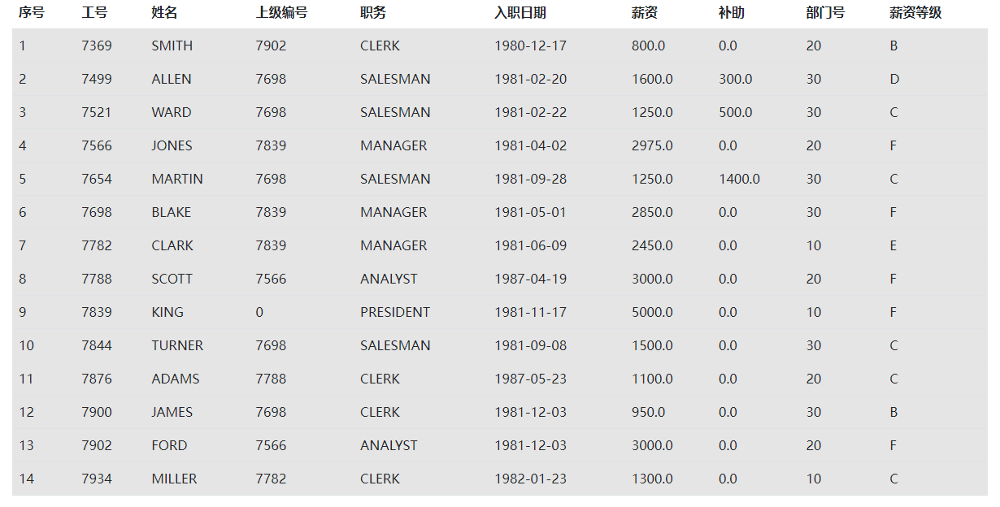

## 什么是EL表达式

EL表达式中定义了一些可以帮助我们快捷从域对象中取出数据的写法,基本语法为

```JSP
${域标志.数据名.属性名(可选)}
```

四个域标志关键字分别为
- `requestScope`  -  request域
- `sessionScope`  -  session域
- `applicationScope`  -  application域
- `pageScope`  -  page域

## EL表达式取出域中的数据

### 指定域中取出数据

```JSP
<%@ page import="com.meturing.pojo.User" %>
<%@ page contentType="text/html;charset=UTF-8" language="java" %>
<html>
   <title>Title</title>
</head>
<body>
	<%--向pageContext域中放数据--%>
	<%
	    pageContext.setAttribute("msg", "pageContextMessage");
	    pageContext.setAttribute("userx", new User(1,"大黄","abcdefg"));
    %>
     <%--
	    从域中取出数据
	    El表达式在获取对象属性值得时候,是通过对象的属性的get方法获取的
	    保证对象的要获取的属性必须有对应get方法才可以
	    EL表达式在使用时是不需要import其他类的
	    El如果获取的是NULL值,是不展示任何信息的
    --%>
    pageContext域中的数据:<br/>
    msg:${pageScope.msg}<br/>
    username:${pageScope.userx.name}<br/>
    <hr/>
	request域中的数据:<br/>
	msg:${requestScope.msg}<br/>
	username:${requestScope.user.name}<br/>
	<hr/>
	session域中的数据:<br/>
	msg:${sessionScope.msg}<br/>
	username:${sessionScope.users[1].name}<br/>
    <hr/>
    application域中的数据:<br/>
    msg:${applicationScope.msg}<br/>
    username:${applicationScope.userMap.a.name}<br/>
    <hr/>
    </body>
</html>
```



### 省略域取数据

```JSP
<%@ page import="com.meturing.pojo.User" %>
<%@ page contentType="text/html;charset=UTF-8" language="java" %>
<html>
   <title>Title</title>
</head>
<body>
	<%--向pageContext域中放数据--%>
	<%
	    pageContext.setAttribute("msg", "pageContextMessage");
	    pageContext.setAttribute("userx", new User(1,"大黄","abcdefg"));
    %>
	 <%--
		EL表达式在取出数据的时候是可以省略域标志的
		EL表达式会自动依次到四个域中去找数据
    --%>
    PageContext username:${userx.name}<br/>
	Request username:${user.name}<br/>
	Session username:${users[1].name}<br/>
	Application username:${userMap.a.name}<br/>
    <hr/>
    <%--
	    ${数据的名字}如果省略域标志,取数据的顺序如下
	    pageContext -> pagecontextMsg:${pageScope.msg}
	    request -> requestMsg:${requestScope.msg}
	    session -> sessionMsg:${sessionScope.msg}
	    application -> applicationMsg:${applicationScope.msg}
    --%>
    ${msg}
    </body>
</html>
```

### 取请求中的参数

```JSP
<%@ page import="com.meturing.pojo.User" %>
<%@ page contentType="text/html;charset=UTF-8" language="java" %>
<html>
   <title>Title</title>
</head>
<body>
	<%--
	    EL表达式获取请求中的参数
    --%>
    username:${param.username}<br/>
    hobby:${paramValues.hobby[0]}
    hobby:${paramValues.hobby[1]}
    </body>
</html>
```


### 总结

1. EL表达式定义在JSP页面上,在转译之后的java文件中,会被转化成java代码
2. EL表达式是一种后台技术,服务器上运行,不是在浏览器上运行,不能用于HTML页面
3. EL表达式底层是通过**反射**实现的,在获取对象属性值时是通过对象的get方法实现的

## EL表达式对运算符的支持

在EL表达式中, 支持运算符的使用

### 运算符的分类

- 算数运算符
	- `+` `-` `*` `/` `%`
- 比较运算符
	-  == `eq` `equals`
	- `>` `gt` `greater` `then`
	- `<` `lt` `lower`  `then`
	- `>=`  `ge`  `greater` `then or equals`
	- `<=`  `le`   `lower then or equals`
	- `!=`   `ne`   `not equals`
- 逻辑运算符
	- `||`  `or`
	- `&& ` `and`
- 三目运算符
	- `${条件 ? 表达式1 : 表达式2}`
- 判空运算符
	- `empty`

### EL表达式运算符的使用

#### 算数运算符

`+`  在EL表达式中的‘+’只有数学运算的功能，没有连接符的功能，它会试着把运算符两边的操作数转换为数值类型，进而进行数学加法运算，最后把结果输出。**若出现   ${'a'+'b'}则会出现异常。**
`/`  **如果除以0 结果为Infinity 而不是出现异常**
`%`  如果和0取余数,那么会出现异常

```JSP
<%@ page import="java.util.List" %>
<%@ page import="java.util.ArrayList" %>
<%@ page contentType="text/html;charset=UTF-8" language="java" %>
<html>
<head>
    <title>Title</title>
</head>
<body>
算数运算符：
<hr/>
${10 + 10}<br/><%-- 20 --%>
${"10" + 10}<br/><%-- 20 --%>
${"10" + "10"}<br/><%-- 20 --%>
<%--${"10a" + 10}<br/>--%><%-- 异常 --%>
${10/0}<br/><%-- Infinity --%>
<%-- ${10%0}<br/>--%><%-- 异常 --%>
</body>
</html>
```

#### 关系运算符/比较运算符

比较运算符推荐写成字母形式,不推荐使用 == >=  <=

```JSP
<%@ page import="java.util.List" %>
<%@ page import="java.util.ArrayList" %>
<%@ page contentType="text/html;charset=UTF-8" language="java" %>
<html>
<head>
    <title>Title</title>
</head>
<body>
关系运算符/比较运算符
<hr/>
${10 == 10}<br/>
${10 eq 10}<br/>
${10 gt 8}<br/>
</body>
</html>
```

#### 逻辑运算符

```JSP
<%@ page import="java.util.List" %>
<%@ page import="java.util.ArrayList" %>
<%@ page contentType="text/html;charset=UTF-8" language="java" %>
<html>
<head>
    <title>Title</title>
</head>
<body>
逻辑运算符
<hr/>
${ true || false}<br/>
${ true or false}<br/>
${ true && false}<br/>
${ true and false}<br/>
</body>
</html>
```

#### 条件运算符/三目运算符

```JSP
<%@ page import="java.util.List" %>
<%@ page import="java.util.ArrayList" %>
<%@ page contentType="text/html;charset=UTF-8" language="java" %>
<html>
<head>
    <title>Title</title>
</head>
<body>
条件运算符/三目运算符
<hr/>
${(100-1)%3==0?10+1:10-1}<br/>
</body>
</html>
```

#### 判断空运算符

```JSP
<%@ page import="java.util.List" %>
<%@ page import="java.util.ArrayList" %>
<%@ page contentType="text/html;charset=UTF-8" language="java" %>
<html>
<head>
    <title>Title</title>
</head>
<body>
判断空运算符
<%--empty 为null 则为true--%>
<%  //向域中放入数据
	pageContext.setAttribute("a",null);
	pageContext.setAttribute("b","");
	int[] arr ={};
	pageContext.setAttribute("arr",arr);
	List list =new ArrayList();
	pageContext.setAttribute("list",list);
%>
<hr/>
${empty a}<br/>
${empty b}<br/><%--字符串长度为0 则认为是空--%>
${empty arr}<br/><%--数组长度为0 认为不是空--%>
${empty list}<br/><%--集合长度为0 认为是空--%>
${list.size() eq 0}<br/><%--集合长度为0 认为是空--%>
</body>
</html>
```

## 使用EL表达式改造案例



```jsp
<%@ page import="java.util.List" %>  
<%@ page import="com.example.servletcase.pojo.Emp" %>  
<%@ page contentType="text/html; charset=UTF-8" pageEncoding="UTF-8" %>  
<!DOCTYPE html>  
<html>  
<head>  
    <title>JSP - Hello World</title>  
    <!-- 引入CSS文件 -->  
    <link rel="stylesheet" href="css/bootstrap.min.css"/>  
    <!-- 导入顺序:JQuery文件\bootstrap.bundle.min.js\bootstrap.min.js -->  
    <script src="js/bootstrap.bundle.min.js"></script>  
    <script src="js/bootstrap.min.js"></script>  
</head>  
<body>  
  
<div style="width: 1200px;margin: 0px auto">  
    <%  
        List<Emp> emps = (List<Emp>) request.getAttribute("emps");  
    %>  
    <table class="table">  
        <thead>  
        <tr>  
            <th scope="col">序号</th>  
            <th scope="col">工号</th>  
            <th scope="col">姓名</th>  
            <th scope="col">上级编号</th>  
            <th scope="col">职务</th>  
            <th scope="col">入职日期</th>  
            <th scope="col">薪资</th>  
            <th scope="col">补助</th>  
            <th scope="col">部门号</th>  
            <th scope="col">薪资等级</th>  
        </tr>  
        </thead>  
        <tbody>        <%  
            for (int i = 0; i < emps.size(); i++) {  
                Emp emp = emps.get(i);  
                pageContext.setAttribute("emp", emp);  
        %>  
        <tr class="table-active">  
            <td><%=i + 1%>  
            </td>  
            <td>${emp.empno}  
            </td>  
            <td>${emp.ename}  
            </td>  
            <td>${emp.mgr}  
            </td>  
            <td>${emp.job}  
            </td>  
            <td>${emp.hiredate}  
            </td>  
            <td>${emp.sal}  
            </td>  
            <td>${emp.comm}  
            </td>  
            <td>${emp.deptno}  
            </td>  
            <td>                ${emp.sal le 500 ? "A": ""}  
                ${emp.sal gt 500 and emp.sal le 1000 ? "B": ""}  
                ${emp.sal gt 1000 and emp.sal le 1500 ? "C": ""}  
                ${emp.sal gt 1500 and emp.sal le 2000 ? "D": ""}  
                ${emp.sal gt 2000 and emp.sal le 2500 ? "E": ""}  
                ${emp.sal gt 2500 ? "F": ""}  
            </td>  
        </tr>  
        <%  
            }  
        %>  
        </tbody>  
    </table>  
</div>  
</body>  
</html>
```
