## Docker的介绍与安装

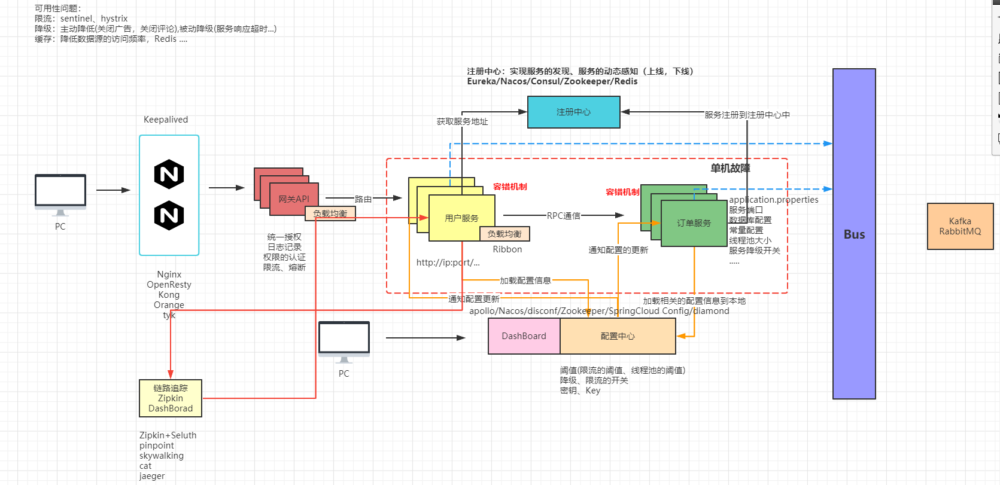

### 什么是Docker？

Docker是基于`Go`语言实现的开源项目。
Docker的主要目标是`Build，Ship and Run Any App,Anywhere`，也就是通过对应用组件的封装、分发、部署、运行等生命周期的管理，使用户的APP（可以是一个WEB应用或数据库应用等等）及其运行环境能够做到一次封装，到处运行。

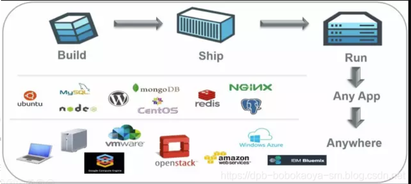

Linux 容器技术的出现就解决了这样一个问题，而 Docker 就是在它的基础上发展过来的。将应用运行在 Docker 容器上面，而 Docker 容器在任何操作系统上都是一致的，这就实现了跨平台、跨服务器。只需要一次配置好环境，换到别的机子上就可以一键部署好，大大简化了操作。

>解决了运行环境和配置问题软件容器，方便做持续集成并有助于整体发布的容器虚拟化技术

### Docker能干什么？

#### 以前的虚拟化技术

虚拟机（`virtual machine`）就是带环境安装的一种解决方案。
它可以在一种操作系统里面运行另一种操作系统，比如在Windows 系统里面运行Linux 系统。应用程序对此毫无感知，因为虚拟机看上去跟真实系统一模一样，而对于底层系统来说，虚拟机就是一个普通文件，不需要了就删掉，对其他部分毫无影响。这类虚拟机完美的运行了另一套系统，能够使**应用程序，操作系统和硬件**三者之间的逻辑不变。
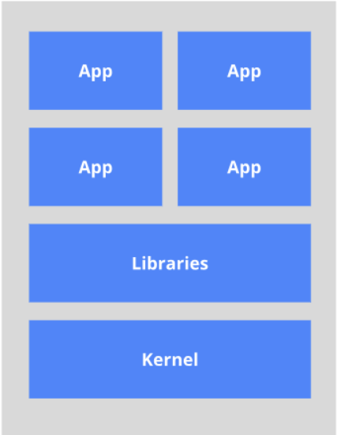

虚拟机的缺点：
1. 资源占用多
2. 冗余步骤多
3. 启动慢
4. 每个App都依赖于公共的Libraries，容易造成冲突。

#### 容器虚拟化技术

由于前面虚拟机存在这些缺点，Linux 发展出了另一种虚拟化技术：Linux 容器（Linux Containers，缩写为 LXC）。
Linux 容器不是模拟一个完整的操作系统，而是对进程进行隔离。有了容器，就可以将软件运行所需的所有资源打包到一个隔离的容器中。容器与虚拟机不同，不需要捆绑一整套操作系统，只需要软件工作所需的库资源和设置。系统因此而变得高效轻量并保证部署在任何环境中的软件都能始终如一地运行。
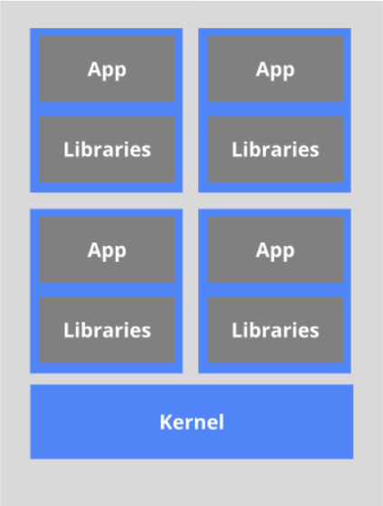
**Docker 和传统虚拟化方式的不同之处：**
1. 传统虚拟机技术是虚拟出一套硬件后，在其上运行一个完整操作系统，在该系统上再运行所需应用进程；
2. 而容器内的应用进程直接运行于宿主机的内核，容器内没有自己的内核，而且也没有进行硬件虚拟，因此容器要比传统虚拟机更为轻便。
3. 每个容器之间互相隔离，每个容器有自己的文件系统 ，容器之间进程不会相互影响，能区分计算资源。

#### 实际的运行

Docker作为开发人员需要掌握，作为`运维人员`必须掌握, 一次构建，随处运行。
1. 更快速的应用交付和部署
2. 更便捷的升级和扩缩容
3. 更简单的系统运维
4. 更高效的计算资源利用

### 相关资源

[Docker官网](http://www.docker.com/)
[Docker仓库](https://hub.docker.com/)

### Docker的安装

#### Docker安装的前提环境

+ Docker支持以下的CentOS版本： 
	+ **CentOS 7 (64-bit) 8** 
	+ **CentOS 6.5 (64-bit) 或更高的版本**
+ 前提条件：
	+ 目前，CentOS 仅发行版本中的内核支持 Docker。 Docker 运行在 CentOS 7 上，要求系统为64位、系统内核版本为 3.10 以上。 
	+ Docker 运行在 CentOS-6.5 或更高的版本的 CentOS 上，要求系统为64位、系统内核版本为 2.6.32-431 或者更高版本。 
	+ 查看自己的内核 
		+ uname命令用于打印当前系统相关信息（内核版本号、硬件架构、主机名称和操作系统类型等）。

你可以使用如下命令查看当前系统的相关信息
+ 内核版本号：`uname -r`
+ 硬件版本号：`uname -m`
+ 主机名称：`hostname`
+ 操作系统类型：`uname -o`

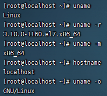

#### Vagrant虚拟机环境

[VirtualBox官网](https://www.virtualbox.org/)
[Vagrant官网](https://www.vagrantup.com/)
[Vagrant镜像仓库](https://app.vagrantup.com/boxes/search)

安装VirtualBox和Vagrant，傻瓜式安装。安装完成后需要重启计算机。

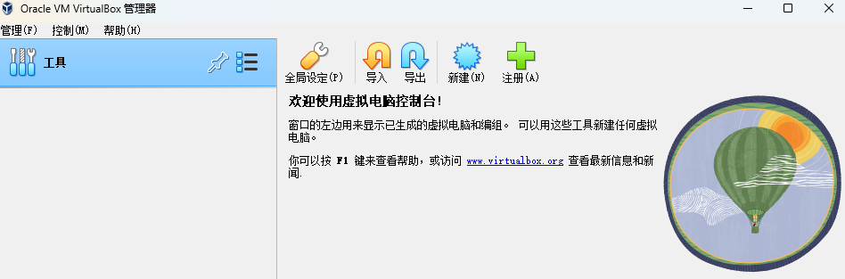

在cmd命令窗口输入`vagrant` 命令弹出如下内容表示 `vagrant` 安装成功。

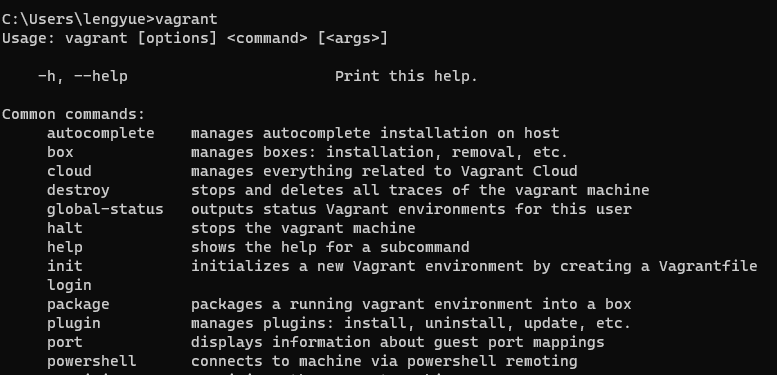


通过Vagrant安装虚拟机：
- 创建一个空的目录，cmd切换到该目录中，然后执行`vagrant init centos/7` 会创建`Vagrantfile`文件。 
	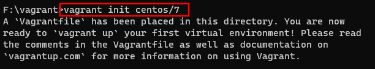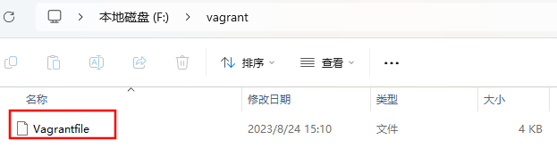
- 执行`vagrant up` 第一次执行的时候会远程下相关的镜像文件，并启动虚拟机。
	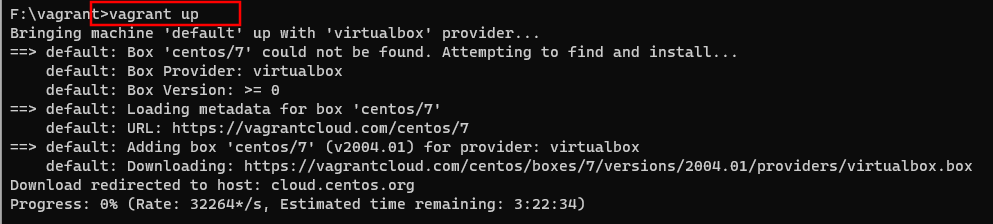
- 连接虚拟机通过`vagrant ssh` 连接，默认的账号密码是： `vagrant vagrant`
	
通过Vagrant仓库下载虚拟机配置文件：
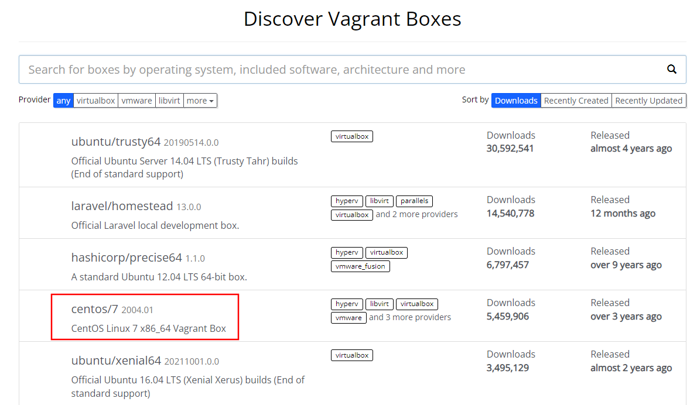


#### 网络配置

配置文件名称：`Vagrantfile`
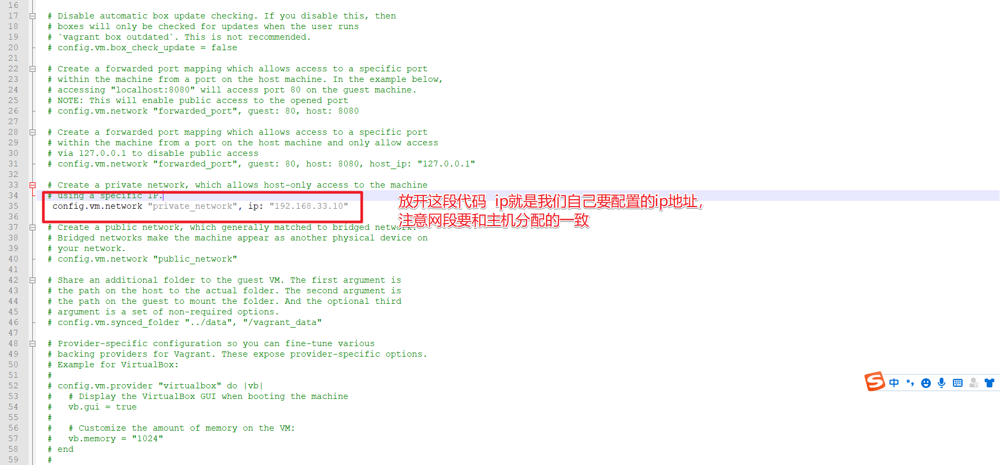

查看当前主机给虚拟机分配的网关网段：

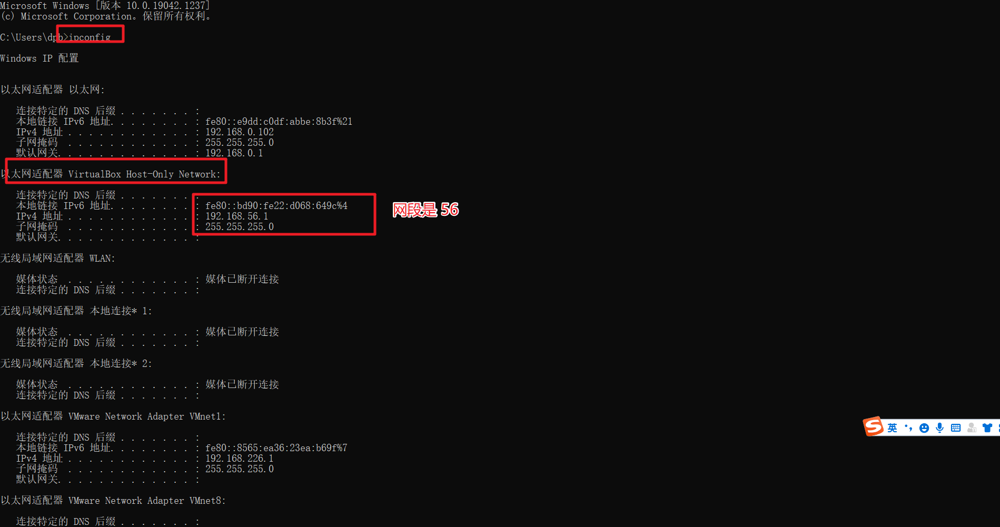

所以修改后的IP为：`192.168.56.10`

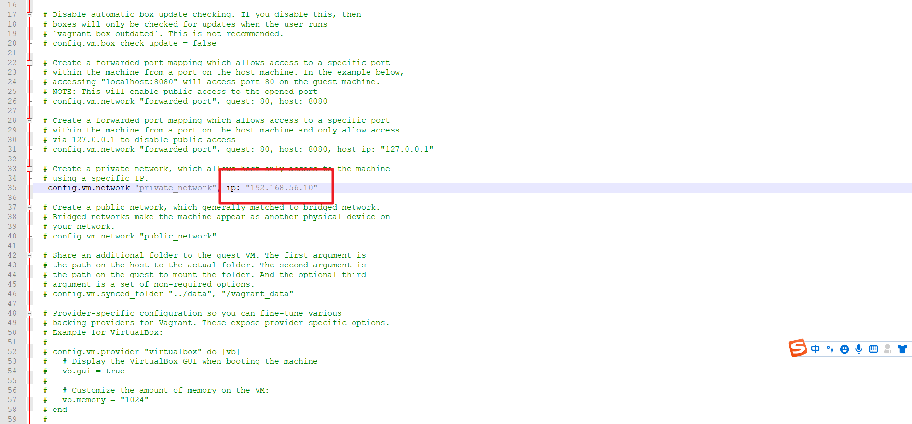

重启测试，使用**XShell**远程连接工具测试连接：采用**SSH**连接，需要使用私钥。
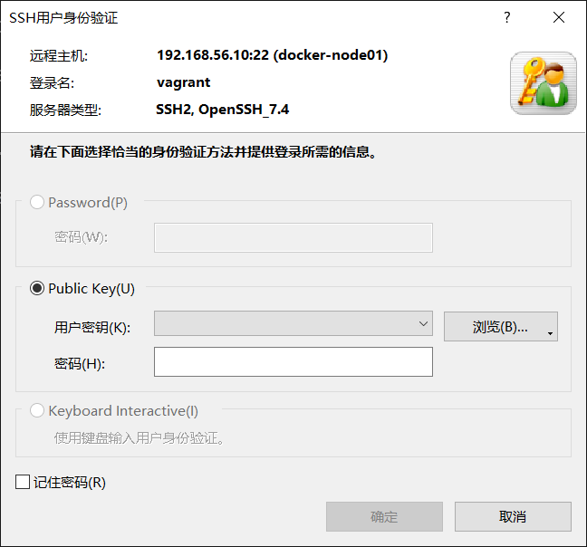

私钥地址：
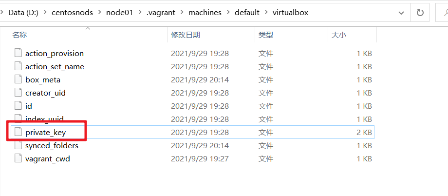

#### Docker的安装

[官方文档](https://docs.docker.com/engine/install/centos/)

1. 卸载原有的环境
	```shell
	sudo yum remove docker \
                  docker-client \
                  docker-client-latest \
                  docker-common \
                  docker-latest \
                  docker-latest-logrotate \
                  docker-logrotate \
                  docker-engine
	```
2. 安装对应的依赖和镜像地址
	```shell
	sudo yum install -y yum-utils
	sudo yum-config-manager --add-repo https://download.docker.com/linux/centos/docker-ce.repo
	```
1. 安装Docker CE
	```shell
	sudo yum install docker-ce docker-ce-cli containerd.io docker-buildx-plugin docker-compose-plugin
	```
1. 启动Docker
	```shell
	sudo systemctl start docker
	```
1. 测试是否安装成功：查看Docker安装版本
	```shell
	sudo docker version
	```

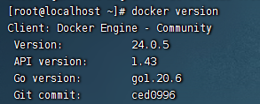

安装成功！

>补充：当我们下载docker镜像的时候，网路过慢，可切换国内镜像源，加快下载速度。
>配置阿里云镜像源：`yum-config-manager --add-repo http://mirrors.aliyun.com/docker-ce/linux/centos/docker-ce.repo`
>yum更新：`yum makecache fast`
>开机启动docker：`sudo systemctl enable docker`

### docker的基本组成


#### 镜像(Image)

Docker镜像（Image）就是一个只读的模板。镜像可以用来创建 Docker 容器，一个镜像可以创建很多容器。

| **Docker** | **面向对象** |
|:-------|:-----|
| 容器     | 对象   |
| 镜像     | 类    |  

#### 容器(Container)

Docker 利用容器（Container）独立运行的一个或一组应用，容器是用镜像创建的运行实例。它可以被启动、开始、停止、删除，每个容器都是相互隔离的、保证安全的平台。可以把容器看做是一个简易版的 Linux 环境（包括root用户权限、进程空间、用户空间和网络空间等）和运行在其中的应用程序。容器的定义和镜像几乎一模一样，也是一堆层的统一视角，唯一区别在于容器的最上面那一层是可读可写的。

#### 仓库(Repository)

仓库（Repository）是集中存放镜像文件的场所。
仓库(Repository)和仓库注册服务器（Registry）是有区别的。仓库注册服务器上往往存放着多个仓库，每个仓库中又包含了多个镜像，每个镜像有不同的标签（tag）。   
仓库分为公开仓库（Public）和私有仓库（Private）两种形式。
最大的公开仓库是 [Docker Hub](https://hub.docker.com/)，存放了数量庞大的镜像供用户下载，国内的公开仓库包括阿里云 、网易云等。

#### 总结

镜像文件生成的容器实例，本身也是一个文件，称为镜像文件。
一个容器运行一种服务，当我们需要的时候，就可以通过docker客户端创建一个对应的运行实例，也就是我们的容器   。
至于仓储，就是放了一堆镜像的地方，我们可以把镜像发布到仓储中，需要的时候从仓储中拉下来就可以了。

### 阿里云镜像加速

默认访问的仓库是在国外，所以访问速度是没法保证的。为了更好的体验，我们可以配置阿里云的镜像加速。
[阿里云容器镜像服务](https://cr.console.aliyun.com/cn-hangzhou/instances/mirrors)：进入阿里云首页后，直接**搜索容器镜像服务**，进入**镜像加速器**。然后根据操作文档，配置阿里云镜像加速。
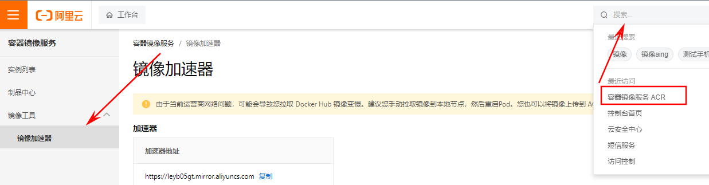
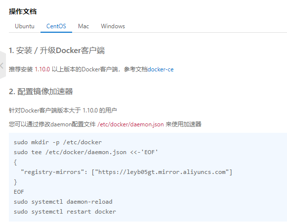
```shell
sudo mkdir -p /etc/docker
sudo tee /etc/docker/daemon.json <<-'EOF' 
{
	"registry-mirrors": ["https://leyb05gt.mirror.aliyuncs.com"] 
}
EOF
sudo systemctl daemon-reload
sudo systemctl restart docker
```
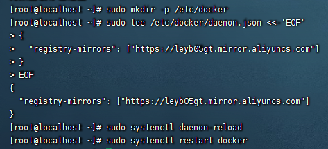

