## Docker的常用命令

### 帮助命令

|**命令**|**说明**|
|---|---|
|docker version|查看docker的版本信息|
|docker info|查看docker详细的信息|
|docker --help|docker的帮助命令，可以查看到相关的其他命令|

### 镜像命令

|**镜像命令**|**说明**|
|---|---|
|docker images|列出本地主机上的镜像|
|docker search 镜像名称|从 docker hub 上搜索镜像|
|docker pull 镜像名称|从docker hub 上下载镜像|
|docker rmi 镜像名称|删除本地镜像|

#### docker images

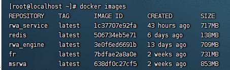

镜像表格信息说明：

|**选项**|**说明**|
|---|---|
|REPOSITORY|表示镜像的仓库源|
|TAG|镜像的标签|
|IMAGE ID|镜像ID|
|CREATED|镜像创建时间|
|SIZE|镜像大小|
参数说明

|**参数**|**说明**|
|---|---|
|-a|列出本地所有的镜像|
|-q|只显示镜像ID|
|--digests|显示镜像的摘要信息|
|--no-trunc|显示完整的镜像信息|

```shell
[root@localhost ~]# docker images
REPOSITORY    TAG       IMAGE ID       CREATED        SIZE
rwa_service   latest    1c37707e92fa   43 hours ago   717MB
redis         latest    506734eb5e71   6 days ago     138MB
rwa_engine    latest    3e0f6ed6691b   13 days ago    709MB
fr            latest    7bdfae2a8a0e   2 weeks ago    731MB
msrwa         latest    638df0c27cf5   2 weeks ago    853MB
[root@localhost ~]# docker images -a
REPOSITORY    TAG       IMAGE ID       CREATED        SIZE
rwa_service   latest    1c37707e92fa   43 hours ago   717MB
redis         latest    506734eb5e71   6 days ago     138MB
<none>        <none>    90c071d3189c   9 days ago     717MB
rwa_engine    latest    3e0f6ed6691b   13 days ago    709MB
fr            latest    7bdfae2a8a0e   2 weeks ago    731MB
msrwa         latest    638df0c27cf5   2 weeks ago    853MB
[root@localhost ~]# docker images -q
1c37707e92fa
506734eb5e71
3e0f6ed6691b
7bdfae2a8a0e
638df0c27cf5
[root@localhost ~]# docker images --digests
REPOSITORY    TAG       DIGEST                                                                    IMAGE ID       CREATED        SIZE
rwa_service   latest    <none>                                                                    1c37707e92fa   43 hours ago   717MB
redis         latest    sha256:c45b9ac48fde5e7ffc59e785719165511b1327151c392c891c2f552a83446847   506734eb5e71   6 days ago     138MB
rwa_engine    latest    <none>                                                                    3e0f6ed6691b   13 days ago    709MB
fr            latest    <none>                                                                    7bdfae2a8a0e   2 weeks ago    731MB
msrwa         latest    <none>                                                                    638df0c27cf5   2 weeks ago    853MB
[root@localhost ~]# docker images --no-trunc
REPOSITORY    TAG       IMAGE ID                                                                  CREATED        SIZE
rwa_service   latest    sha256:1c37707e92fa690683af4389642f1d3ee1cb3a55d1927e5c722cd7aea6f993c5   43 hours ago   717MB
redis         latest    sha256:506734eb5e71d5555e75ecfe2253806f75a6845cec83d7e03ca974137e9dc622   6 days ago     138MB
rwa_engine    latest    sha256:3e0f6ed6691b38a278db60430d6b934f1310281b63c0c59da887ae1199ff822a   13 days ago    709MB
fr            latest    sha256:7bdfae2a8a0e51250274b5763d99d520dca12dd8bfd497e3b3ab8180aa591e23   2 weeks ago    731MB
msrwa         latest    sha256:638df0c27cf58c3faf9c59662c257570e9fb694acf3eaeb8fd9a1cb162eab57a   2 weeks ago    853MB
```

#### docker search

docker hub是Docker的在线仓库，我们可以通过docker search 在上面搜索我们需要的镜像。
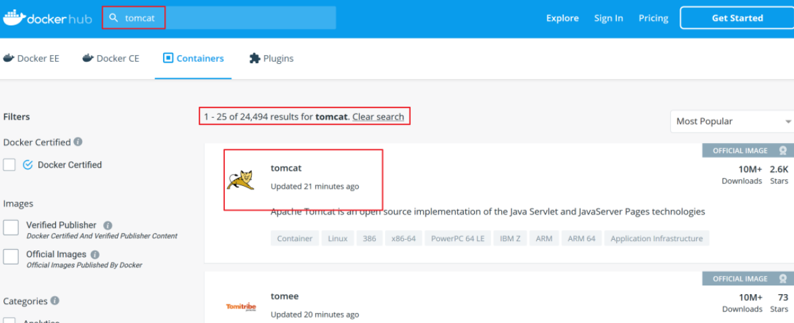

|**参数名称**|**描述**|
|---|---|
|--no-trunc|显示完整的描述信息|
|--limit|分页显示|
|-f|过滤条件 docker search -f STARS=5 tomcat|

```shell
[root@localhost ~]# docker search tomcat
NAME                          DESCRIPTION                                      STARS     OFFICIAL   AUTOMATED
tomcat                        Apache Tomcat is an open source implementati…   3577      [OK]       
tomee                         Apache TomEE is an all-Apache Java EE certif…   110       [OK]       
bitnami/tomcat                Bitnami Tomcat Docker Image                      49                   [OK]
bitnamicharts/tomcat                                                           0                    
secoresearch/tomcat-varnish   Tomcat and Varnish 5.0                           0                    [OK]
vulhub/tomcat                                                                  0                    
islandora/tomcat                                                               0                    
wnprcehr/tomcat                                                                0                    
hivdb/tomcat-with-nucamino                                                     0                    
jumpserver/tomcat                                                              0                    
sismics/tomcat                Apache Tomcat Servlet Container                  1                    
eclipse/rdf4j-workbench       Dockerfile for Eclipse RDF4J Server and Work…   6                    
semoss/docker-tomcat          Tomcat, Java, Maven, and Git on top of debian    0                    [OK]
eclipse/hadoop-dev            Ubuntu 14.04, Maven 3.3.9, JDK8, Tomcat 8        0                    [OK]
gbif/ipt                      The GBIF Integrated Publishing Toolkit (IPT)…   1                    
dhis2/base-dev                Images in this repository contains DHIS2 WAR…   0                    
eclipse/alpine_jdk8           Based on Alpine 3.3. JDK 1.8, Maven 3.3.9, T…   1                    [OK]
misolims/miso-base            MySQL 5.7 Database and Tomcat 8 Server neede…   0                    
dhis2/base                    Images in this repository contains DHIS2 WAR…   0                    
jelastic/tomcat               An image of the Tomcat Java application serv…   4                    
cfje/tomcat-resource          Tomcat Concourse Resource                        2                    
rightctrl/tomcat              CentOS , Oracle Java, tomcat application ssl…   7                    [OK]
amd64/tomcat                  Apache Tomcat is an open source implementati…   6                    
arm64v8/tomcat                Apache Tomcat is an open source implementati…   8                    
softwareplant/tomcat          Tomcat images for jira-cloud testing             0                    [OK]
[root@localhost ~]# docker search tomcat --limit 5 
NAME                          DESCRIPTION                                      STARS     OFFICIAL   AUTOMATED
tomcat                        Apache Tomcat is an open source implementati…   3577      [OK]       
tomee                         Apache TomEE is an all-Apache Java EE certif…   110       [OK]
bitnami/tomcat                Bitnami Tomcat Docker Image                      49                   [OK]
bitnamicharts/tomcat                                                           0                    
secoresearch/tomcat-varnish   Tomcat and Varnish 5.0                           0                    [OK]
[root@localhost ~]# docker search tomcat --limit 5 --no-trunc
NAME                          DESCRIPTION                                                                                            STARS     OFFICIAL   AUTOMATED
tomcat                        Apache Tomcat is an open source implementation of the Java Servlet and JavaServer Pages technologies   3577      [OK]       
tomee                         Apache TomEE is an all-Apache Java EE certified stack where Apache Tomcat is top dog.                  110       [OK]       
bitnami/tomcat                Bitnami Tomcat Docker Image                                                                            49                   [OK]
bitnamicharts/tomcat                                                                                                                 0                    
secoresearch/tomcat-varnish   Tomcat and Varnish 5.0                                                                                 0                    [OK]
[root@localhost ~]# docker search tomcat -f STARS=5 
NAME                      DESCRIPTION                                      STARS     OFFICIAL   AUTOMATED
tomcat                    Apache Tomcat is an open source implementati…   3577      [OK]       
tomee                     Apache TomEE is an all-Apache Java EE certif…   110       [OK]       
bitnami/tomcat            Bitnami Tomcat Docker Image                      49                   [OK]
eclipse/rdf4j-workbench   Dockerfile for Eclipse RDF4J Server and Work…   6                    
rightctrl/tomcat          CentOS , Oracle Java, tomcat application ssl…   7                    [OK]
amd64/tomcat              Apache Tomcat is an open source implementati…   6                    
arm64v8/tomcat            Apache Tomcat is an open source implementati…   8
```

#### docker pull

从Docker Hub上下载文件，配合[docker search](#docker%20search)命令使用

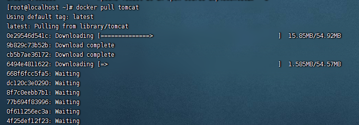
配合下载完成即可。

#### Docker rmi

| **删除方式** | **命令**                               |
| -------- | ---------------------------------- |
| 删除单个 | docker rmi -f 镜像ID               |
| 删除多个 | docker rmi -f 镜像1:TAG 镜像2:TAG  |
| 删除全部 | docker rmi -f $(docker images -qa) |
`-f`表示强制删除


### 容器命令

有镜像才能创建容器。

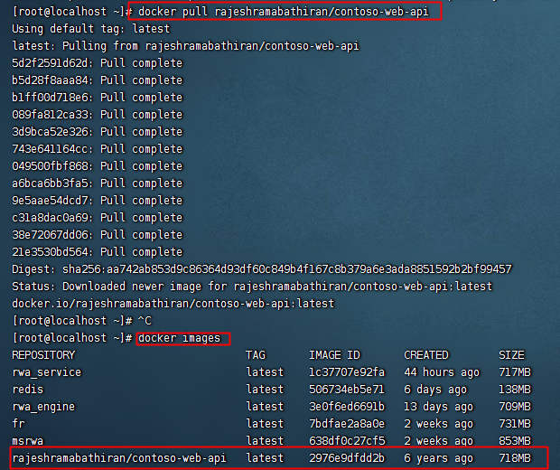
#### 创建并启动容器

创建并启动一个容器的命令
`docker run [OPTIONS] IMAGE [COMMAND]`
OPTIONS中的一些参数

|**options**|**说明**|
|---|---|
|--name|"容器新名字": 为容器指定一个名称|
|-d|后台运行容器，并返回容器ID，也即启动守护式容器|
|`-i`|`以交互模式运行容器，通常与 -t 同时使用`|
|`-t`|`为容器重新分配一个伪输入终端，通常与 -i 同时使用`|
|-P:|随机端口映射|
|-p|指定端口映射|
-p 指定端口映射有如下四种映射方式：
+ ip:hostPort:containerPort 
+ ip::containerPort
+ `hostPort:containerPort` 
+ containerPort

交互式的容器
```shell
docker run -it centos /bin/bash
```

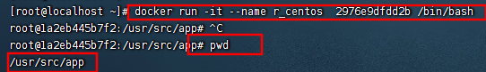

#### 列举运行的容器

我们要查看当前正在运行的容器有哪些，可以通过`ps `命令来查看
`docker ps [OPTIONS]`
OPTONS可用的参数

|**OPTIONS**|**说明**|
|---|---|
|-a|列出当前所有正在运行的容器+历史上运行过的|
|-l|显示最近创建的容器。|
|-n|显示最近n个创建的容器。|
|-q|静默模式，只显示容器编号。|
|--no-trunc|不截断输出。|
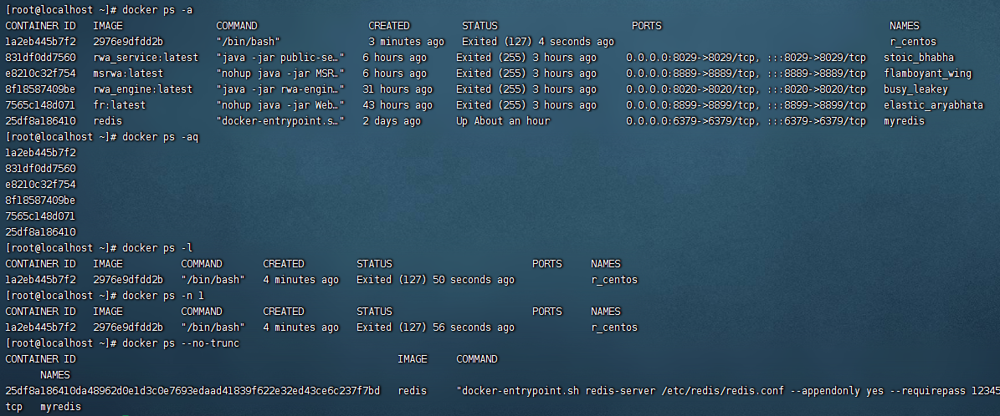
#### 退出容器的命令

我们启动了一个容器后，如何退出容器。

|**退出方式**|**说明**|
|---|---|
|exit|容器停止退出|
|ctrl+p+q|容器不停止退出|

#### 启动容器

`docker start 容器ID或者容器名称`

#### 重启容器

`docker restart 容器id或者名称`

#### 停止容器

`docker stop 容器ID或者名称`
还可以通过强制停止方式处理
`docker kill 容器ID或者名称`

#### 删除容器

有时候容器使用完成就没有作用了，我们想要删除掉容器，这时可以通过rm命令

```shell
docker rm 容器ID
docker rm -f $(docker ps -qa)
docker ps -a -q | xargs docker rm
```

### 其他命令

#### 守护式容器

`docker run -d 容器名称`


我们通过 docker ps -a 可以看到刚刚启动的容器已经退出了
为了让守护式容器能够一直执行，我们可以在启动容器后在后台运行一个循环的脚本

`docker run -d -it  rajeshramabathiran/contoso-web-api:latest  /bin/bash  -c 'while true;do echo hello bobo;sleep 2;done'`
`docker logs -f -t --tail 3 ee174b5d15df`

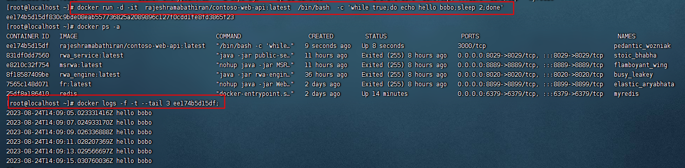

#### 查看容器中运行的进程

`docker top 容器ID`
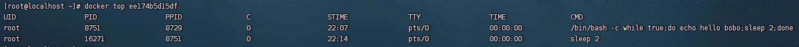

#### 查看容器细节

我们如果想要查看容器细节可以使用`inspect`命令
`docker inspect 容器ID`

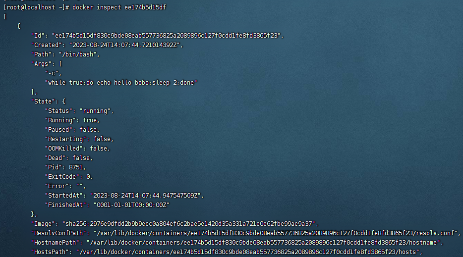

#### 进入运行的容器

|**进入方式**|**说明**|
|---|---|
|exec|在容器中打开新的终端,并且可以启动新的进程|
|attach|直接进入容器启动命令的终端，不会启动新的进程|

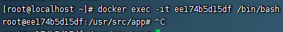

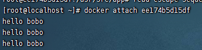


#### 文件复制

`docker cp 容器ID:容器内路径  目的地路径`
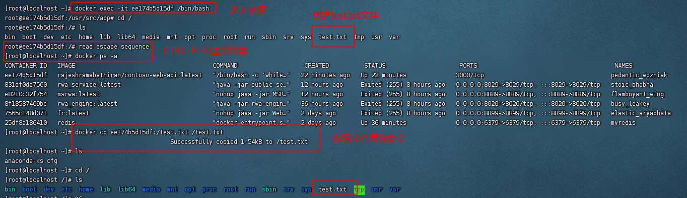

