## Docker数据卷

### 数据卷

​前面我们介绍了镜像和容器，通过镜像我们可以启动多个容器，但是我们发现当我们的容器停止获取删除后，我们在容器中的应用的一些数据也丢失了，这时为了解决容器的数据持久化，我们需要通过容器数据卷来解决这个问题。

#### 数据卷是什么

Docker容器产生的数据，如果不通过docker commit生成新的镜像，使得数据作为镜像的一部分保存下来，那么当容器删除后，数据自然也就没有了，为了能保存数据在docker中我们使用卷。简单来说，容器卷就相当于Redis中持久化方式的RDB和AOF。

#### 解决了什么问题

卷就是目录或文件，存在于一个或多个容器中，由docker挂载到容器，但不属于联合文件系统，因此能够绕过Union File System提供一些用于持续存储或共享数据的特性：
卷的设计目的就是数据的持久化，完全独立于容器的生存周期，因此Docker不会在容器删除时删除其挂载的数据卷。
特点：
1. 数据卷可在容器之间共享或重用数据。
2. 卷中的更改可以直接生效。
3. 数据卷中的更改不会包含在镜像的更新中。
4. 数据卷的生命周期一直持续到没有容器使用它为止。

> 持久化，容器间继承和共享数据

#### 数据卷使用

##### 直接添加

运行一个centos容器

```shell
docker run -it -v /宿主机绝对路径:/容器内目录 镜像名
```

运行此命令直接进入容器中，通过`ls`命令可以看到容器内自动创建了文件夹`dockerfile1`。

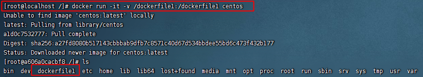

在宿主机的根目录下会多出对应的文件夹

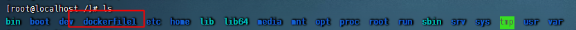

通过inspect命令可以查询容器的详情
```shell
docker inspect 容器ID
```

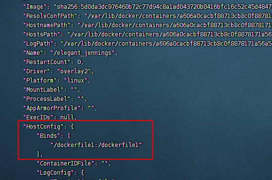

###### 数据共享的操作

宿主机在数据卷`dockerfile1`中添加文件`test.txt`并输入内容`Hello World!`。

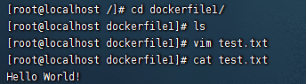

在容器中对应的位置`dockerfile1`中查看此文件。

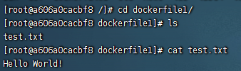

容器中可以同步看到，然后在容器中修改数据

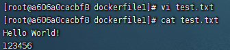

停止掉容器后，数据依然存在，实现了容器中数据的持久化保存。

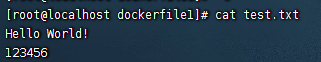

###### 权限的修改

有时候我们想要对容器进行权限控制：不允许在容器中修改挂载的文件。

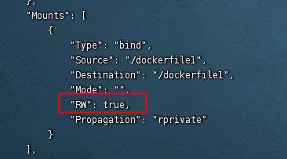

`RW`的属性值为`true`代表容器中该目录的权限为可读写。

我们可以在启动容器的时候设置权限：
```shell
docker run -it -v /宿主机绝对路径:/容器目录:ro 镜像名
```
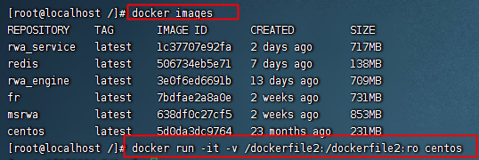

在容器中，文件为只读模式，可查看但是不可以修改。

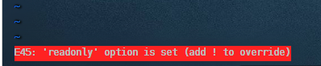

再次通过`docker inspect 容器ID`查看容器的详细信息。此时`RW`为属性值为false，`Mode`为属性值ro，只支持读操作，不允许写操作。

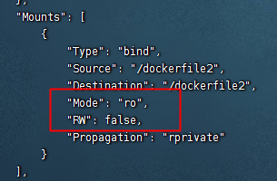

##### Dockerfile添加

宿主机目录下创建一个目录Dockerfile，并在该目录下新建一个文件`testContainer`，内容如下：

```shell
# volume test
FROM centos
VOLUME ["/dataVolumeContainer1","/dataVolumeContainer2"]
CMD echo "finished,--------successfully!"
CMD /bin/bash
```

然后根据此文件构建镜像：
```shell
docker build -f testContainer -t frostylunar/centos:1.0 .
```

| **参数** | **说明**              |
|:---|:----------------|
| -f | Dockerfile文件的路径 |
| -t | 标签              |
| .  | 当前路径            |  

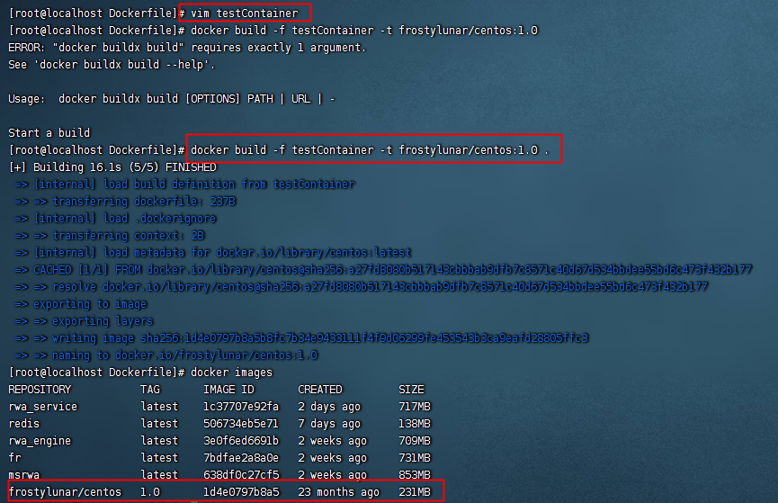

启动我们构建的镜像，并进入容器内部：

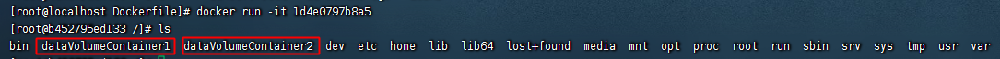

容器内自动创建了两个目录卷，那么这两个目录和宿主机的映射目录在哪呢？这时我们可以通过inspect命令查看。


此时创建了两个匿名容器卷，验证一下是否正确：在宿主机的该目录下创建文件，到容器中查看。

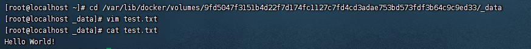

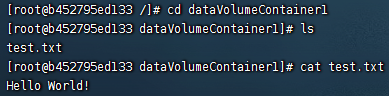

