## 数据卷容器

命名的容器挂载数据卷，其他容器通过挂载这个容器实现数据共享，挂载数据的容器，称之为数据卷容器。

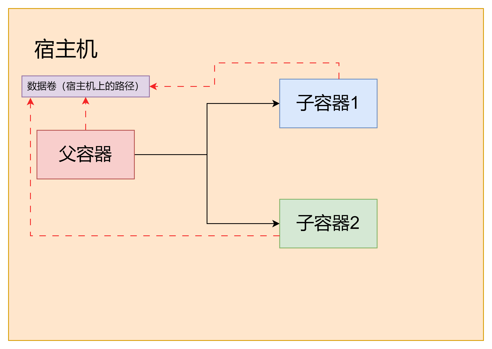

### 启动一个父容器

```shell
docker run -it --name fl01 frostylunar/centos:1.0
```

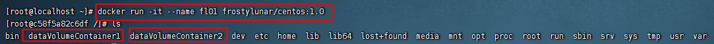

### 创建两个子容器

```shell
docker run -it --name fl02 --volumes-from fl01 frostylunar/centos:1.0
docker run -it --name fl03 --volumes-from fl01 frostylunar/centos:1.0
```

第一个子容器：
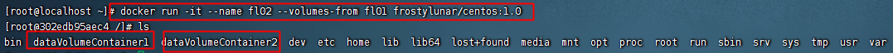

第二个子容器：
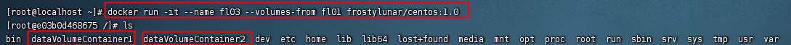

创建子容器完成后，我们就可以开始进行测试了：
在父容器中的`dataVolumeContainer1`数据卷中创建文件test.txt，如下图所示，子容器中均可以访问到此文件。

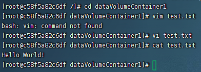
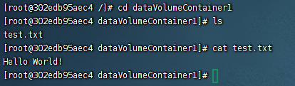
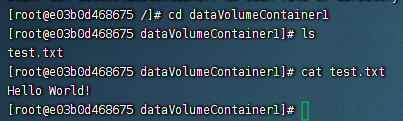

当我们在子容器1中对文件内容进行更改，则父容器和子容器2中文件的内容均进行更改。

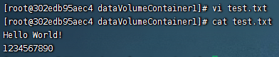

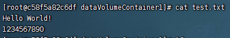


>注意：删除fl01后，容器fl02和fl03仍然可以进行数据共享。

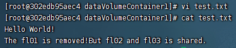

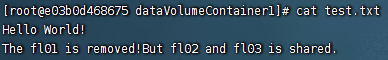

>注意：容器之间配置信息的传递，数据卷的生命周期一直持续到没有容器使用它为止。


