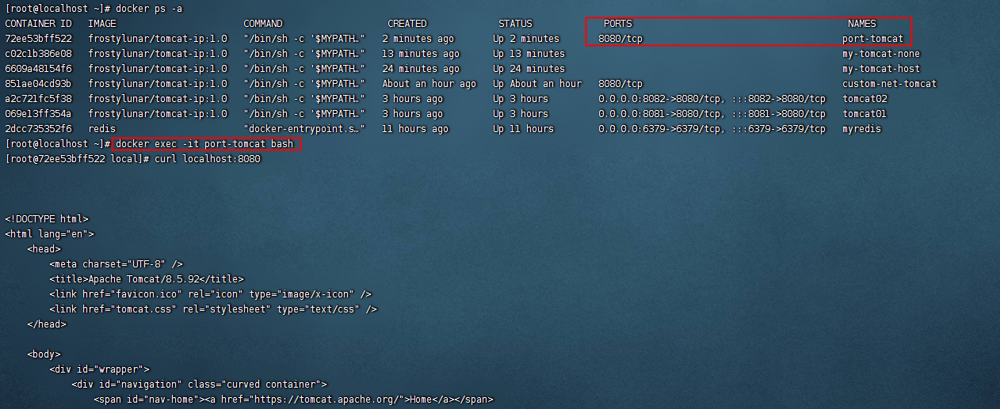
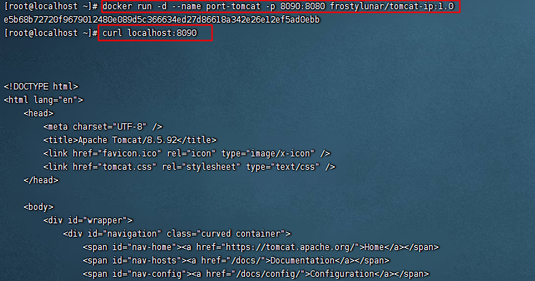
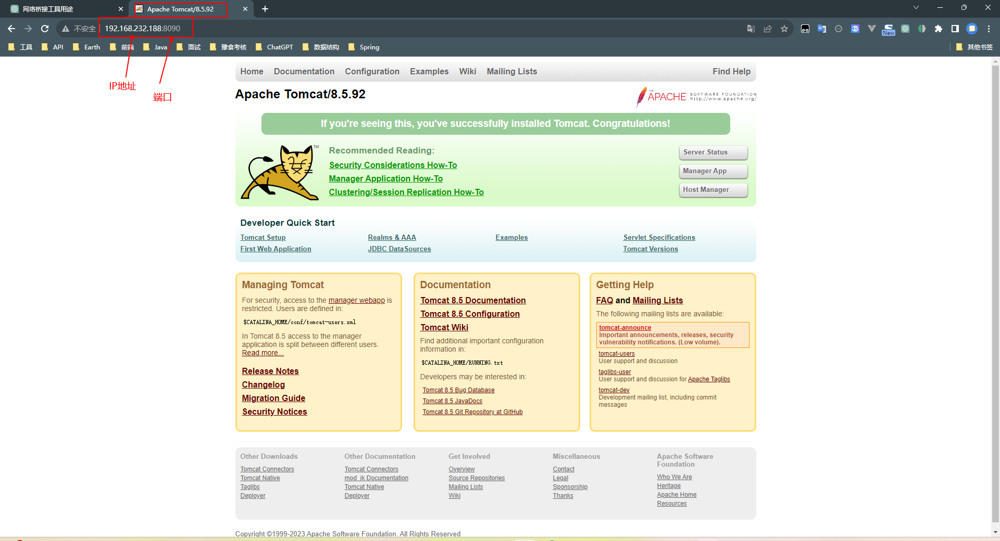
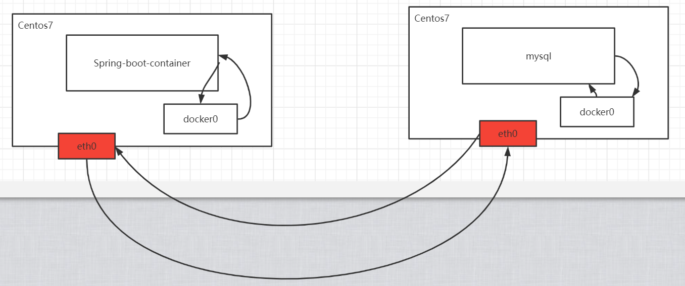

## Docker网络介绍

Docker是基于Linux Kernel的namespace，CGroups，UnionFileSystem等技术封装成的一种自定义容器格式，从而提供了一套虚拟运行环境。

> namespace：用来做隔离的，比如 pid[进程]、net【网络】、mnt【挂载点】
> CGroups：Controller Groups 用来做资源限制，比如内存和CPU等
> Union File Systems：用来做Image和Container分层

### 计算机网络模型

[Docker网络官网](https://docs.docker.com/network/)。

**OSI**：开放系统互联参考模型(Open System Interconnect)
**TCP/IP**：传输控制协议/网际协议(Transmission Control/Internet Protocol)，是指能够在多个不同网络间实现信息传输的协议簇。TCP/IP协议不仅仅指的是TCP 和IP两个协议，而是指一个由FTP、SMTP、TCP、UDP、IP等协议构成的协议簇， 只是因为在TCP/IP协议中TCP协议和IP协议最具代表性，所以被称为TCP/IP协议。

分层思想：分层的基本想法是每一层都在它的下层提供的服务基础上提供更高级的增值服务，而最高层提供能运行分布式应用程序的服务。


客户端发送请求：


服务端接收请求：


### Linux中的网卡

#### 查看网卡信息

查看网卡的命令：`ip a`


通过`ip a`命令可以看到当前的centos中有三个网卡信息，作用分别是：
1. `lo` (Loopback):
    - 类型：环回接口，用于本地回环测试。
    - 状态：UP（已启用），LOWER_UP（链路已连接）。
    - IPv4地址：127.0.0.1/8，表示本地主机。
    - IPv6地址：::1/128，表示本地主机的IPv6地址。
2. `ens33`:
    - 类型：以太网接口，可能是物理网卡或虚拟网卡。
    - 状态：UP（已启用），LOWER_UP（链路已连接）。
    - MAC地址：00:0c:29:8e:8d:90。
    - IPv4地址：192.168.232.188/24，子网掩码为255.255.255.0。
    - 广播地址：192.168.232.255，表示在这个子网内广播。
    - IPv6地址：fe80::421b:125e:c924:9afe/64，链路本地IPv6地址。
3. `docker0`:
    - 类型：Docker桥接接口，用于Docker容器的通信。
    - 状态：UP（已启用）。
    - MAC地址：02:42:f3:fe:38:ea。
    - IPv4地址：172.17.0.1/16，表示Docker桥接网络的网关地址。
    - IPv6地址：fe80::42:f3ff:fefe:38ea/64，链路本地IPv6地址。
4. `veth4ef30a0@if28`:
    - 类型：虚拟以太网接口（veth），与Docker桥接接口`docker0`相连。
    - 状态：UP（已启用），LOWER_UP（链路已连接）。
    - MAC地址：4a:5d:cf:ac:7a:d7。
    - IPv6地址：fe80::485d:cfff:feac:7ad7/64，链路本地IPv6地址。
5. `vethf9e2b80@if56`:
    - 类型：虚拟以太网接口（veth），与Docker桥接接口`docker0`相连。
    - 状态：UP（已启用），LOWER_UP（链路已连接）。
    - MAC地址：2e:78:6c:65:02:b1。
    - IPv6地址：fe80::2c78:6cff:fe65:2b1/64，链路本地IPv6地址。

通过`ip link show`命令查看：


以文件的形式查看网卡：`ls /sys/class/net`


#### 配置文件

在Linux中网卡其实就是文件，所以找到对应的网卡文件即可，存放的路径：`/etc/sysconfig/network-scripts/`


#### 网卡操作

网卡中增加IP地址：`ip addr add 192.168.232.189/24 dev ifcfg-ens33`


删除IP地址: `ip addr delete 192.168.100.120/24 dev ens33`


#### 网卡信息解析

+ 状态：UP/DOWN/UNKOWN等
+ link/ether：MAC地址
+ inet：绑定的IP地址

### Network Namespace

Network Namespace 是实现网络虚拟化的重要功能，它能创建多个隔离的网络空间，它们有独自的网络栈信息。不管是虚拟机还是容器，运行的时候仿佛自己就在独立的网络中。

#### Network Namespce 实战

添加一个`namespace`：`ip netns add ns1`
查看当前具有的`namespace`：`ip netns list`
删除`namespace`：`ip netns delete ns1`


查看namespace[ns1]的网卡情况：`ip netns exec ns1 ip a`


启动网络状态：`ip netns exec ns1 ifup lo`


关闭网络状态：`ip netns exec ns1 ifdown lo`


还可以通过link来设置状态：`ip netns exec ns1 ip link set lo up`


再次添加一个`namespace[ns2]`：`ip netns add ns2`


实现两个`namespace`的通信


要实现两个`network namespace`的通信，我们需要实现到的技术是：
`veth pair`：Virtual Ethernet Pair，是一个成对的端口，可以实现上述功能。


创建一对`link`，也就是接下来要通过veth pair连接的link：`ip link add veth-ns1 type veth peer name veth-ns2`
连接完成后，宿主机中会多出一对网卡，如下所示：


然后将创建好的 `veth-ns1`交给`namespace1`，把`veth-ns2`交给`namespace2`


由上图可知，将网卡分配给两个虚拟空间后，网卡就不在宿主机中了。
再查看`ns1`和`ns2`中的link情况：


此时网卡分别存在于两个虚拟空间中，但是仔细观察发现两个网卡还没有IP地址，显然如果缺少IP地址，两虚拟空间直接无法进行直接通信。
```shell
ip netns exec ns1 ip addr add 192.168.0.11/24 dev veth-ns1
ip netns exec ns2 ip addr add 192.168.0.12/24 dev veth-ns2
```


再次查看，发现`state`是DOWN。所以我们需要启用对应的网卡：


然后就可以进行测试，查看两个虚拟空间之间是否可以连通。


#### Container的NameSpace

按照上面的描述，实际上每个container，都会有自己的`network namespace`，并且是独立的，我们可以进入到容器中进行验证。

容器启动后，如果没有网卡驱动，那么我们需要在打包镜像的时候，在Dockerfile文件中运行`RUN yum -y install initscripts`命令。
>注意：`initscripts` 是一个软件包，它包含了在许多 Linux 系统上用于启动和停止系统服务的初始化脚本和相关工具。在 Linux 中，系统服务（也称为守护进程）是在操作系统启动时自动启动的后台进程，它们可以执行各种任务，例如网络服务、日志记录、定时任务等。


测试两个容器的网络连接：`docker exec -it tomcat01 ping 172.17.0.4`


>问题：此时tomcat01和tomcat02属于两个network namespace，是如何能够ping通的？ 注意这里没有veth-pair技术。

### 深入分析Container网络-Bridge

#### Docker默认Bridge

首先我们通过`ip a`可以查看当前宿主机的网络情况


然后查看 `tomcat01`中的网络： `docker exec -it tomcat01 ip a`可以查看网络IP地址。


测试宿主机与容器的连通性：


既然可以ping通，而且centos和tomcat01又属于两个不同的NetWork NameSpace，他们是怎么连接的？看图


其实在tomcat01中有一个eth0和centos的docker0中有一个veth是成对的，类似于之前实战中的veth-ns1和veth-ns2，要确认也很简单。
执行命令`yum install bridge-utils`安装`bridge-utils`工具。
>`bridge-utils` 是一个 Linux 系统上的实用工具集，用于配置和管理网络桥接（bridging）。网络桥接是一种将多个网络接口连接在一起以工作在同一个网络段的技术。它可以用于多种用途，包括以下几点：
>1. **虚拟化环境中的网络管理：** 在虚拟化环境中，网络桥接用于连接虚拟机和宿主机的物理网络，从而实现虚拟机与外部网络的通信。
>2. **网络流量监控和分析：** 通过将多个网络接口桥接到一个网络桥上，可以在桥接上捕获和分析网络流量，以便进行网络监控和故障排除。
>3. **虚拟网络实验：** 桥接可以用于创建虚拟网络实验环境，其中多台计算机可以直接连接在一起，形成一个独立的虚拟网络。
>4. **容器网络：** 在容器技术中，网络桥接可以用来连接多个容器，使它们能够互相通信和与外部网络通信。
>5. **连接不同物理网络：** 如果你有多个物理网络，你可以使用网络桥接来连接它们，使得这些网络上的设备能够互相通信。
>在安装了 `bridge-utils` 工具集之后，你可以使用其中的命令来创建、配置和管理网络桥接。例如，你可以使用 `brctl` 命令来创建和删除桥接，添加和删除网络接口到桥接上，以及查看当前的网络桥接设置等。
>请注意，随着时间的推移，Linux 网络技术和工具可能会有所变化，因此你可能需要查阅当前系统版本的文档来获取最新的信息和使用方法。

执行`brctl show`命令：


这种网络连接方法我们称之为`Bridge`，其实也可以通过命令查看docker中的网络模式：`docker network ls` , bridge也是docker中默认的网络模式。


不妨检查一下bridge：`docker network inspect bridge`


在`tomcat01`容器中是可以访问互联网的，顺便把这张图画一下咯，NAT是通过iptables实现的。


#### 自定义NetWork

创建一个`network`，类型为 `Bridge`

```shell
docker network create tomcat-net
```


查看`tomcat-net`详情信息：`docker network inspect tomcat-net`


删除`network`：`docker network rm tomcat-net`


创建tomcat容器，并指定使用`tomcat-net`：`docker run -d --name custom-net-tomcat --network tomcat-net frostylunar/tomcat-ip:1.0`


查看`custom-net-tomcat`的网络信息：截取了关键信息


查看网卡接口信息：`brctl show`


此时在`custom-net-tomcat`容器中ping `tomcat01`发现是ping不通的：因为两个容器不在同一网卡上且不在同一网段上。


此时如果`tomcat01`容器能够连接上`tomcat-net`上应该就可以了。


此时发现tomcat01可以连接上custom-net-tomcat，因为此时tomcat01连接着网卡tomcat-net。但是反向ping是不通的，如果要实现双向连接，需要将custome-net-tomcat连接上默认网卡。


### 深入分析 Container网络-Host&None

#### Host

Host模式下，容器将共享主机的网络堆栈，并且主机的所有接口都可供容器使用。容器的主机名将与主机系统上的主机名匹配。

创建一个容器，并指定网络为host：`docker run -d --name my-tomcat-host --network host frostylunar/tomcat-ip:1.0`
查看IP地址：`docker exec -it my-tomcat-host ip a`


检查host网络：`docker inspect host`


#### None

None模式不会为容器配置任何IP，也不能访问外部网络以及其他容器。它具有环回地址，可用于运行批处理作业。
创建一个tomcat容器，并指定网络为none：`docker run -d --name my-tomcat-none --network none frostylunar/tomcat-ip:1.0`


查看IP地址：`docker exec -it my-tomcat-none ip a`


查看none网络：`docker network inspect none`


### 端口映射

创建一个tomcat容器，名称为`port-tomcat`：`docker run -d --name port-tomcat frostylunar/tomcat-ip:1.0`


那么如何访问tomcat项目呢，我们并没有配置端口映射。
首先我们进入容器内部：`docker exec -it port-tomcat bash`
然后发起请求：`curl localhost:8080`
如下图所示，我们可以拿到Tomcat默认首页。



这是在容器内部发起请求，那如果是在容器外呢？
如果是在容器外，那连接会被拒绝，因为容器是完全隔离的环境，如果想访问容器内部则需要做端口映射。


在centos 7中访问该容器内页面，只需要通过`localhost:8090`即可。8090为网卡上的接口映射到容器内的8080端口。



在windows中访问该容器内页面，需要通过`192.168.232.188:8090`即可。**注意：此时需要centos和win网络在同一个网段**




### 多机之间通信

具体深入介绍会在 Docker Swarm 中详聊，本节简单介绍。
在同一台centos7机器上，发现无论怎么折腾，我们一定有办法让两个container通信。 那如果是在两台centos7机器上呢？



VXLAN技术实现：Virtual Extensible LAN(虚拟可扩展局域网)


