## Docker实战

### Docker高可用集群搭建

MySQL集群搭建在实际项目中还是非常必须的，我们通过PXC(`Percona XtraDB Cluster`)来实现强一致性数据库集群搭建。

#### MySQL集群搭建

1. 拉取镜像：`docker pull percona/percona-xtradb-cluster`
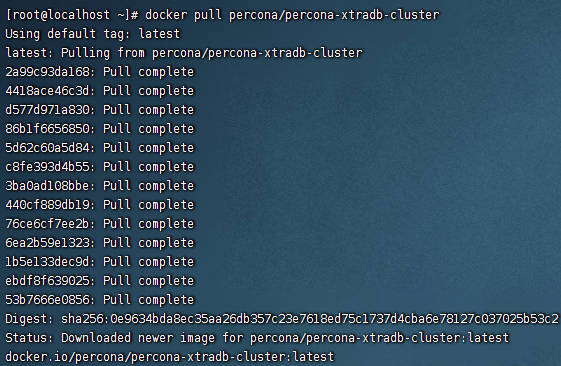

2. 复制pxc镜像【重命名】：`docker tag percona/percona-xtradb-cluster pxc`
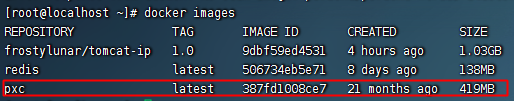

3. 创建单独的网段，给MySQL数据库集群使用：`docker network create --subnet=172.20.0.0/24 pxc-net`
4. 查看网卡列表：`docker network list`
5. 查看网卡详情：`docker network inspect pxc-net`
6. 删除网段：`docker network rm pxc-net`

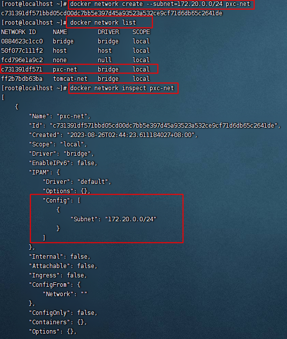

7. 创建和删除volume：`docker volume create --name v1`
8. 删除volume：`docker volume rm v1`
9. 查看容器卷详情：`docker volume inspect v1`

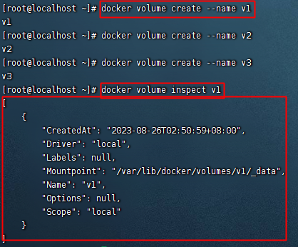

10. 搭建PXC集群
[官方文档](https://docs.percona.com/percona-xtradb-cluster/8.0/docker.html)
+ 运行三个PXC容器
+ CLUSTER_NAME PXC集群名字
+ XTRABACKUP_PASSWORD数据库同步需要用到的密码

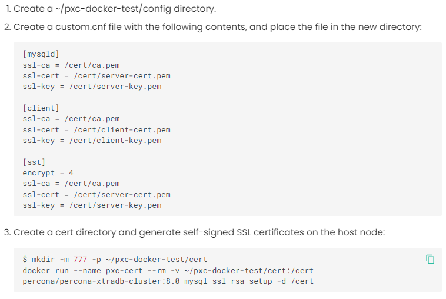


创建第一个节点：`docker run -d --name node1 -p 3301:3306 -v v1:/var/lib/mysql -v ~/pxc-docker-test/cert:/cert -v ~/pxc-docker-test/config:/etc/percona-xtradb-cluster.conf.d  -e MYSQL_ROOT_PASSWORD=123456 -e CLUSTER_NAME=PXC -e EXTRABACKUP_PASSWORD=123456 --privileged --network pxc-net --ip 172.20.0.2 pxc`

创建第二个和第三个节点: 注意 `-e CLUSTER_JOIN=node1`

创建第二个节点：`docker run -d --name node2 -p 3302:3306 -v v2:/var/lib/mysql -v ~/pxc-docker-test/cert:/cert -v ~/pxc-docker-test/config:/etc/percona-xtradb-cluster.conf.d  -e MYSQL_ROOT_PASSWORD=123456 -e CLUSTER_JOIN=node1  -e CLUSTER_NAME=PXC -e EXTRABACKUP_PASSWORD=123456 --privileged --network pxc-net --ip 172.20.0.3 pxc`

创建第三个节点：`docker run -d --name node3 -p 3303:3306 -v v3:/var/lib/mysql -v ~/pxc-docker-test/cert:/cert -v ~/pxc-docker-test/config:/etc/percona-xtradb-cluster.conf.d  -e MYSQL_ROOT_PASSWORD=123456 -e CLUSTER_JOIN=node1  -e CLUSTER_NAME=PXC -e EXTRABACKUP_PASSWORD=123456 --privileged --network pxc-net --ip 172.20.0.4 pxc`

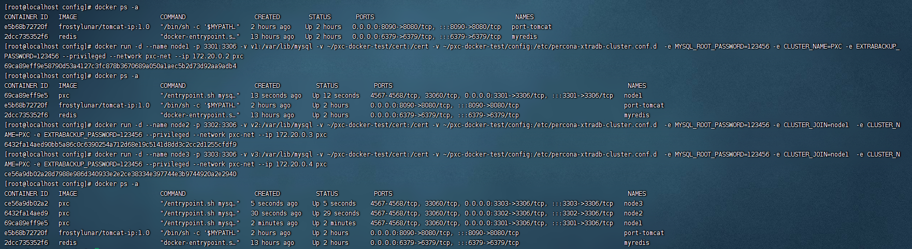

验证：在本地连接远程集群数据库，例如下图：

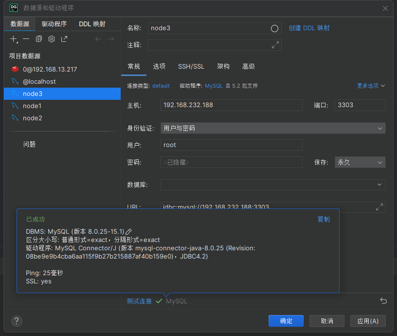

如图所示，在node1中创建数据库test并在此数据库下建立表user。但是在同时，node2以及node3的连接中同时出现了此数据库及数据表。

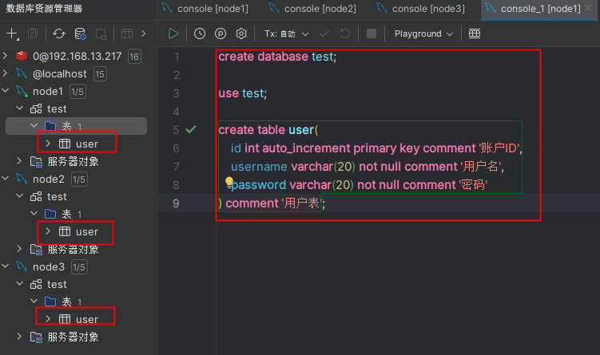

#### 负载均衡服务器搭建

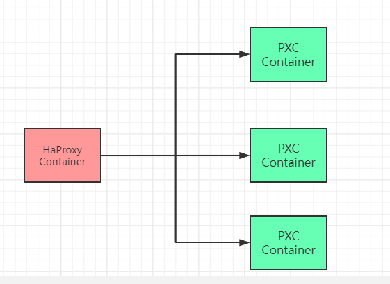

1. 拉取镜像：`docker pull haproxy`
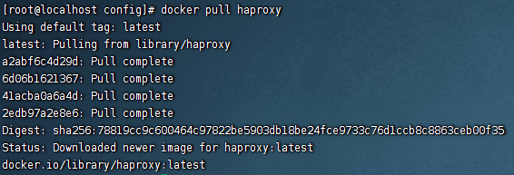

2. 创建配置文件：`vim /tmp/haproxy/haproxy.cfg`
配置文件中的内容：
```cfg
global
	#工作目录，这边要和创建容器指定的目录对应
	# chroot /usr/local/etc/haproxy
	#日志文件
	log 127.0.0.1 local5 info
	#守护进程运行
	daemon

defaults
	log	global
	mode	http
	#日志格式
	option	httplog
	#日志中不记录负载均衡的心跳检测记录
	option	dontlognull
 	#连接超时（毫秒）
	timeout connect 5000
 	#客户端超时（毫秒）
	timeout client  50000
	#服务器超时（毫秒）
 	timeout server  50000

    #监控界面	
    listen  admin_stats
	#监控界面的访问的IP和端口
	bind  0.0.0.0:8888
	#访问协议
 	mode        http
	#URI相对地址
 	stats uri   /dbs_monitor
	#统计报告格式
 	stats realm     Global\ statistics
	#登陆帐户信息
 	stats auth  admin:admin
	#数据库负载均衡
	listen  proxy-mysql
	#访问的IP和端口，haproxy开发的端口为3306
 	#假如有人访问haproxy的3306端口，则将请求转发给下面的数据库实例
	bind  0.0.0.0:3306  
 	#网络协议
	mode  tcp
	#负载均衡算法（轮询算法）
	#轮询算法：roundrobin
	#权重算法：static-rr
	#最少连接算法：leastconn
	#请求源IP算法：source 
 	balance  roundrobin
	#日志格式
 	option  tcplog
	#在MySQL中创建一个没有权限的haproxy用户，密码为空。
	#Haproxy使用这个账户对MySQL数据库心跳检测
 	option  mysql-check user haproxy
	server  MySQL_1 172.20.0.2:3306 check weight 1 maxconn 2000  
 	server  MySQL_2 172.20.0.3:3306 check weight 1 maxconn 2000  
	server  MySQL_3 172.20.0.4:3306 check weight 1 maxconn 2000 
	#使用keepalive检测死链
 	option  tcpka
```

 3. 创建happy容器：`docker run  -d -p 8888:8888 -p 3306:3306 -v /tmp/haproxy:/usr/local/etc/haproxy --name haproxy --privileged --net=pxc-net haproxy`

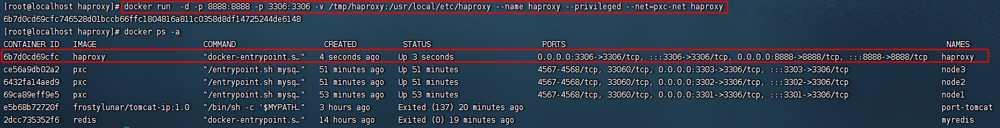

4. 在MySQL数据库上创建用户，用于心跳检测：`CREATE USER 'haproxy'@'%' IDENTIFIED BY '';`
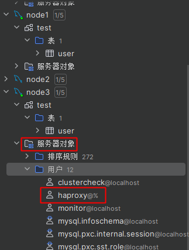

5. 浏览器访问：`http://192.168.232.188:8888/dbs_monitor`
用户名和密码都是`admin`
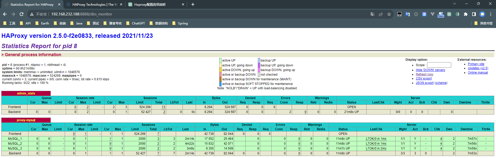

6. 客户端连接Haproxy
```txt
ip:centos_ip
port:3306
user:root
password:123456
```

### Spring Boot项目部署

一个实际的项目部署情况应该是如下图所示：

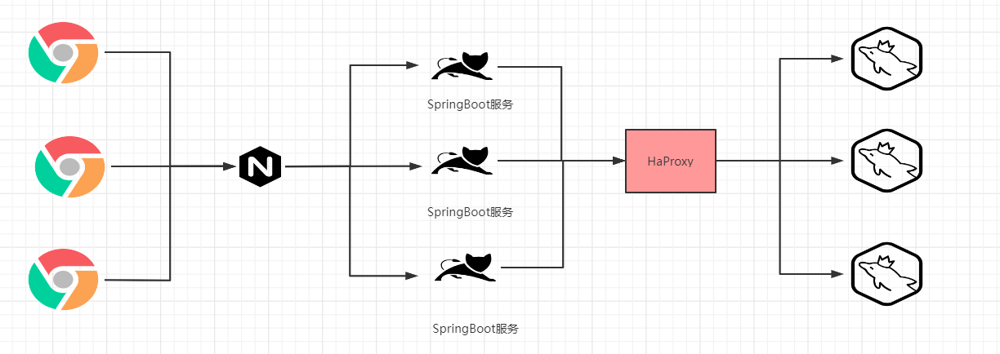

接下来我们就在MySQL集群环境的基础上来完成一个SpringBoot项目的集群部署操作，网络地址分配为：

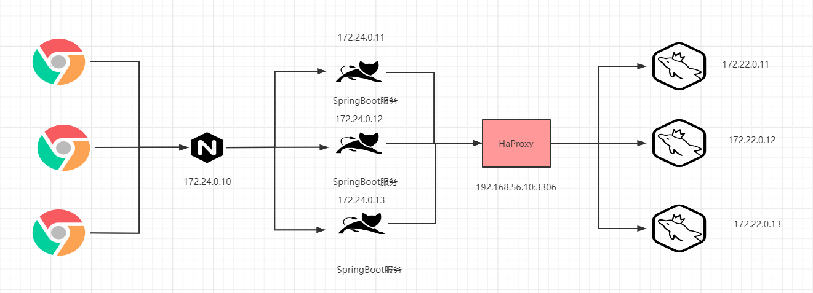

创建对应的网络：`docker network create --subnet=172.24.0.0/24 sbm-net`

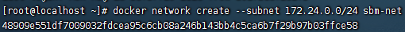
2. 创建SpringBoot项目，通过整合Mybatis实现CRUD操作。
配置文件中配置的JDBC属性为：
```properties
spring.datasource.driverClassName=com.mysql.cj.jdbc.Driver  
spring.datasource.url=jdbc:mysql://192.168.232.188:3306/test?serverTimezone=UTC&useUnicode=true&characterEncoding=utf-8&useSSL=false  
spring.datasource.username=root  
spring.datasource.password=123456  
spring.datasource.type=com.alibaba.druid.pool.DruidDataSource  
mybatis.type-aliases-package=com.bobo.pojo  
mybatis.mapper-locations=classpath:mapper/*.xml
```
3. 对应的项目打包成jar包，并上传到虚拟服务器`/tmp/springboot/`下，然后创建Dockerfile文件。

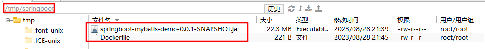

4. 基于Dockerfile构建镜像：`docker build -f Dockerfile -t sbm-image .`
```bash
FROM openjdk:8
MAINTAINER frostylunar
LABEL name="springboot-mybatis" version="1.0" author="FrostyLunar"
COPY springboot-mybatis-demo-0.0.1-SNAPSHOT.jar springboot-mybatis.jar
CMD ["java","-jar","springboot-mybatis.jar"]
```

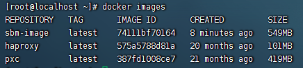

5. 基于Image创建Container：`docker run -d --name sbm03 -p 8083:8080 --net=sbm-net --ip 172.24.0.4 sbm-image`

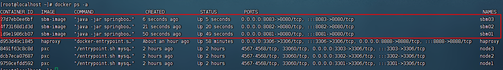

6. 查看启动日志：`docker logs sbm01`

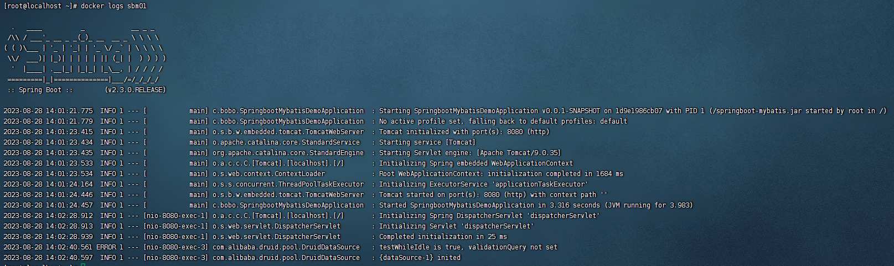

7. 浏览器访问测试：`http://192.168.232.188:8081/user/query`
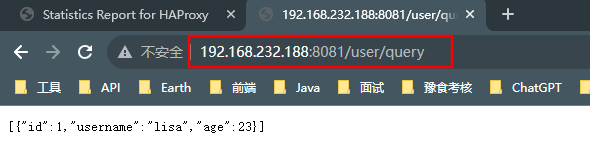

8. 创建多个容器：
```shell
docker run -d --name sbm01 -p 8081:8080 --net=pro-net --ip 172.24.0.2 sbm-image
docker run -d --name sbm02 -p 8082:8080 --net=pro-net --ip 172.24.0.3 sbm-image
docker run -d --name sbm03 -p 8083:8080 --net=pro-net --ip 172.24.0.4 sbm-image
```

9. Nginx安装
我们通过Nginx来实现负载均衡服务
在centos的/tmp/nginx下新建nginx.conf文件，并进行相应的配置

```conf
user nginx;
worker_processes  1;
events {
    worker_connections  1024;
}
http {
    include       /etc/nginx/mime.types;
    default_type  application/octet-stream;
    sendfile        on;
    keepalive_timeout  65; 

   
    server {
        listen 80;
        location / {
         proxy_pass http://balance;
        }
    }
    
    upstream balance{  
        server 172.24.0.2:8080;
        server 172.24.0.3:8080;
        server 172.24.0.4:8080;
    }
    include /etc/nginx/conf.d/*.conf;
}
```

拉取Nginx镜像：`docker pull nginx`
运行Nginx镜像：`docker run -d --name my-nginx -p 80:80 -v /tmp/nginx/nginx.conf:/etc/nginx/nginx.conf --network=sbm-net --ip 172.24.0.5 nginx`

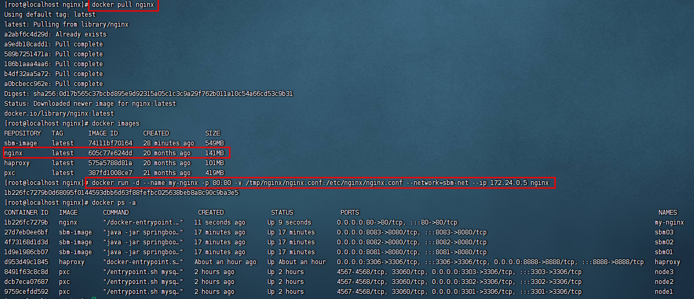

10. 测试：`http://192.168.232.188/user/query`


