## DockerCompose

### DockerCompose介绍

Compose 是用于定义和运行多容器 Docker 应用程序的工具。通过 Compose，您可以使用 YML 文件来配置应用程序需要的所有服务。然后，使用一个命令，就可以从 YML 文件配置中创建并启动所有服务。

DockerCompose的使用步骤
- 创建对应的Dockerfile文件
- 创建yml文件，在yml文件中编排我们的服务
- 通过`docker-compose up`命令 一键运行我们的容器

### Compose安装

[DockerCompose官网安装教程](https://docs.docker.com/compose/install/linux/)

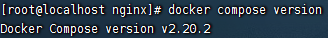

### DockerCompose初体验

[DockerCompose官网案例体验](https://docs.docker.com/compose/gettingstarted/)

创建对应的目录：

```shell
 mkdir composetest
 cd composetest
```

创建Python文件 app.py

```python
import time

import redis
from flask import Flask

app = Flask(__name__)
cache = redis.Redis(host='redis', port=6379)

def get_hit_count():
    retries = 5
    while True:
        try:
            return cache.incr('hits')
        except redis.exceptions.ConnectionError as exc:
            if retries == 0:
                raise exc
            retries -= 1
            time.sleep(0.5)

@app.route('/')
def hello():
    count = get_hit_count()
    return 'Hello World! I have been seen {} times.\n'.format(count)
```
在同级目录下创建`requirements.txt`文件

```txt
flask
redis
```

然后创建对应的Dockerfile文件

```shell
# syntax=docker/dockerfile:1
FROM python:3.7-alpine
WORKDIR /code
ENV FLASK_APP=app.py
ENV FLASK_RUN_HOST=0.0.0.0
RUN apk add --no-cache gcc musl-dev linux-headers
COPY requirements.txt requirements.txt
RUN pip install -r requirements.txt
EXPOSE 5000
COPY . .
CMD ["flask", "run"]
```

然后创建核心的 yml文件`docker-compose.yml`

```yml
version: "3.9"
services:
  web:
    build: .
    ports:
      - "5000:5000"
  redis:
    image: "redis:alpine"
```
最终通过`docker-compose up`命令来启动容器

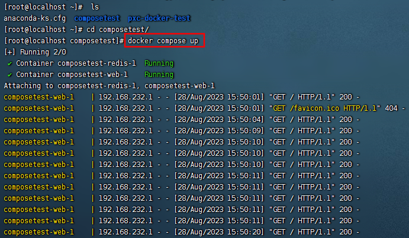

启动时间比较久，耐心等待即可
测试访问：`http://192.168.232.188:8000/`

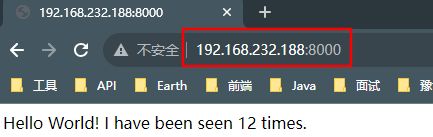

如果要退出服务 `Ctrl+c` 或者 `docker compose down`

### Compose配置规则

docker-compse.yml核心
官网地址：[https://docs.docker.com/compose/compose-file/compose-file-v3/](https://docs.docker.com/compose/compose-file/compose-file-v3/)

```yml
version: '' # 版本
servers:  # 服务
  服务1: web
     # 服务的配置
     build
     network
     images
  服务2: redis
  服务3:
  服务4:
  ...
# 其他配置 网络，全局的规则 数据卷
volumes:
configs:
networks:
```

### Compose一键部署实战

#### 一键部署WP博客

1. 创建my_wordpress目录
```shell
mkdir my_wordpress
```

2. 创建yaml文件，docker-compose.yml
```shell
version: "3.9"
    
services:
  db:
    image: mysql:5.7
    volumes:
      - db_data:/var/lib/mysql
    restart: always
    environment:
      MYSQL_ROOT_PASSWORD: 123456
      MYSQL_DATABASE: wordpress
      MYSQL_USER: wordpress
      MYSQL_PASSWORD: 123456
    
  wordpress:
    depends_on:
      - db
    image: wordpress:latest
    volumes:
      - wordpress_data:/var/www/html
    ports:
      - "8000:80"
    restart: always
    environment:
      WORDPRESS_DB_HOST: db:3306
      WORDPRESS_DB_USER: wordpress
      WORDPRESS_DB_PASSWORD: 123456
      WORDPRESS_DB_NAME: wordpress
volumes:
  db_data: {}
  wordpress_data: {}
```

通过up命令启动：`docker compose up -d`

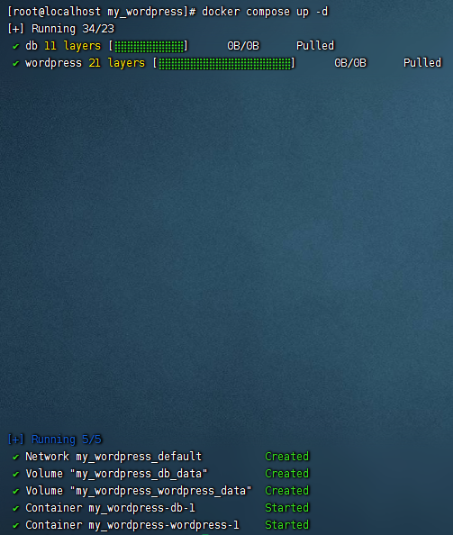

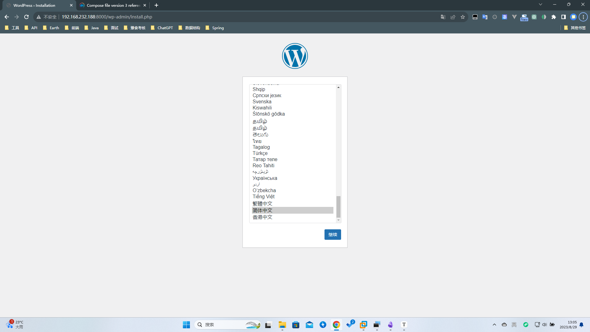

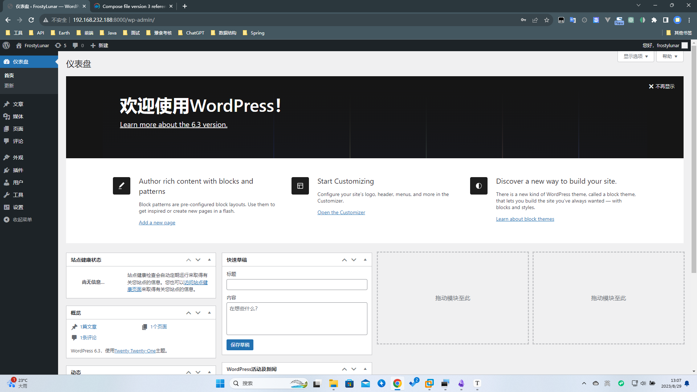

#### SpringBoot项目部署实战

通过Java项目实现计数器项目的功能

```java
@RestController  
public class CounterController {  
    @Autowired  
    StringRedisTemplate stringRedisTemplate;  
  
    @GetMapping("/hello")  
    public String sayHello() {  
        Long counter = stringRedisTemplate.opsForValue().increment("counter");  
        return "页面的访问次数：" + counter;  
    }  
}
```

编写Dockerfile文件

```shell
FROM openjdk:8  
LABEL authors="Frostylunar"  
COPY MyCounter-0.0.1-SNAPSHOT.jar app.jar  
EXPOSE 8080  
ENTRYPOINT ["java", "-jar","app.jar"]
```

编写docker-compose,yml文件

```yml
version: '3.9'  
  
services:  
  myapp:  
    build: .  
    image: myapp  
    depends_on:  
      - redis  
    ports:  
      - "8080:8080"  
  redis:  
    image: "library/redis:alpine"
```

上传到Linux服务器后，通过`docker compose up`命令执行。

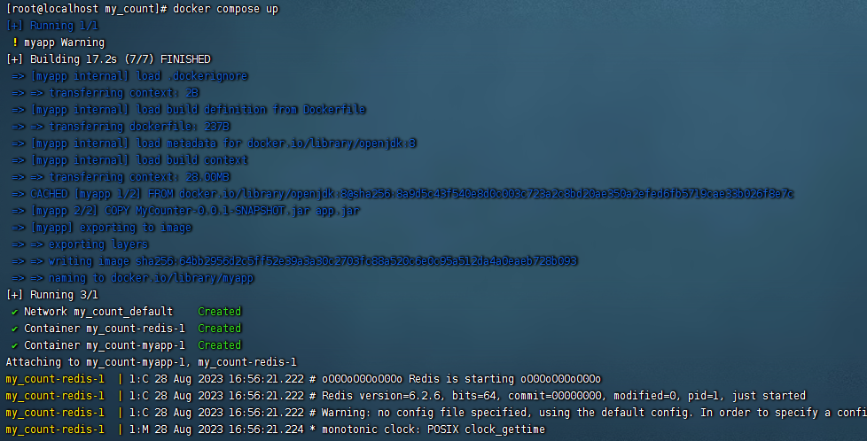

通过访问`http://192.168.232.188:8080/hello`进行测试。

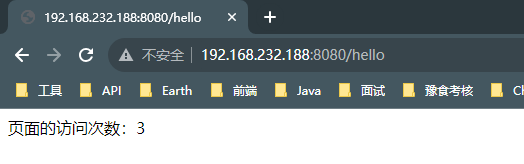

### Compose常见操作

1. 查看版本：`docker compose version`

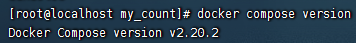

2. 根据yml创建service：`docker compose up`
指定yaml：`docker compose up -f xxx.yaml`
后台运行：`docker compose up -d`

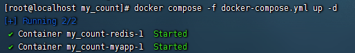

3. 查看启动成功的service：`docker compose ps`

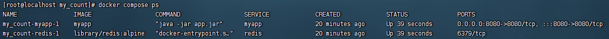

也可以使用`docker ps`

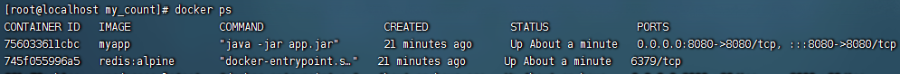

4. 查看images：`docker compose images`

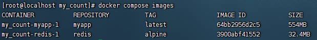

5. 停止/启动service：`docker compose stop/start`

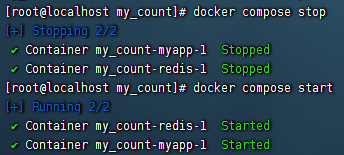

6. 删除service，同时会删除掉network和volume：`docker compose down`

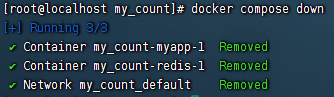

7. 进入到某个service：`docker compose exec redis sh`

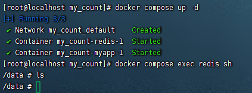

### scale扩缩容

```shell
docker compose up --scale redis=5 -d
```

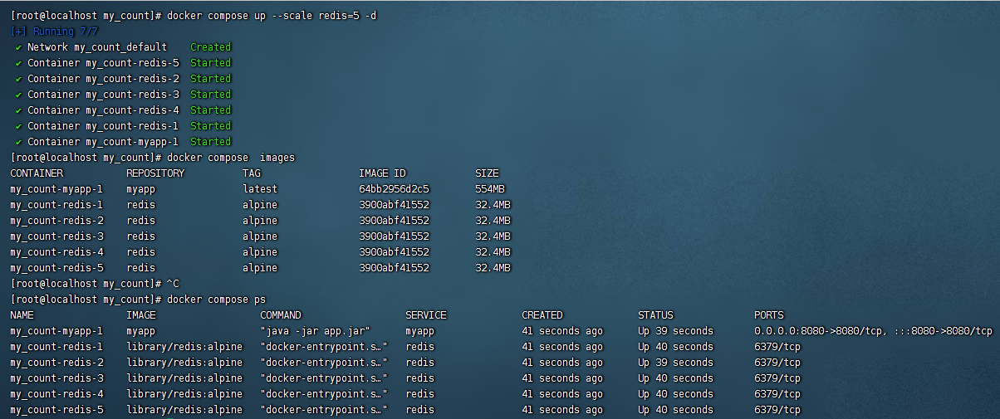

小结：`docker compose `

工程--服务--容器

```yml
version:
services:
  服务1:
  服务2:
  服务3:
```
