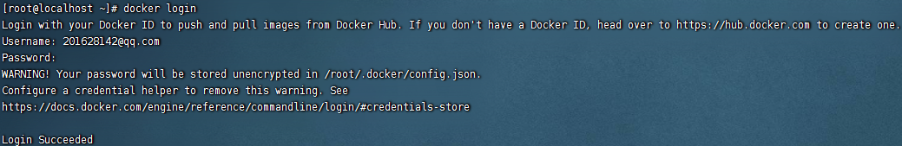
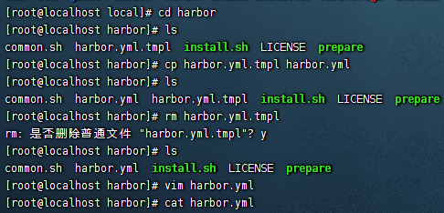

## Harbor

镜像私服仓库

### DockerHub

官网地址：`hub.docker.com`

1. 在docker机器上登录：`docker login`，然后输入用户名密码进行登录



2. 登录成功后，就可以推送镜像到docker仓库：`docker push wang186017/myapp:latest`


注意：此处推送的镜像命名需要符合规则，例如需要用户名开头，如果不是则会出现如下错误：


如果出现以上错误，我们可以使用`docker tag [镜像名]`对镜像进行重命名。


之后重新推送即可。


3. 其他人想要下载此镜像，只需要运行如下命令：`docker pull wang186017/myapp`


### 阿里云Docker Registry

仓库地址：`https://cr.console.aliyun.com/cn-hangzhou/instance/repositories`

登录阿里云，进入到镜像服务，创建命名空间


创建镜像仓库


将镜像推送到阿里云镜像仓库


### 私服Harbor

#### Harbor简介

Docker容器应用的开发和运行离不开可靠的镜像管理，虽然Docker官方也提供了公共的镜像仓库，但是从安全和效率等方面考虑，部署我们私有环境内的Registry也是非常必要的。Harbor是由VMware公司开源的企业级的Docker Registry管理项目，它包括权限管理(RBAC)、LDAP、日志审核、管理界面、自我注册、镜像复制和中文支持等功能。

#### 功能介绍

|**组件**|**功能**|
|---|---|
|harbor-adminserver|配置管理中心|
|harbor-db|MySQL数据库|
|harbor-jobservice|负责镜像复制|
|harbor-log|记录操作日志|
|harbor-ui|Web管理页面和API|
|nginx|前端代理，负责前端页面和镜像上传/下载转发|
|redis|会话|
|registry|镜像存储|

#### Habor安装

官网安装教程：`https://goharbor.io/docs/2.3.0/install-config/`

首先需要下载对应的安装文件：`https://github.com/goharbor/harbor/releases`

1. 使用在线方式下载：`wget https://github.com/goharbor/harbor/releases/download/v2.8.3/harbor-online-installer-v2.8.3.tgz`


2. 解压压缩包，修改配置文件：`tar -zxvf harbor-online-installer-v2.8.3.tgz`
把 harbor.yml.tmpl 修改为 harbor.yml 文件：`cp harbor.yml.tmpl harbor.yml`

```yml
hostname: 192.168.232.188

http:
  port: 80

https:
  port: 443
  certificate: /data/cert/192.168.232.188.crt
  private_key: /data/cert/192.168.232.188.key

harbor_admin_password: Harbor12345

database:
  password: root123
  max_idle_conns: 100
  max_open_conns: 900
  conn_max_idle_time: 0
  
data_volume: /data/harbor

trivy:
  ignore_unfixed: false

  skip_update: false

  offline_scan: false

  security_check: vuln

  insecure: false

jobservice:
  max_job_workers: 10
  logger_sweeper_duration: 1 #days

notification:
  webhook_job_max_retry: 3
  webhook_job_http_client_timeout: 3 #seconds

# Log configurations
log:
  level: info
  local:
    rotate_count: 50
    rotate_size: 200M
    location: /data/harbor/logs

_version: 2.8.0

proxy:
  http_proxy:
  https_proxy:
  no_proxy:
  components:
    - core
    - jobservice
    - trivy

upload_purging:
  enabled: true
  age: 168h
  interval: 24h
  dryrun: false
cache:
  enabled: false
  expire_hours: 24
```



3. harbor配置 https 访问

参考文档：

[https://goharbor.io/docs/1.10/install-config/configure-https/](https://goharbor.io/docs/1.10/install-config/configure-https/)

[https://goharbor.io/docs/1.10/install-config/troubleshoot-installation/#https](https://goharbor.io/docs/1.10/install-config/troubleshoot-installation/#https)

默认情况下，Harbor不附带证书。可以在没有安全性的情况下部署Harbor，以便您可以通过HTTP连接到它。但是，只有在没有外部网络连接的空白测试或开发环境中，才可以使用HTTP。在没有空隙的环境中使用HTTP会使您遭受中间人攻击。在生产环境中，请始终使用HTTPS。如果启用Content Trust with Notary来正确签名所有图像，则必须使用HTTPS。
要配置HTTPS，必须创建SSL证书。您可以使用由受信任的第三方CA签名的证书，也可以使用自签名证书。

**生成证书颁发机构证书**

在生产环境中，您应该从CA获得证书。在测试或开发环境中，您可以生成自己的CA。要生成CA证书，请运行以下命令。

**生成CA证书私钥**：`openssl genrsa -out ca.key 4096`


**生成CA证书**

调整`-subj`选项中的值以反映您的组织。如果使用FQDN连接Harbor主机，则必须将其指定为通用名称（`CN`）属性。

```shell
openssl req -x509 -new -nodes -sha512 -days 3650 -subj "/C=CN/ST=Beijing/L=Beijing/O=example/OU=Personal/CN=192.168.232.188" -key ca.key -out ca.crt
```

如果是ip访问， 将 `harbor.od.com` 改成 ip地址

**生成服务器证书**

证书通常包含一个`.crt`文件和一个`.key`文件

**生成私钥**

`openssl genrsa -out 192.168.232.188.key 4096`

**生成证书签名请求（CSR）**

```shell
openssl req -sha512 -new -subj "/C=CN/ST=Beijing/L=Beijing/O=example/OU=Personal/CN=192.168.232.188" -key 192.168.232.188.key -out 192.168.232.188.csr
```

如果是ip访问， 将 `harbor.od.com` 改成 ip地址

**生成一个x509 v3扩展文件**

无论您使用FQDN还是IP地址连接到Harbor主机，都必须创建此文件，以便可以为您的Harbor主机生成符合主题备用名称（SAN）和x509 v3的证书扩展要求。替换`DNS`条目以反映您的域
```shell
cat > v3.ext <<-EOF
authorityKeyIdentifier=keyid,issuer
basicConstraints=CA:FALSE
keyUsage = digitalSignature, nonRepudiation, keyEncipherment, dataEncipherment
extendedKeyUsage = serverAuth
subjectAltName = @alt_names

[alt_names]
DNS.1=harbor.od.com
DNS.2=harbor.od.com
DNS.3=harbor.od.com
EOF
```

+ 如果您是IP访问

```shell
cat > v3.ext <<-EOF
authorityKeyIdentifier=keyid,issuer
basicConstraints=CA:FALSE
keyUsage = digitalSignature, nonRepudiation, keyEncipherment, dataEncipherment
extendedKeyUsage = serverAuth
subjectAltName = IP:192.168.232.188
```

粘贴完成后，输入`EOF`结束输入。

**使用该v3.ext文件为您的Harbor主机生成证书**

```shell
openssl x509 -req -sha512 -days 3650 \
    -extfile v3.ext \
    -CA ca.crt -CAkey ca.key -CAcreateserial \
    -in 192.168.232.188.csr \
    -out 192.168.232.188.crt
```

如果是ip访问， 将 `harbor.od.com` 改成 ip地址

**提供证书给Harbor和Docker**

生成后`ca.crt`，`harbor.od.com.crt`和`harbor.od.com.key`文件，必须将它们提供给`Harbor`和`docker`，重新配置它们

将服务器证书和密钥复制到Harbor主机上的`/data/cert/`文件夹中

```shell
mkdir -p /data/cert/
cp harbor.od.com.crt /data/cert/
cp harbor.od.com.key /data/cert/
```

转换`harbor.od.com.crt`为`harbor.od.com.cert`，供Docker使用

```shell
openssl x509 -inform PEM -in harbor.od.com.crt -out harbor.od.com.cert
```

将服务器证书，密钥和CA文件复制到Harbor主机上的Docker证书文件夹中。您必须首先创建适当的文件夹

```shell
mkdir -p /etc/docker/certs.d/harbor.od.com/
cp harbor.od.com.cert /etc/docker/certs.d/harbor.od.com/
cp harbor.od.com.key /etc/docker/certs.d/harbor.od.com/
cp ca.crt /etc/docker/certs.d/harbor.od.com/
```

如果将默认`nginx`端口443映射到其他端口，请创建文件夹`/etc/docker/certs.d/yourdomain.com:port`或`/etc/docker/certs.d/harbor_IP:port`

重新启动Docker Engine：`systemctl restart docker`

证书目录结构

```txt
/etc/docker/certs.d/
└── harbor.od.com
    ├── ca.crt
    ├── harbor.od.com.cert
    └── harbor.od.com.key
```

Harbor将`nginx`实例用作所有服务的反向代理。您可以使用`prepare`脚本来配置`nginx`为使用HTTPS

```shell
./prepare
```

初始化服务

```shell
sh install.sh
```

连接验证

默认用户名：`admin`
默认密码：`Harbor12345`


停止并删除服务

```shell
docker compose down -v
```

重启服务

```shell
docker compose up -d
```

Docker登录


#### Harbor部署应用

上传镜像到Harbor服务中

在Web服务中创建项目和用户


然后项目分配用户


拉取命令：`docker pull 192.168.232.188/frostylunar/myapp@sha256:c92fb05f56d3b72e6a58d867ffe2bcdb680bab411cd210282a69f8153e762875`


