## Swarm

解决集群问题 k8s

官网地址：[https://docs.docker.com/engine/swarm/](https://docs.docker.com/engine/swarm/)

### Swarm 介绍

Swarm是Docker官方提供的一款集群管理工具，其主要作用是把若干台Docker主机抽象为一个整体，并且通过一个入口统一管理这些Docker主机上的各种Docker资源。Swarm和Kubernetes比较类似，但是更加轻，具有的功能也较kubernetes更少一些。

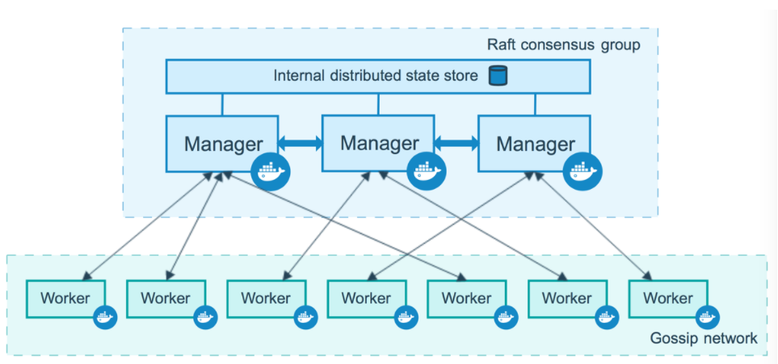

#### 管理节点

管理节点处理集群管理任务：
- 维护集群状态
- 调度服务
- 服务群模式[HTTP API 端点](https://docs.docker.com/engine/api/)

使用`Raft`实现，管理器维护整个 swarm 及其上运行的所有服务的一致内部状态。出于测试目的，可以使用单个管理器运行 swarm。如果单管理器群中的管理器出现故障，您的服务会继续运行，但您需要创建一个新集群来恢复。

为了利用 swarm 模式的容错特性，Docker 建议您根据组织的高可用性要求实现奇数个节点。当您有多个管理器时，您可以在不停机的情况下从管理器节点的故障中恢复。

- 三个管理器的群体最多可以容忍一个管理器的损失。  
- 一个五管理器群可以容忍最大同时丢失两个管理器节点。
- 一个`N`管理器集群最多可以容忍管理器的丢失 `(N-1)/2`。
- Docker 建议一个集群最多有七个管理器节点。

#### 工作节点

工作节点也是 Docker 引擎的实例，其唯一目的是执行容器。Worker 节点不参与 Raft 分布式状态，不做出调度决策，也不为 swarm 模式 HTTP API 提供服务。

您可以创建一个由一个管理器节点组成的集群，但是如果没有至少一个管理器节点，您就不能拥有一个工作节点。默认情况下，所有经理也是工人。在单个管理器节点集群中，您可以运行类似命令`docker service create`，调度程序将所有任务放在本地引擎上。

为防止调度程序将任务放置在多节点群中的管理器节点上，请将管理器节点的可用性设置为`Drain`。调度器在`Drain`mode 中优雅地停止节点上的任务并调度`Active`节点上的任务 。调度程序不会将新任务分配给具有`Drain` 可用性的节点。

### Swarm集群搭建

#### 环境准备

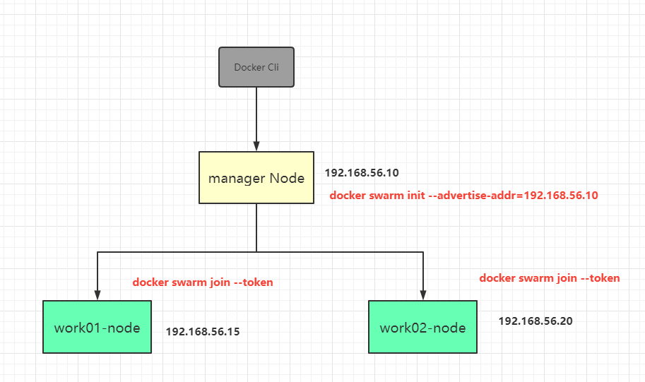

准备3个节点，通过vagrant新增加两个节点
需要单独指定hostname：`config.vm.hostname="work01-node"`
还有就是每个节点需要具备Docker环境

#### 集群环境搭建

1. 创建manager节点
进入manager节点，manager node也可以作为worker node提供服务
```shell
docker swarm init -advertise 192.168.56.10
```

`注意观察日志，拿到worker node加入manager node的信息`

```shell
docker swarm join --token SWMTKN-1-0a5ph4nehwdm9wzcmlbj2ckqqso38pkd238rprzwcoawabxtdq-arcpra6yzltedpafk3qyvv0y3 192.168.56.10:2377
```

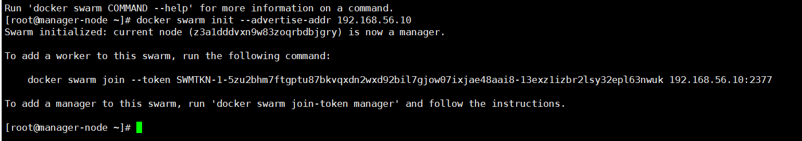

2. 进入两个Worker

```shell
docker swarm join --token SWMTKN-1-0a5ph4nehwdm9wzcmlbj2ckqqso38pkd238rprzwcoawabxtdq-arcpra6yzltedpafk3qyvv0y3 192.168.56.10:2377
```

3. 进入manager node 查看集群情况

```shell
docker node ls
```

4. node类型转换

可以将worker提升成manager，从而保证manager的高可用

```shell
docker node promote worker01-node
docker node promote worker02-node

#降级可以用demote
docker node demote worker01-node
```

在线Swarm演示：[http://labs.play-with-docker.com](http://labs.play-with-docker.com/) 通过Dock Hub 的账号密码登录即可，有效会话4个小时

### Raft一致性协议

Raft一致性协议：保证manager节点半数存活集群环境可用

#### 一主两从

还是参考上面的案例直接操作

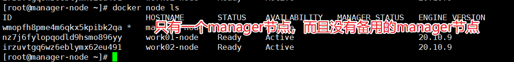

我们停掉manager节点，那么整个集群环境是不可用的

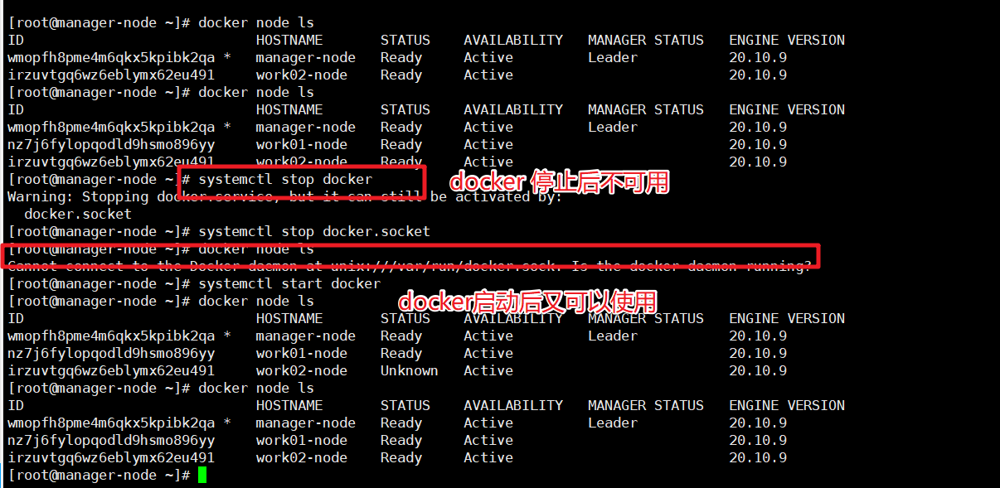

我们将一个work节点提升等级

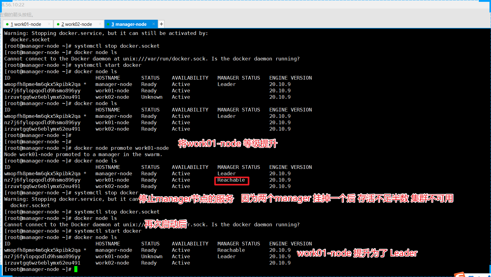

#### 二主一从

除了上面的`promote`提升到 主的案例以外，我们还可用重新来搭集群处理
我们可以在init后直接在 manager节点执行如下命令
```shell
docker swarm join-token manager
```

#### 三主0从

停止其中一个整个集群还是可用

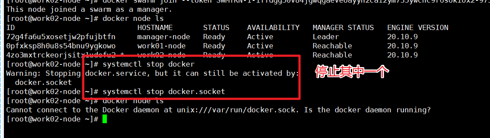

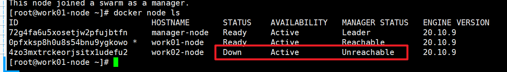

但是停止掉两个后就不可用使用了

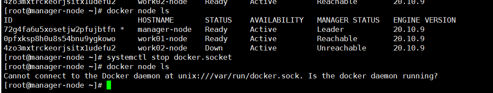

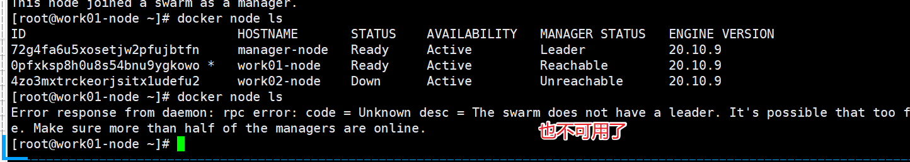
### Service

1. 创建一个tomcat的service

```shell
docker service create --name my-tomcat tomcat
```

2. 查看当前swarm的service

```shell
docker service ls
```

3. 查看service的启动日志

```shell
docker service logs my-tomcat
```

4. 查看service的详情

```shell
docker service inspect my-tomcat
```

5. 查看my-tomcat运行在哪个node上

```shell
docker service ps my-tomcat
```

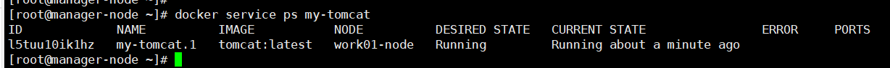

`日志`
```log
ID                  NAME                IMAGE               NODE                
DESIRED STATE       CURRENT STATE           ERROR               PORTS
u6o4mz4tj396        my-tomcat.1         tomcat:latest       worker01-node       
Running             Running 3 minutes ago  
```

6. 水平扩展service

```shell
docker service scale my-tomcat=3  
docker service ls  
docker service ps my-tomcat
```

`日志`：可以发现，其他node上都运行了一个my-tomcat的service

```log
[root@manager-node ~]# docker service ps my-tomcat
ID                  NAME                IMAGE               NODE                DESIRED STATE       CURRENT STATE            ERROR               PORTS
u6o4mz4tj396        my-tomcat.1         tomcat:latest       worker01-node       Running             Running 8 minutes ago                        
v505wdu3fxqo        my-tomcat.2         tomcat:latest       manager-node        Running             Running 46 seconds ago                       
wpbsilp62sc0        my-tomcat.3         tomcat:latest       worker02-node       Running             Running 49 seconds ago  
```

此时到worker01-node上：`docker ps`，可以发现container的name和service名称不一样，这点要知道

```log
CONTAINER ID        IMAGE               COMMAND             CREATED             STATUS              PORTS               NAMES
bc4b9bb097b8        tomcat:latest       "catalina.sh run"   10 minutes ago      Up 10 minutes       8080/tcp            my-tomcat.1.u6o4mz4tj3969a1p3mquagxok
```

7. 如果某个node上的my-tomcat挂掉了，这时候会自动扩展

```shell
[worker01-node]  
docker rm -f containerid  
​  
[manager-node]  
docker service ls  
docker service ps my-tomcat
```

8. 删除service

```shell
docker service rm my-tomcat
```

### overlay

Overlay 在网络技术领域，指的是一种网络架构上叠加的虚拟化技术模式，其大体框架是对基础网络不进行大规模修改的条件下，实现应用在网络上的承载，并能与其它网络业务分离，并且以基于IP的基础网络技术为主。

VXLAN（Virtual eXtensible LAN）技术是当前最为主流的Overlay标准

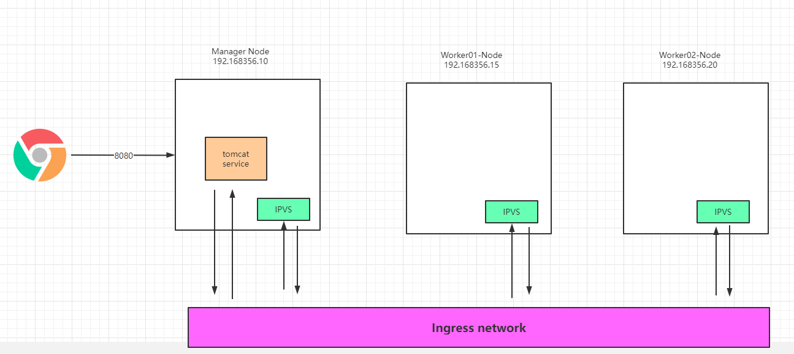

### WordPress实战

1. 创建MySQL service

```shell
docker service create --name mysql --mount type=volume,source=v1,destination=/var/lib/mysql --env MYSQL_ROOT_PASSWORD=examplepass --env MYSQL_DATABASE=db_wordpress --network my-overlay-net mysql:5.6
```

2. 创建WordPress的Service

```shell
docker service create --name wordpress --env WORDPRESS_DB_USER=root --env WORDPRESS_DB_PASSWORD=examplepass --env WORDPRESS_DB_HOST=mysql:3306 --env WORDPRESS_DB_NAME=db_wordpress -p 8080:80 --network my-overlay-net wordpress
```

3. 访问测试

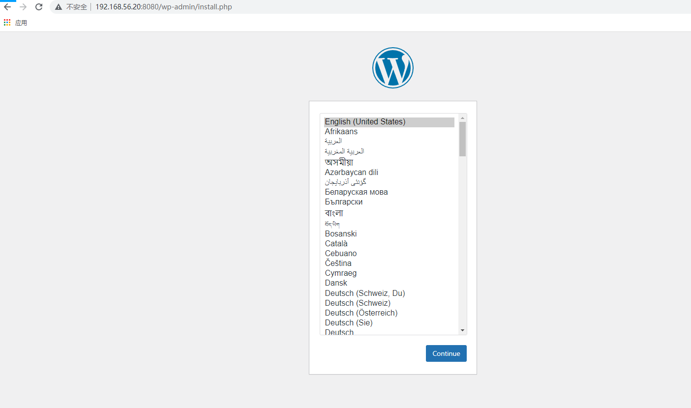

4. 查看my-overlay-net

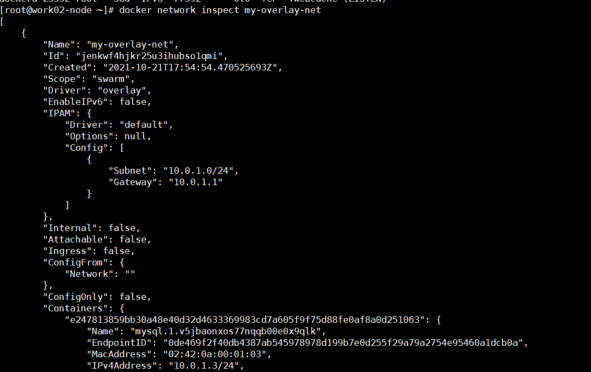

