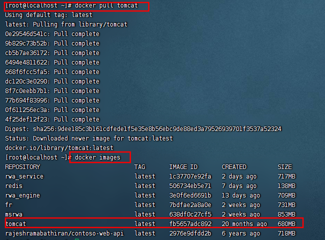
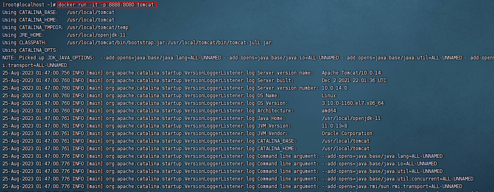
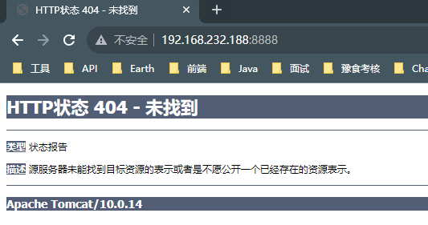
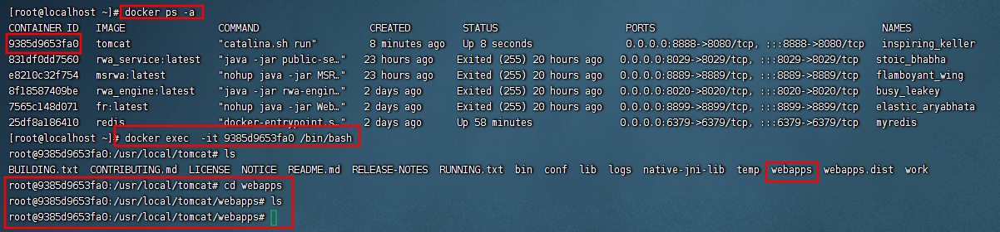
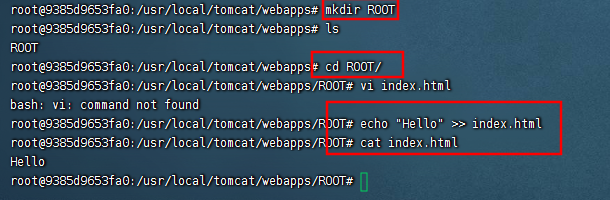
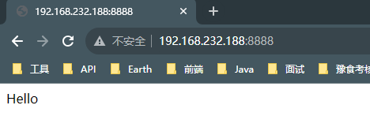
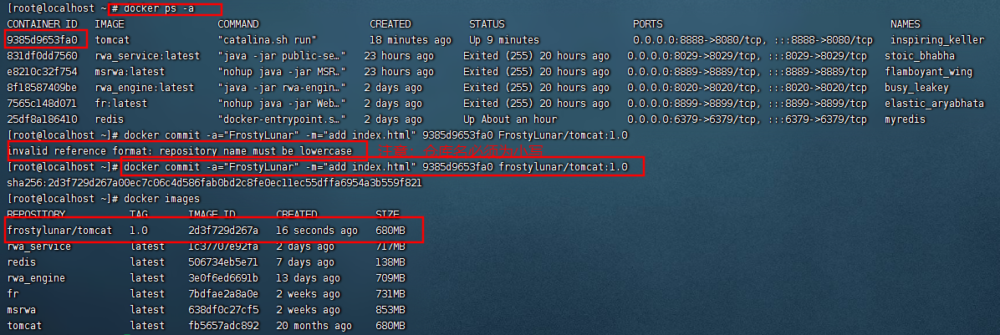
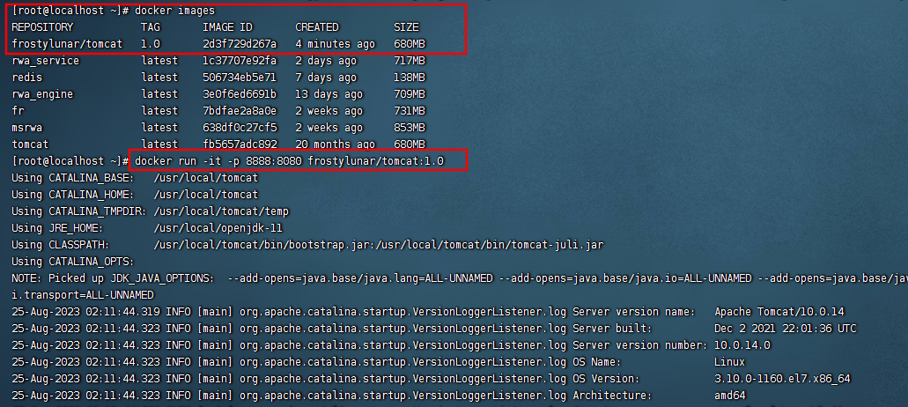
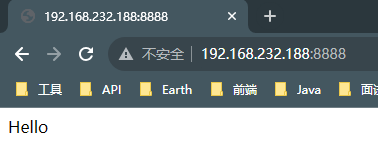

## Docker镜像文件介绍

### 镜像是什么

> 镜像是一种轻量级、可执行的独立软件包，用来打包软件运行环境和基于运行环境开发的软件，它包含运行某个软件所需的所有内容，包括代码、运行时、库、环境变量和配置文件。

#### UnionFS

UnionFS（联合文件系统）: Union文件系统（UnionFS）是一种分层、轻量级并且高性能的文件系统，它支持对文件系统的修改作为一次提交来一层层的叠加，同时可以将不同目录挂载到同一个虚拟文件系统下(unite several directories into a single virtual filesystem)。
Union 文件系统是 Docker 镜像的基础。镜像可以通过分层来进行继承，基于基础镜像（没有父镜像），可以制作各种具体的应用镜像。


`特性`：一次同时加载多个文件系统，但从外面看起来，只能看到一个文件系统，联合加载会把各层文件系统叠加起来，这样最终的文件系统会包含所有底层的文件和目录。

#### 镜像加载原理

Docker镜像加载原理：
Docker的镜像实际上由一层一层的文件系统组成，这种层级的文件系统叫`UnionFS`。
`Bootfs(boot file system)`主要包含Bootloader和Kernel, Bootloader主要是引导加载Kernel, Linux刚启动时会加载Bootfs文件系统，在Docker镜像的最底层是bootfs。这一层与我们典型的Linux/Unix系统是一样的，包含Boot加载器和内核。当boot加载完成之后整个内核就都在内存中了，此时内存的使用权已由bootfs转交给内核，此时系统也会卸载bootfs。
`Rootfs (root file system)` ，在Bootfs之上。包含的就是典型 Linux 系统中的 /dev, /proc, /bin, /etc 等标准目录和文件。Rootfs就是各种不同的操作系统发行版，比如Ubuntu，Centos等等。

#### 分层的镜像

其实我们前面在 pull 文件的时候比如 Tomcat，在pull界面我们就可以看到下载的文件是一层层的。


#### 分层结构的特点

其实我们也会考虑docker为什么会采用这种分层的结果，它有什么好处呢？
最大的一个好处就是共享资源：
比如：有多个镜像都从相同的 base 镜像构建而来，那么宿主机只需在磁盘上保存一份base镜像，同时内存中也只需加载一份 base 镜像，就可以为所有容器服务了。而且镜像的每一层都可以被共享。

#### 镜像的特点

Docker镜像都是只读的，当容器启动时，一个新的可写层被加载到镜像的顶部，这一层通常被称为容器层，容器层之下的都叫镜像层。

### 镜像操作

`docker commit -m="要提交的描述信息" -a="作者" 容器ID 要创建的目标镜像名:[标签名]`

**操作案例**：我们通过Tomcat镜像来创建容器后操作处理，然后将容器制作为新的镜像，然后我们通过新的镜像来制作容器来演示这个效果，有点绕，我们直接通过案例来说。

#### 下载tomcat镜像



#### 创建容器并启动

```shell
docker run -it -p 8888:8080 tomcat
```

|**参数**|**说明**|
|---|---|
|-p|主机端口:docker容器端口|
|-P|随机分配端口|
|-i|交互|
|-t|终端|



容器启动成功后，直接通过`IP:PORT`的形式访问此服务。



此时，客户端浏览器显示为404，此页面虽然显示为404，但说明我们的Tomcat服务启动起来了，那为什么会显示404呢，我们进入容器内部看一下。



由上图可知，在Tomcat容器的webapps目录下为空，此时启动服务当然访问不到任何页面。

#### 修改容器

我们发现启动的容器中没有要访问的资源，那么我们自己创建对应的资源即可
```shell
docker exec -it 容器ID /bin/bash
```


修改完成后，再次访问此服务，可以访问到页面了。


#### 创建镜像

我们现在的容器和下载的有区别了，我们可以在这个基础上来创建新的镜像

```shell
docker commit -a='FrostyLunar' -m='add index.html' 容器ID frostylunar/tomcat:1.0
```



#### 启动新镜像

```shell
docker run -it -p 8888:8080 frostylunar/tomcat:1.0
```



启动新镜像成功后，再次访问此服务，可以直接进入此页面。



