## DockerFile

DockerFile是用来构建Docker镜像的`构建文件`，是由一系列`命令`和`参数`构成的`脚本`。

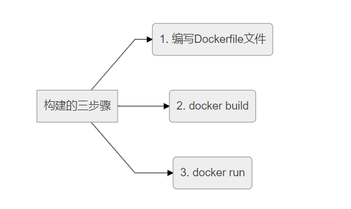

```shell
FROM scratch
ADD centos-7-x86_64-docker.tar.xz /

LABEL \
    org.label-schema.schema-version="1.0" \
    org.label-schema.name="CentOS Base Image" \
    org.label-schema.vendor="CentOS" \
    org.label-schema.license="GPLv2" \
    org.label-schema.build-date="20201113" \
    org.opencontainers.image.title="CentOS Base Image" \
    org.opencontainers.image.vendor="CentOS" \
    org.opencontainers.image.licenses="GPL-2.0-only" \
    org.opencontainers.image.created="2020-11-13 00:00:00+00:00"

CMD ["/bin/bash"]
```

### Dockerfile介绍

#### 构建过程

Dockerfile中的指令需要满足如下的规则：


#### 执行流程

docker执行一个Dockerfile脚本的流程大致如下：
1. docker从基础镜像运行一个容器
2. 执行一条指令并对容器作出修改
3. 执行类似docker commit的操作提交一个新的镜像层
4. docker再基于刚提交的镜像运行一个新的容器
5. 执行Dockerfile中的下一条指令直到所有指令都执行完成

从应用软件的角度来看，Dockerfile、Docker镜像与Docker容器分别代表软件的三个不同阶段，
- Dockerfile是软件的原材料
- Docker镜像是软件的交付品
- Docker容器则可以认为是软件的运行态。

Dockerfile面向开发，Docker镜像成为交付标准，Docker容器则涉及部署与运维，三者缺一不可，合力充当Docker体系的基石。

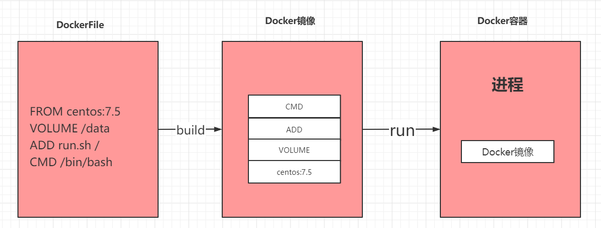

1. Dockerfile，需要定义一个Dockerfile，Dockerfile定义了进程需要的一切东西。Dockerfile涉及的内容包括执行代码或者是文件、环境变量、依赖包、运行时环境、动态链接库、操作系统的发行版、服务进程和内核进程(当应用进程需要和系统服务和内核进程打交道，这时需要考虑如何设计namespace的权限控制)等等;
2. Docker镜像，在用Dockerfile定义一个文件之后，docker build时会产生一个Docker镜像，当运行 Docker镜像时，会真正开始提供服务;
3. Docker容器，容器是直接提供服务的。

|**指令**|**说明**|
|---|---|
|FROM|基础镜像，当前新镜像是基于哪个镜像的，有继承的意味|
|MAINTAINER|镜像维护者的姓名和邮箱地址|
|RUN|容器构建时需要运行的命令|
|EXPOSE|当前容器对外暴露的端口|
|WORKDIR|指定在创建容器后，终端默认登录进来的工作目录，一个落脚点|
|ENV|用来在构建镜像过程中设置环境变量|
|ADD|将宿主机目录下的文件拷贝进镜像且ADD命令会自动处理URL和解压tar压缩包|
|COPY|类似ADD，拷贝文件和目录到镜像中。 将从构建上下文目录中<源路径>的文件/目录复制到新的一层的镜像内的<目标路径>位置 COPY src dest COPY ["src","dest"]|
|VOLUME|容器数据卷，用于数据保存和持久化工作|
|CMD|指定一个容器启动时要运行的命令 Dockerfile中可以有多个CMD指令，但只有最后一个生效，CMD会被docker run之后的参数替换|
|ENTRYPOINT|指定一个容器启动时要运行的命令 ENTRYPOINT的目的和CMD一样，都是在指定容器启动程序及参数|
|ONBUILD|当构建一个被继承的Dockerfile时运行命令，父镜像在被子继承后父镜像的onbuild被触发|

```shell
RUN set -eux; \
	nativeLines="$(catalina.sh configtest 2>&1)"; \
	nativeLines="$(echo "$nativeLines" | grep 'Apache Tomcat Native')"; \
	nativeLines="$(echo "$nativeLines" | sort -u)"; \
	if ! echo "$nativeLines" | grep -E 'INFO: Loaded( APR based)? Apache Tomcat Native library' >&2; then \
		echo >&2 "$nativeLines"; \
		exit 1; \
	fi

EXPOSE 8080
CMD ["catalina.sh", "run"]

docker run -it -p 7777:8080 tomcat  ls -l

RUN set -eux; \
	nativeLines="$(catalina.sh configtest 2>&1)"; \
	nativeLines="$(echo "$nativeLines" | grep 'Apache Tomcat Native')"; \
	nativeLines="$(echo "$nativeLines" | sort -u)"; \
	if ! echo "$nativeLines" | grep -E 'INFO: Loaded( APR based)? Apache Tomcat Native library' >&2; then \
		echo >&2 "$nativeLines"; \
		exit 1; \
	fi

EXPOSE 8080
CMD ["catalina.sh", "run"]
CMD ls -l
```

Dockerfile命令：

|**BUILD**|**BOTH**|**RUN**|
|---|---|---|
|FROM|WORKDIR|CMD|
|MAINTAINER|USER|ENV|
|COPY||EXPOSE|
|ADD||VOLUME|
|RUN||ENTRYPOINT|
|ONBUILD|||
|.dockerignore|||

### Dockerfile案例

#### Base镜像

Docker Hub中99%的镜像都是通过在base镜像中安装和配置需要的软件构建出来的，如下
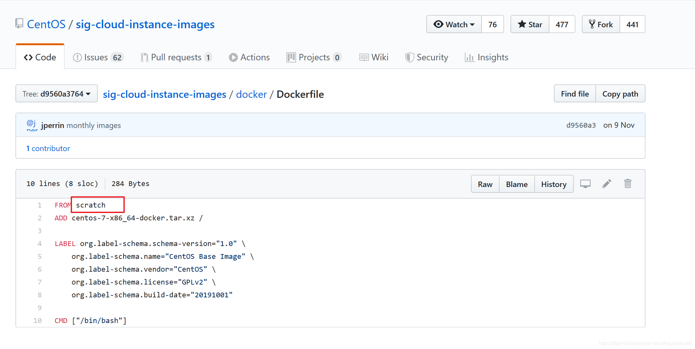

`scratch`相对于java中的`Object`

#### 自定义镜像

我们从官方pull下来的`centos`镜像是mini版的，所以不带有`vim`这些基础命令，那我们就来自定义一个镜像，功能比官方下载的强大点，同时运用下各个指令。

##### 编写

首先我们来编写对应的Dockerfile文件。内容如下：
```shell
FROM centos

MAINTAINER frostylunar<201628142@qq.com>

ENV MYPATH /usr/local

WORKDIR $MYPATH

RUN yum -y install vim

EXPOSE 80

CMD echo $MYPATH

CMD echo "success_______________ok"

CMD /bin/bash
```

##### 构建

将脚本构建成对应的镜像文件。
```shell
docker build -f dockerfile名称 -t 新建的镜像名:TAG .
```

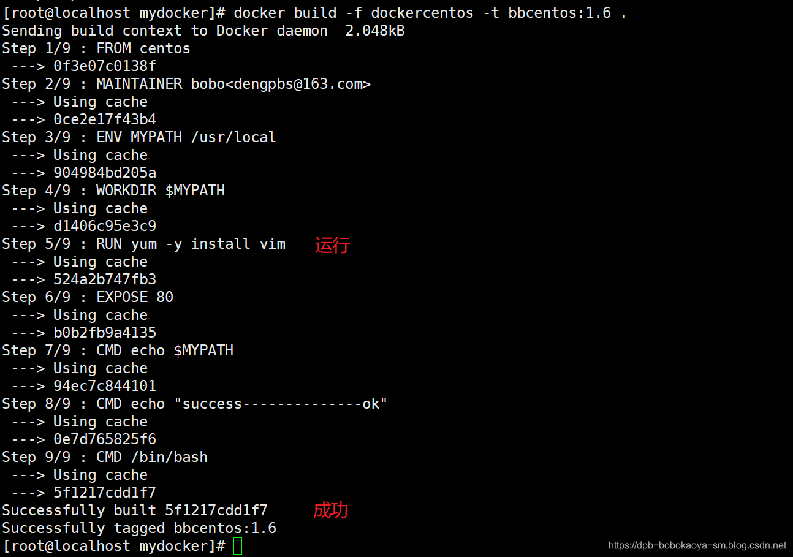

查看镜像

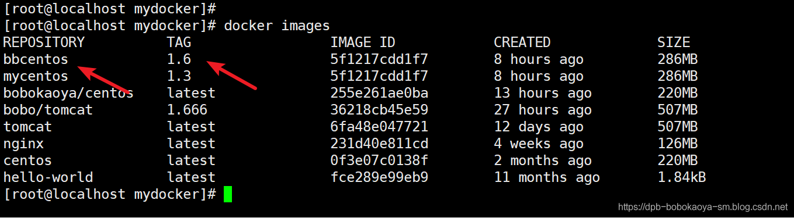

##### 运行

运行镜像文件。
`docker run -it 新镜像名称:TAG`


运行容器后，落脚点是 `/usr/local` 因为我们配置了`WORKDIR`

##### 镜像历史

查看一个镜像文件的变更历史可以使用如下命令：
```shell
docker history 镜像名
```

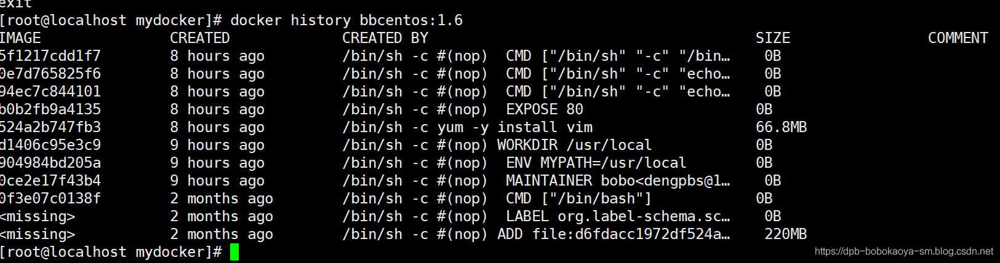

在本例中我们用到了 `FROM` `MAINTAINER` `RUN` `EXPOSE` `ENV` `WORKDIR` 命令

#### CMD/ENTRYPOINT案例

接下来我们通过案例来看看`CMD`和`ENTRYPOINT`两个命令的区别，这两个命令的作用都是`指定一个容器启动时要运行的命令`

##### CMD

Dockerfile中可以有多个CMD指令，但只有最后一个生效，CMD会被docker run之后的参数替换掉，我们通过tomcat的案例来介绍。 正常情况如下：

```shell
docker run -it -p 8888:8080 tomcat
```

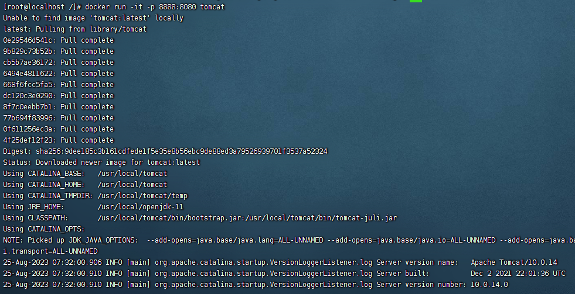

但是当我们在执行命令后添加参数的话，如下所示：
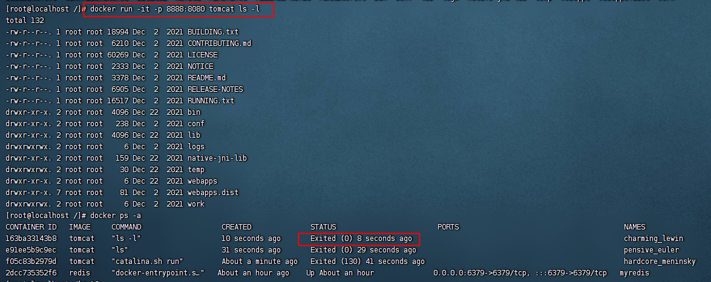

原因是我们查看Tomcat对应的Dockfile文件。
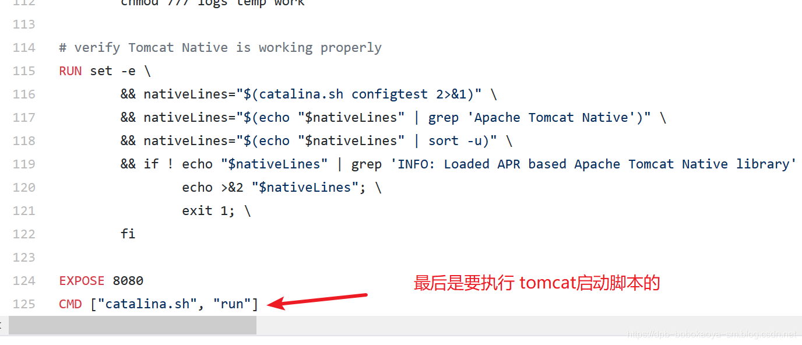
然而我们的run命令，把Dockerfile中的最后的CMD命令覆盖了~~

##### ENTRYPOINT

有别于`CMD`命令，`ENTRYPOINT`命令是在 `docker run` 之后的参数会被当做参数传递给 `ENTRYPOINT`，之后形成新的组合命令。我们通过`curl`指令来介绍这个案例。 Dockerfile文件如下：

```shell
FROM centos:7
RUN yum install -y curl
ENTRYPOINT [ "curl", "-s", "http://www.baidu.com" ]
```

构建
```shell
docker build -f Dockerfile -t tomcat:1.0 .
```
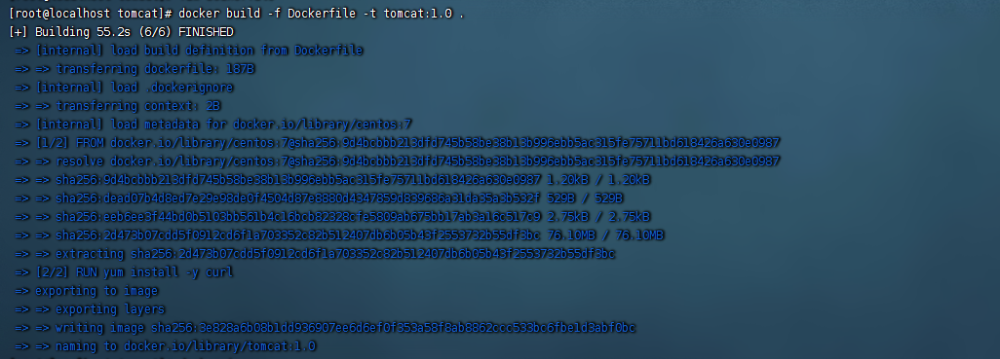
运行
```shell
docker run -it tomcat:1.0
```

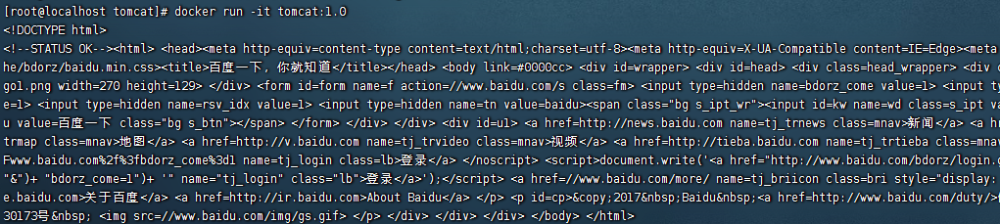

添加参数`-i` 查看响应报文头
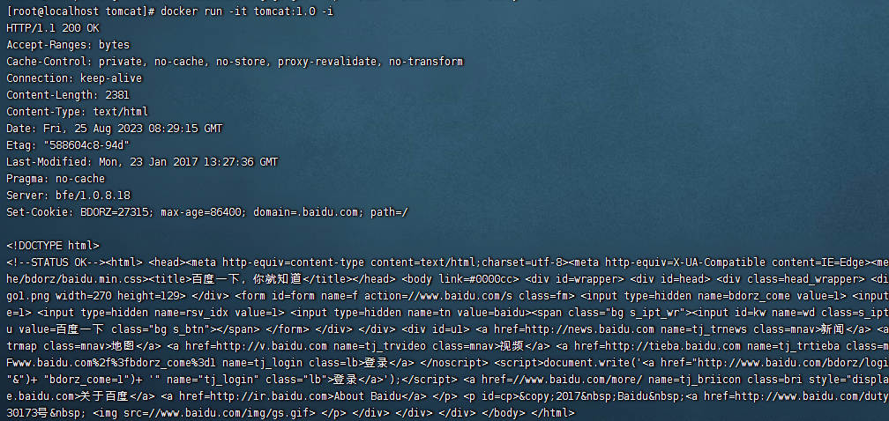

通过这个例子 可以看到`ENTRYPOINT`不会覆盖，而是组合成了一个新的命令。

#### 自定义Tomcat

自定义一个`tomcat`镜像来介绍下`ADD`和`COPY`这两个命令的区别。

##### 添加一个文件

在tomcat目录下新建`hello.txt`文件，作用是测试`COPY`命令。

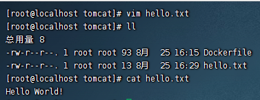

##### 拷贝相关软件

准备对应JDK和Tomcat的压缩文件。

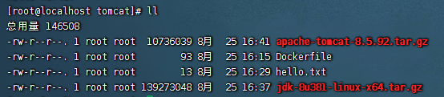

##### 创建Dockerfile文件

Dockerfile文件内容如下所示：
```shell
FROM  centos:7
MAINTAINER   frostylunar<201628142@qq.com>
#把宿主机当前上下文的hello.txt拷贝到容器/usr/local/路径下
COPY hello.txt /usr/local/helloincontainer.txt
#安装vim编辑器
RUN yum -y install vim
#设置工作访问时候的WORKDIR路径，登录落脚点
ENV MYPATH /usr/local
WORKDIR $MYPATH
#把jdk 与 tomcat 添加到容器中
ADD jdk-8u381-linux-x64.tar.gz $MYPATH
ADD apache-tomcat-8.5.92.tar.gz $MYPATH
#配置jdk与 tomcat 环境变量
ENV JAVA_HOME $MYPATH/jdk1.8.0_381
ENV CLASSPATH $JAVA_HOME/lib/dt.jar:$JAVA_HOME/lib/tools.jar
ENV CATALINA_HOME $MYPATH/apache-tomcat-8.5.92
ENV CATALINA_BASE $MYPATH/apache-tomcat-8.5.92
ENV PATH $PATH:$JAVA_HOME/bin:$CATALINA_HOME/lib:$CATALINA_HOME/bin
#容器运行时监听的端口
EXPOSE  8080
#启动时运行tomcat
CMD $MYPATH/apache-tomcat-8.5.92/bin/startup.sh && tail -F $MYPATH/apache-tomcat-8.5.92/bin/logs/catalina.out
```
##### 构建

```shell
docker build -f Dockerfile -t frostylunar/tomcat:1.0 .
```
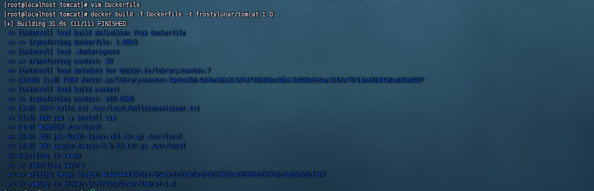

构建成功！

##### 运行

构建成功后，就可以开始运行了，运行命令如下所示：
```shell
 docker run -it -p 9080:8080 --name frostylunar-tomcat -v /root/dockerfile/tomcat/test:/usr/local/apache-tomcat-8.5.92/webapps/test -v /root/dockerfile/tomcat/tomcatlogs/:/usr/local/apache-tomcat-8.5.92/logs --privileged=true frostylunar/tomcat:1.0
```

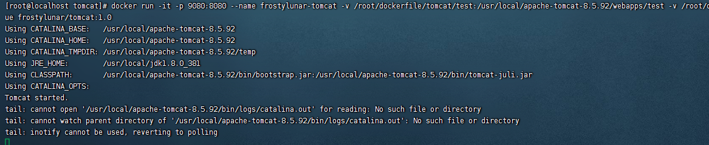

##### 验证

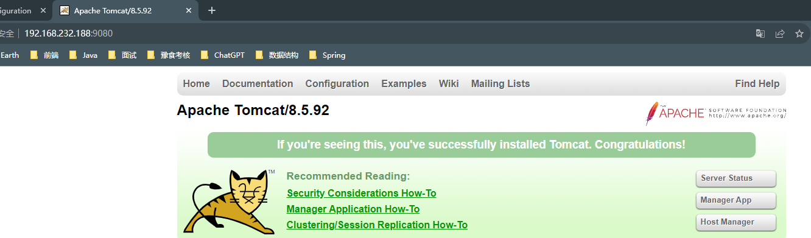

##### 部署Web项目

既然我们已经部署好了我们自己的Tomcat容器，而且也设置了对应的数据卷，那么我们来实际部署一个web案例来看看。

###### web.xml文件

在Tomcat的test目录下创建`WEB-INF目录`，然后创建`web.xml`文件。

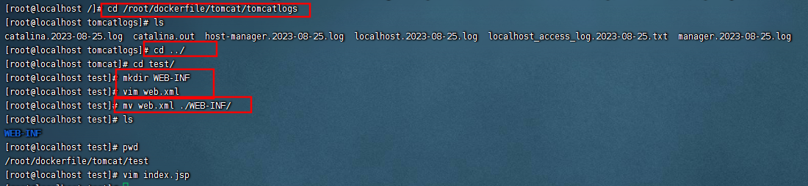

```xml
<?xml version="1.0" encoding="UTF-8"?>
<web-app xmlns:xsi="http://www.w3.org/2001/XMLSchema-instance"
  xmlns="http://java.sun.com/xml/ns/javaee"
  xsi:schemaLocation="http://java.sun.com/xml/ns/javaee http://java.sun.com/xml/ns/javaee/web-app_2_5.xsd"
  id="WebApp_ID" version="2.5">
  <display-name>test</display-name>
</web-app>
```

###### 创建jsp文件

然后创建一个简单的JSP页面即可。
```jsp
<%@ page language="java" contentType="text/html; charset=UTF-8" pageEncoding="UTF-8"%>
<!DOCTYPE html PUBLIC "-//W3C//DTD HTML 4.01 Transitional//EN" "http://www.w3.org/TR/html4/loose.dtd">
<html>
  <head>
    <meta http-equiv="Content-Type" content="text/html; charset=UTF-8">
    <title>Insert title here</title>
  </head>
  <body>
    -----------welcome------------
    <%="i am in docker tomcat self "%>
    <br>
    <br>
    <% System.out.println("=============docker tomcat self");%>
  </body>
</html>
```

###### 重启容器

```shell
docker ps -a
docker restart bed4693e7412
```

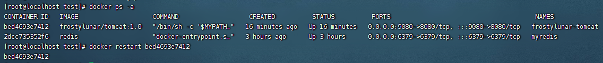

重启成功，重新访问页面：`http://192.168.232.188:9080/test/`


